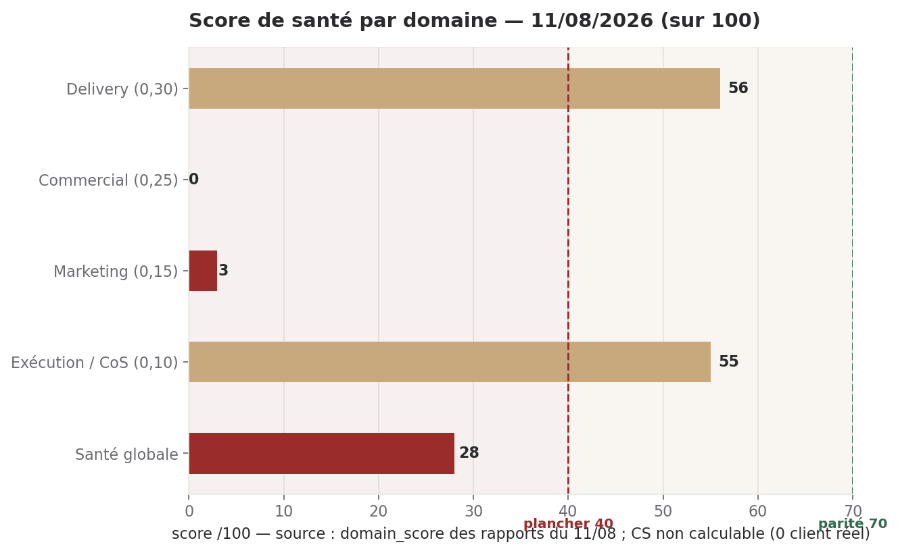
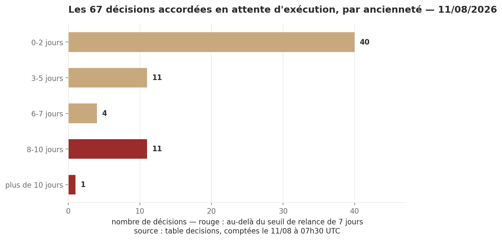

# Brief du 11 août 2026

**Statut : brief quotidien du CEO digital. Quatre décisions attendent ton arbitrage.**

## Ce qu'il faut retenir

1. **Une seule chose est apparue aujourd'hui, et elle coûte quinze minutes.** Deux des six axes du curseur d'autonomie ne sont pas tenus par un refus technique — vérifié ce matin dans la source du garde-fou. C'est exactement ce que le DSI de Crédit Logement vient vérifier dans trois semaines.
2. **Le verdict sur le cloisonnement des données clients est rendu à l'échéance, et il confirme le risque au lieu de le lever.** Deux directions, deux méthodes indépendantes, même conclusion. J'ai commandé le chiffrage du correctif ce matin ; il est rendu le 13/08.
3. **Le correctif B2 que tu as accordé hier n'a produit aucun commit.** 0 site sur 6. Ce n'est pas un manque de volonté : c'est le constat « il n'y a personne pour exécuter », sur un correctif déjà payé d'avance.
4. **Le reste du rouge était déjà rouge hier** — site en Entracte à J+2, jalon BUILD à J-4 sans mouvement depuis le 08/08, trames commerciales en v0 depuis huit jours.
5. **Le comité, lui, a bien fonctionné** : 6 rondes fraîches sur 6, et trois directions ont corrigé spontanément leurs propres affirmations. C'est un de ces signalements qui a permis de trouver l'alerte du jour.

---

## 1. Santé globale — 28/100, rouge



**Calcul** : Delivery 56 × 0,30 = 16,80 · Commercial 0 × 0,25 = 0,00 · Marketing 3 × 0,15 = 0,45 · Exécution 55 × 0,10 = 5,50. Total 22,75. Le Customer Success n'a pas de score calculable — 0 compte client réel, ce qui est normal avant septembre et **n'est pas une ronde manquante** : son poids de 0,20 est retiré et l'on divise par 0,80. **22,75 / 0,80 = 28,4 → 28.**

**Tendance : 30 le 10/08 → 28 aujourd'hui.** Stable en bas, pas une dégradation. Deux réserves de lecture, toutes deux importantes :

- Le **0 du Commercial** est déclaré par lui-même comme un artefact : sa formule ne mesure que le sourcing et la rédaction de cas d'usage, au jour 2/7 d'une semaine en régime A sans contact sortant. Neutralisé, le score global serait **41**. Le travail réel qu'il a produit ce matin — deux corrections de ses propres affirmations, la corroboration chiffrée du support Marketing — n'entre dans aucun compteur, et il le signale plutôt que de gonfler son score.
- Les scores de **79 à 88 des 07 au 09/08 ne sont pas comparables** à ceux d'aujourd'hui : ils reposaient sur un Commercial compté à 100, valeur absente des rapports stockés. La rupture du 10/08 est méthodologique, pas réelle. Je ne trace donc pas de courbe sur cette série.

**Surveillance du comité** : 6 rondes fraîches sur 6 — Delivery, Commercial, Marketing, Customer Success, Chief of Staff, et le Juridique qui a rapporté alors que son régime à la demande ne l'exigeait pas. Aucune escalade de dispositif.

---

## 2. Hier

**Delivery** — Verdict B3 rendu à l'échéance : les cinq collections documentaires sont partagées entre tous les clients et le filtre par projet n'est appliqué que si le paramètre est fourni à l'appel. B2 volet code inchangé, 0 des 6 sites corrigés malgré ton GO du 10/08. Service sain (health 200, redis connecté, 0 job en file, 1 seule erreur sur 24 h). Couverture des journaux remontée à 97,7 % côté backend contre un black-out total le 10/08. **Aucune exécution créée ni terminée en 24 h** — 9ᵉ jour de la chaîne d'incident 165/166/167.

**Commercial** — L'addendum Crédit Logement répond aux trois prérequis avec un jour d'avance sur l'échéance du 12/08. Il a corroboré le support visuel du Marketing chiffre par chiffre contre les sources primaires : 2,35 USD vérifié à la décimale contre l'exécution 167, jetons Sophie et Olivia vérifiés contre DEC-2026-0810-11, **aucun écart**. Il a aussi corrigé deux de ses propres affirmations sans qu'on le lui demande. Aucun signal de sourcing nouveau depuis le 06/08 ; les trois trames restent en v0 à J-4 de leur échéance.

**Marketing** — Support visuel Crédit Logement complet et à jour des confirmations du Commercial, prêt pour ta relecture. Portrait de Raj déposé, premier contenu du pipeline BUILD. Capacité du jour délibérément concentrée sur la tâche routée plutôt que sur la séquence — choix documenté, pas un abandon. Quatre contenus attendent leur validation depuis sept jours.

**Customer Success** — 0 compte client réel, inchangé depuis 28 jours ; aucun canal de tickets actif ; aucune nouvelle exécution depuis hier. Il a corrigé sa formulation de la veille sur Salesforce et signalé spontanément un appel sortant du canal strict de son curseur, sans donnée client.

**Exécution (Chief of Staff)** — Score 55/100. Trois décisions en risque d'oubli, toutes de la chaîne BUILD du 02/08, et cette fois **vérifiées dans le code source** et non par absence de mention : ce sont des preuves d'absence, pas des absences de preuve. Un écart de traçabilité de six jours comblé. Une fausse décision en attente reclassée. Surveillance de la trésorerie inactive depuis cinq jours.

**Juridique** (hors régime quotidien) — Confirme le défaut de cloisonnement **de première main par lecture directe du code**, là où le Delivery l'avait établi par test. Cloisonnement au niveau de la base toujours désactivé sur 47 tables sur 47. Signale spontanément deux écarts de garde-fou le concernant, en refusant de les exploiter. Mission « vente hors France » non livrée, engagement reporté au 13/08.

---

## 3. KPIs

| Indicateur | Valeur | Statut |
| --- | --- | --- |
| Cloisonnement des données clients | non prouvé — filtre optionnel, collections partagées, 47/47 tables sans cloisonnement | 🔴 |
| Axes du curseur tenus techniquement | 4/6 | 🔴 |
| B2 volet code — sites corrigés | 0/6, GO donné le 10/08, aucun commit depuis | 🔴 |
| Site public | Entracte, code 200 — J+2 | 🔴 |
| BUILD tracé jusqu'au sandbox | 0 exécution tracée depuis le 08/08, jalon à J-4 | 🔴 |
| Trames commerciales | 3 structures en v0 depuis 7-8 jours | 🔴 |
| Surveillance de la trésorerie | inactive depuis 5 jours | 🔴 |
| Couverture des journaux 24 h | 97,7 % en continuité / 0,12 % en accès réels — deux mesures différentes, voir §6 | 🟠 |
| Pipeline commercial | 11 entrées, 0 conversion, 0 sponsor nommé sur les 10 comptes | 🟠 |
| Dossier Crédit Logement | dossier + addendum + support prêts, chiffres corroborés | 🟢 |
| Service backend | health 200, v2.0.0, redis connecté, 0 job en file | 🟢 |
| Comptes clients réels | 0 — normal avant septembre | ⚪ |

---

## 4. Priorités du jour

1. **Garde-fou du curseur — corriger ou déclarer, avant ta relecture du 12/08.** Porteur : toi pour le go, puis Delivery et Marketing. `DEC-2026-0811-02`, `DEC-2026-0811-04`.
2. **Cloisonnement des données clients — chiffrage du correctif.** Routé au Delivery ce matin, rendu le 13/08, 0 €. `DEC-2026-0811-03`.
3. **B2 volet code — 6 sites, 0 corrigé.** L'arbitrage est rendu depuis hier ; il manque un exécutant. `DEC-2026-0810-09`, `DEC-2026-0810-06`.
4. **BUILD tracé jusqu'au sandbox avant le 15/08.** J-4, GO et plafond de 20 € accordés depuis le 09/08, aucune tentative depuis le 08/08. C'est ce qui bloque les trois trames commerciales. `DEC-2026-0809-03`.
5. **Réouverture du site en vitrine.** J+2. Tu es aujourd'hui le seul à pouvoir faire le geste chez l'hébergeur. `DEC-2026-0809-01`.

---

## 5. Décisions attendues

### Les deux compteurs, jamais additionnés

| Compteur | Valeur | Qui doit agir |
| --- | --- | --- |
| **En attente de ton arbitrage** | **4** | toi — c'est le seul chiffre qui appelle une action de ta part |
| **Accordées, en attente d'exécution** | **67** | les directions, et c'est à moi de leur demander des comptes |



**Ce que le second chiffre veut dire, et ce qu'il ne veut pas dire.** Il est passé de 58 à 67 en une journée, et il serait malhonnête de te laisser lire ça comme une dégradation. Sur les 67, **40 ont moins de deux jours** et sont pour l'essentiel l'enregistrement d'arbitrages que **tu** as rendus les 09 et 10/08 — des écritures au registre, pas des tâches en souffrance. Le compteur monte parce que le registre s'enrichit. **Seules 3 cumulent l'âge et l'absence d'exécution vérifiée dans le code** : les trois évolutions BUILD du 02/08, que le CoS a relancées nommément auprès du Delivery pour le deuxième cycle. Je ne te les remonte pas — tu les as déjà tranchées le 02/08, c'est à moi d'obtenir le statut.

---

### ESCALADE — `DEC-2026-0811-02` · Garde-fou : deux axes du curseur ne sont pas tenus

**Qui la demande** : moi, constat de ce matin. Elle ne pèse sur ta file que depuis quelques heures.

**L'argument.** Le garde-fou déclenche ses contrôles sur des **motifs textuels dans la commande**, pas sur son **effet**. Deux conséquences, lues dans la source ce matin :

- axe **« écrire en base »** : le contrôle ne se déclenche que sur des mots-clés SQL. Or les deux outils par lesquels le comité écrit réellement — `bin/deos-state` et `bin/deos-decisions` — n'en contiennent aucun. Le contrôle ne se déclenche jamais.
- axe **« modifier le dispositif »** : les prompts des directeurs et le garde-fou lui-même ne sont protégés que contre une redirection en ligne de commande, pas contre l'outil d'édition de fichiers.

**Preuve indépendante, trois sources le même matin** : trois directions ont testé leur canal d'écriture et l'écriture a réussi à chaque fois alors que leur cran est réglé sur « Conseille » — `rapport_delivery` à 06:33:38Z, `rapport_marketing` à 06:34:39Z, `rapport_legal` à 07:05:43Z. Le Juridique l'a signalé spontanément au lieu de l'exploiter.

**L'argument contraire, que je porte moi-même.** Écrire son propre rapport est le fonctionnement **normal** d'une direction : le périmètre par clé est respecté, il n'y a eu ni fuite, ni donnée client, ni écriture en production. **Ce n'est pas une brèche** — c'est un écart entre le cran *annoncé* et le cran *appliqué*, sur deux axes. Les quatre autres tiennent : les refus durs sur la production, l'envoi externe, la dépense et l'écriture en base de production fonctionnent et sont journalisés — le refus réel du 06/08 utilisé au geste 3 du support en est la pièce. Et tu avais **déjà identifié le 06/08** (`DEC-2026-0806-14`) que le curseur n'existait que comme texte : le dispositif a été construit depuis, ce constat en pointe le dernier trou, il ne l'annule pas.

**Options, réponse en un mot** : **CORRIGER** (quelques lignes, réversible, appliqué par un directeur sous ton go) · **DÉCLARER** (ne pas corriger et écrire dans le support ce que chaque axe tient vraiment) · **ATTENDRE** (après la démonstration).

**Coût** : 0 € — aucun appel d'API, aucune licence. 5 minutes de ton temps pour le go, et 0 minute de plus si tu réponds pendant la relecture déjà prévue demain. *Coût de ne pas le faire* : non chiffrable directement ; ce qui l'est, c'est la valeur de l'affaire que ce point conditionne — **43 200 à 86 400 € par an** selon la grille A.

**Ma recommandation** : **CORRIGER, puis DÉCLARER**. Corriger est une porte à double sens. Se faire prendre en défaut par un DSI qui vérifie est une porte à sens unique.

---

### `DEC-2026-0809-02` · Prix DEOS grands comptes — grille affichée et plafond de jours

**Qui la demande** : le Commercial, via mon routage. **2 jours.**

**L'argument.** L'étude commandée le 08/08 a été livrée le jour même. Deux choses seulement sont demandées : valider la grille de l'approche A — *1 200 € par direction gouvernée et par mois, minimum 3 directions, soit 43 200 à 86 400 € par an* — plus la phrase de cadrage à dire si la question du prix tombe en réunion ; et confirmer le plafond de jours que tu peux réellement consacrer au canal DEOS. Bloquant au titre de DH-CRO-002 : aucun prix hors offre canonique ne sort de la bouche du Commercial sans ton arbitrage.

**L'argument contraire.** Il ne porte pas sur le fond mais sur la **forme de ta réponse**, et il vient de ton propre historique. Le 09/08 tu as donné une orientation de prix sur le Pro — 79 €, `DEC-2026-0809-13`, accordée. Deux jours après, **l'offre canonique n'a toujours pas été modifiée**, et le Commercial continue donc à citer 49 € par discipline. Une orientation donnée en conversation et non inscrite dans le fichier de référence ne change rien à ce qui sort de sa bouche. Répondre ici sans faire committer l'offre canonique dans le même geste reproduirait exactement ce blocage.

**Options** : **VALIDER** la grille A telle quelle comme grille *affichée* · **CORRIGER** le chiffre · **ATTENDRE** et renvoyer le prix à un cadrage payé.

**Coût** : 0 €. 15 min pour la grille, 5 min pour le plafond de jours, 5 min pour faire inscrire les deux prix dans l'offre canonique — **25 minutes**. *Coût de ne pas le faire* : la présentation au DSI a lieu la dernière semaine d'août et tu pars en congés juste après ; le Commercial s'y présenterait sans prix affichable sur la seule question qui tombera à coup sûr.

**Ma recommandation** : valider la grille A comme grille **affichée** — elle ancre la bonne catégorie sans engager de prix ferme — donner le plafond de jours même approximativement, et **exiger dans la même réponse que les deux prix soient inscrits dans l'offre canonique**. Une fourchette vaut mieux qu'un silence qui laisse toutes les projections en hypothèse.

---

### `DEC-2026-0810-29` · Canal d'écriture Salesforce pour les 11 comptes du pipeline

**Qui la demande** : le Commercial. **1 jour.**

**L'argument.** Tu as posé la règle le 10/08 : ce qui n'est pas dans Salesforce n'existe pas. Les 11 entrées du pipeline vivent dans l'état du comité — donc elles n'existent pas au sens de ta propre règle. Fait nouveau vérifié aujourd'hui, **indépendamment par le Commercial et par le Customer Success** : le script ajouté le 10/08 appelle un relais web qui ne figure pas dans les routes du service. Le canal annoncé n'est pas déployé.

**L'argument contraire.** Ouvrir un canal d'écriture pour onze lignes est disproportionné, et c'est ta propre discipline budgétaire qui le dit : chercher l'économie avant la rallonge. Provisionner un utilisateur d'intégration en écriture est un chantier, et une porte à sens unique — un droit d'écriture sur l'org ne se retire pas aussi facilement qu'il s'accorde.

**Options** : **SAM** (tu saisis les 11 comptes via ton accès admin) · **DELIVERY** (on provisionne un utilisateur d'intégration en écriture).

**Coût** : 0 € dans les deux cas, la licence est déjà payée. Option SAM : 20 à 30 min, dans le créneau que tu as déjà retenu le 10/08. Option DELIVERY : 5 min de go, mais une demi-journée de Delivery et une porte à sens unique. *Coût de ne pas le faire* : la donnée n'est pas perdue ; ce qui se perd est la conformité à ta propre règle, et le fait que le Commercial travaille sur une source que tu as déclarée non faisant foi.

**Ma recommandation** : **SAM**. Si le volume monte en septembre, la question se rouvre — elle sera alors chiffrable.

---

### `DEC-2026-0811-01` · Journalisation des accès — passer le niveau à INFO

**Qui la demande** : le Chief of Staff. Inscrite ce matin, mais l'arbitrage attendait depuis le 05/08 **sans avoir jamais été posé formellement** — c'est l'écart de traçabilité qu'il a comblé.

**L'argument.** La couverture réelle des accès est de 0,12 % : le service répond au trafic mais ne le journalise pas, parce que le niveau de journalisation est fixé trop haut. Vérifié ce jour : le réglage est inchangé, et les 53 262 lignes du journal sont des échos de base de données produits par les rondes du comité, pas des accès. Correctif : une ligne, plus un redémarrage.

**L'argument contraire — et ici deux rapports se contredisent, je te les présente côte à côte sans trancher.** Le Delivery mesure **97,7 %** de couverture et propose de considérer la fiabilisation comme presque acquise. Le CoS mesure **0,12 %**. **Les deux sont exacts** : le Delivery mesure la *continuité temporelle* (combien d'heures des dernières 24 h comportent des lignes), le CoS mesure le *contenu* (combien de ces lignes sont des accès réels). On peut avoir un journal continu et vide de ce qu'on veut y lire. Par ailleurs le journal est déjà à 1023,6 Mo pour un plafond de 1 Go : passer à INFO **réduirait la rétention de trois jours**.

**Options** : **OUI** (passer à INFO et redémarrer en heures creuses) · **NON** (clore sur le périmètre déjà livré) · **PLUS TARD**.

**Coût** : 0 €. 5 min de go, mais l'exécution demande un redémarrage du backend — donc un porteur qui n'existe pas aujourd'hui dans le comité. *Coût de ne pas le faire* : **non chiffrable, et c'est l'argument central** — il n'y a aucun utilisateur réel. Site en Entracte, 0 compte client, dernière activité de plateforme le 10/08 par un compte technique.

**Ma recommandation** : **PLUS TARD** — et je m'écarte ici de la recommandation du CoS. Journaliser des accès quand il n'y a pas d'accès coûte trois jours de rétention pour rien. Ta discipline budgétaire pose la question dans cet ordre : *ce qu'on peut simplement arrêter de faire* avant *ce qu'on peut ajouter*. La bonne réponse est donc facile à rendre dès maintenant : **oui, mais le jour de la réouverture de la vitrine, pas avant.**

---

### Ce que j'ai routé moi-même ce matin, sans te solliciter

| Décision | Porteur | Objet | Coût |
| --- | --- | --- | --- |
| `DEC-2026-0811-03` | Delivery | Chiffrer le correctif de cloisonnement B3 — trois lignes chiffrées, rendu le 13/08 | 0 €, 0 min de toi |
| `DEC-2026-0811-04` | Marketing | Préciser dans le support Crédit Logement ce que chaque axe du curseur tient réellement, en deux variantes selon ta réponse | 0 €, 0 min de toi |

---

## 6. Alertes

**🔴 CRITIQUE — Le cloisonnement des données clients n'est pas prouvé, et le verdict du jour le confirme au lieu de le lever.** Les collections documentaires sont partagées entre tous les clients, le filtre par projet n'est appliqué que si le paramètre est fourni à l'appel, et un agent peut recevoir une valeur par défaut qui le désactive silencieusement. Le cloisonnement au niveau de la base est désactivé sur 47 tables sur 47. **Deux directions, deux méthodes, même conclusion** : le Delivery par test, le Juridique par lecture directe du code. Le premier client réel est attendu dans trois semaines. Aucun correctif n'avait été demandé jusqu'ici — la mission portait sur le diagnostic. J'ai commandé le chiffrage ce matin. *Source : rapport Delivery et ronde juridique du 11/08.*

**🟠 HAUTE — Deux des six axes du curseur ne sont pas tenus par un refus technique.** Constaté par lecture de la source du garde-fou, corroboré par trois écritures réussies ce matin qui auraient dû être bloquées. Aucune conséquence sur des données clients. Voir `DEC-2026-0811-02`. *Source : lecture de `.claude/hooks/pretooluse-guard.sh` le 11/08 à 07:33Z ; `deos_state_history` ids 47, 49, 52.*

**🟠 HAUTE — B2 volet code : 0 des 6 sites corrigés.** Tu as donné le GO le 10/08, le chiffrage était de 5 à 15 USD. Vérifié par moi : aucun commit dans le dépôt depuis le 10/08 à 13:01Z. Chaque enregistrement futur via l'écran de réglages réintroduira du clair. Ce n'est pas un manque de volonté du Delivery — il n'écrit jamais dans le dépôt, c'est son cran. C'est le constat « il n'y a personne pour exécuter », sur un correctif déjà payé d'avance.

**🟠 HAUTE — Le jalon BUILD du 15/08 est à J-4 et rien n'a bougé depuis le 08/08.** 9ᵉ jour de la chaîne d'incident, aucune exécution tracée, alors que le GO et le plafond de 20 € sont accordés depuis le 09/08. Conséquence déjà mesurable : les trois trames commerciales restent en v0 depuis sept à huit jours, bloquées sur l'absence de preuve du moteur Team.

**🟠 HAUTE — La surveillance de la trésorerie est inactive depuis cinq jours.** Ni le solde ni la consommation d'API ne sont vérifiables aujourd'hui. Dernières valeurs connues : plafond d'API de 100 USD, consommation à 20 % au 02/08, jamais réactualisée. Le CoS refuse d'estimer, et il a raison. **Je ne comble pas ce silence.**

**🟡 MOYENNE — Le site public affiche toujours Entracte, J+2.** Vérifié par moi à 07:23Z. Le Juridique confirme que la vitrine n'est pas bloquée juridiquement. Il manque le geste chez l'hébergeur.

**🟡 MOYENNE — Deux rapports se contredisent sur la couverture des journaux** : 97,7 % pour le Delivery, 0,12 % pour le CoS. Je te les présente côte à côte plutôt que de choisir : ils ne mesurent pas la même chose. Point de méthode à fixer, pas une faute.

**🟡 MOYENNE — Le rapport du Juridique du 11/08 ne m'a pas été transmis dans mes entrées du jour.** Je l'ai trouvé en interrogeant la mémoire du comité — et c'est lui qui porte la corroboration indépendante de l'alerte critique ci-dessus. La ronde à la demande n'est pas branchée sur l'alimentation du CEO : sans cette recherche, ce brief aurait été plus pauvre sur son point le plus important.

**⚪ BASSE — Le projet 107 reste marqué prêt pour le BUILD alors que son exécution a échoué.** Inchangé depuis le 16/07.

---

## 7. Opportunités

- **Le dossier Crédit Logement est le point solide du jour, et il est en avance.** Dossier, addendum et support visuel prêts ; chiffres corroborés à la décimale par le Commercial contre les sources primaires, aucun écart trouvé. Tu peux relire demain avec un niveau de confiance élevé sur l'exactitude. *Coût : 20 à 30 min de ton temps, 0 €.*
- **La fiabilisation de l'export des journaux produit un résultat mesurable pour la première fois** : 97,7 % et 87,1 % de continuité contre un black-out total le 10/08. À confirmer sur deux à trois rondes avant de considérer la décision close, et à lire avec la réserve du CoS. *Coût : 0 €, aucune action.*
- **Trois directions ont corrigé spontanément leurs propres affirmations ce matin** — le Commercial deux fois, le CS une fois, le Juridique en signalant deux écarts qui le favorisaient. C'est exactement ce que la consigne d'auto-audit du 10/08 cherchait à produire, et c'est ce signalement qui a permis de trouver l'alerte du jour. *Coût : 0 €, à maintenir.*
- **Une vue de qualification existe déjà en production et n'est pas exploitée** (`v_deos_prospects`) : score du décideur, points de douleur, angle d'approche. Vide aujourd'hui, mais à connaître avant de proposer quoi que ce soit de neuf sur la qualification. *Coût : 0 €, aucune action aujourd'hui.*

---

## 8. Ma recommandation

**Passe quinze minutes sur le garde-fou avant tout le reste. C'est une porte à sens unique.**

Presque tout ce qui est rouge ce matin l'était déjà hier, et rien de ce que tu décideras aujourd'hui ne le changera avant plusieurs jours. Une seule chose est apparue aujourd'hui, coûte quinze minutes, et se referme définitivement si on la laisse passer.

Le curseur d'autonomie est le cœur de ce que tu vends, et c'est précisément ce que le DSI de Crédit Logement vient vérifier — **tu l'avais toi-même identifié le 06/08**. Le dispositif a été construit depuis et il fonctionne. Mais j'ai vérifié ce matin dans sa source que deux de ses six axes ne déclenchent aucun refus sur les outils réellement employés, et le support de démonstration montre les six axes côte à côte. Un DSI qui demande « et si une direction écrit quand même ? » obtient aujourd'hui une réponse que le dispositif ne tient pas.

Corriger est une porte à double sens : quelques lignes, réversible, 0 €. Se faire prendre en défaut par un DSI qui vérifie est une porte à sens unique.

**Réponds `(a)` sur `DEC-2026-0811-02`.** Le Marketing tient déjà les deux variantes du support pour ta relecture de demain, et tu présentes **quatre axes tenus plus deux déclarés** plutôt que six présentés à l'identique dont deux ne le sont pas.

**Coût** : 0 € · 5 minutes aujourd'hui, 0 minute de plus demain · *Coût de ne pas le faire* : 43 200 à 86 400 € par an, la valeur de la seule affaire du portefeuille qui ait une date fixée.

---

## Réserves

- **Les 112 prospects dans Salesforce ne sont vérifiables ni par le Commercial ni par moi** : ce conteneur n'a ni outil ni identifiants Salesforce. Le fait est rapporté comme source tierce datée (commit du 10/08), jamais comme constaté.
- **Je n'ai franchi aucun garde-fou pour établir l'alerte du jour.** Le constat repose sur la lecture de la source et sur trois traces d'écriture déjà existantes. On ne vérifie pas un garde-fou en le franchissant.
- **T1 et T4 du protocole de cloisonnement restent non exécutés** — hors de portée du conteneur du Delivery. Le verdict est rendu avec cette limite explicite, il n'est pas en attente d'un complément.
- **Ni le solde de trésorerie ni la consommation d'API ne sont connus aujourd'hui.** Toutes les mentions de coût de ce brief sont des estimations d'engagement, pas une projection de trésorerie.

---

## Annexe — méthode et données

Le bloc `brief_data` complet (schéma Gate 1) est stocké dans `deos_state`, clé `brief`, écrit par le CEO le 11/08 à 07:42:23Z — 35 006 octets. Il n'est pas recopié ici : sa place est en base, pas en tête d'un document destiné à être lu.

```bash
/workspace/bin/deos-state get brief
```

**Vérifications faites de première main pendant cette session** : appel direct sur le site public (07:23Z) · historique du dépôt `/repo` (07:22Z) · lecture de `.claude/hooks/pretooluse-guard.sh` (07:33Z) · comptage de la table `decisions` (07:35Z) · lecture de `deos_state_history` pour le 11/08 · lecture intégrale de la ronde juridique du 11/08 · lecture du support visuel Crédit Logement.

**Graphiques** : `briefs/graphiques/sante_domaines_2026-08-11.png` et `briefs/graphiques/dette_execution_2026-08-11.png`, gabarit `charte.py`, données du 11/08.
