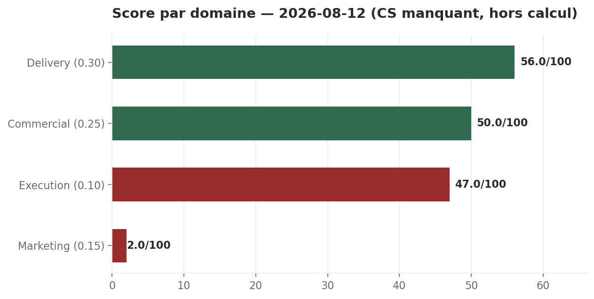

# Brief quotidien — 12 août 2026

**Statut : rouge.** Score de santé 43/100. Ce qu'il faut retenir avant tout le reste : trois décisions que tout le dispositif traite depuis deux jours comme des « GO donnés » (sécurité B2, BUILD, plafond de trésorerie) sont en réalité toujours en attente de ton arbitrage en base — c'est ce qui explique le blocage de deux des trois priorités de la semaine, pas un défaut d'exécution des directions. Le reste (cloisonnement des données clients, site en Entracte, garde-fou, prix DEOS) est connu depuis plusieurs jours et n'a pas bougé.

## 1. Santé globale

**Score : 43/100 — rouge.**

Delivery 56×0,30 = 16,80 · Commercial 50×0,25 = 12,50 · Marketing 2×0,15 = 0,30 · Exécution 47×0,10 = 4,70. Somme 34,30. Customer Success non calculable aujourd'hui (aucun rapport frais, voir plus bas) : son poids de 0,20 est retiré, on divise par 0,80. 34,30 / 0,80 = 42,9 → **43**.

**Tendance : 43 contre 28 hier (+15), à lire avec deux réserves.** Le saut vient presque entièrement du Commercial, qui passe de 0 (artefact de sa formule hebdomadaire au jour 2/7, neutralisé il valait 41) à 50 (jour 3/7, valeur réelle) — ce n'est pas une amélioration opérationnelle. Domaine par domaine : Delivery stable (56), Marketing se dégrade légèrement (3→2), Exécution recule (55→47) à cause de l'écart de gouvernance découvert ce jour. La situation ne s'améliore pas, elle se recalcule sur une base moins faussée.

**Domaine manquant : Customer Success.** Aucun rapport frais ce jour — le dernier disponible date du 11/08 (~24h de péremption). C'est la première fois que ce domaine ne rapporte pas le jour même depuis plusieurs jours. Sous le seuil d'alerte haute que je m'impose (48h), donc pas encore une alerte de gravité haute — mais si la ronde CS est encore absente demain, elle franchit ce seuil et j'inscrirai une décision « rétablir la ronde CS ».

## 2. Hier, par domaine

**Delivery.** Services sains (health 200, redis connecté, 0 job en file, 0 ERROR/WARNING sur 24h). B3 (cloisonnement clients) : chiffrage à 3 options déposé (DEC-2026-0812-01), mais toujours 0/48 tables protégées en base. Chaîne BUILD exec165/166/167 : 10e jour sans nouvelle tentative tracée. B2 volet code : 0/6 sites corrigés, 0 commit depuis le 10/08. Couverture des logs en repli net par rapport à hier, mais expliqué par une fenêtre calme et non par un échec d'export.

**Commercial.** Pipeline inchangé à 11 entrées depuis le 10/08. Fiche ICP produite à partir de 80 projets internes réels, confirme la segmentation PME/ETI existante. 8 fiches de cas d'usage corrigées d'un prix Pro périmé avant tout envoi ; bibliothèque portée à 11/15. Lecture Salesforce toujours absente depuis le conteneur (4 routes testées, 4×404) — même lacune que l'écriture déjà connue. Dossier Credit Logement inchangé, prêt pour relecture ; DEC-2026-0809-02 à 3 jours, sous le seuil de relance — le Commercial signale que tu t'apprêtes à partir en congés.

**Marketing.** Deux tâches à échéance dure traitées en priorité : complément du support Credit Logement, propagation du prix 79/59€ dans le plan de lancement (16 occurrences). Site toujours en Entracte, J+3 depuis l'accord de réouverture. Portrait Diego déposé (rang 8) ; angle 3 du plan de lancement réécrit pour respecter la doctrine du 08/08 sur les pertes d'emploi. Score au plancher (2/100) pour la 3e journée consécutive, cause structurelle inchangée.

**Customer Success.** Périmé — aucun rapport ce jour. Dernier disponible (11/08) : 0 compte client réel (normal avant septembre), aucun canal de tickets actif, aucune nouvelle activité plateforme depuis le 10/08.

**Exécution (CoS).** Score 47/100 (rouge) : 1 décision en retard (AI Act, 6j), 3 en risque d'oubli (chaîne BUILD du 02/08, 10j, re-vérifiées en code). Écart de gouvernance critique détecté et escaladé directement à toi : DEC-2026-0810-09 (GO sécurité B2) reste attente_sam alors qu'elle est citée comme tranchée dans plusieurs rapports — vérification étendue ce jour à DEC-2026-0809-03 (BUILD) et DEC-2026-0810-10 (cash), toutes trois attente_sam avec le même horodatage de mise à jour. Trésorerie inactive depuis 6 jours, en aggravation. 1 décision close avec preuve (DEC-2026-0803-01).

## 3. KPIs

| Indicateur | Statut | Valeur |
| --- | --- | --- |
| Gouvernance des décisions (GO réels vs crus) | 🔴 critique | 3 décisions crues tranchées, toujours attente_sam |
| Cloisonnement données clients (B3) | 🔴 critique | 0/48 tables protégées, chiffrage prêt |
| B2 volet code | 🔴 rouge | 0/6 sites corrigés, 0 commit depuis le 10/08 |
| Chaîne BUILD exec165/167 | 🔴 rouge | 10e jour sans nouvelle tentative |
| Site public | 🔴 rouge | Entracte, J+3 depuis l'accord de réouverture |
| Trésorerie — surveillance | 🔴 rouge | inactive 6j (maj 06/08), rapport financier 3j (maj 09/08) |
| Marketing — score | 🔴 rouge | 2/100, 3e jour au plancher |
| Service backend | 🟢 vert | health 200, redis connecté, 0 job en file |
| Bibliothèque cas d'usage | 🟢 vert | 11/15, rythme tenable |
| Pipeline commercial | 🟡 ambre | 11 entrées, inchangé depuis le 10/08 |
| N8N supervision | 🟡 ambre | hors service depuis le 11/08, attente_sam |
| Fraîcheur ronde CS | 🟡 ambre | absente ce jour (~24h, sous le seuil de 48h) |

## 4. Priorités du jour

1. **ESCALADE — Trois GO crus donnés ne l'ont jamais été** (DEC-2026-0810-09, DEC-2026-0809-03, DEC-2026-0810-10). *Porteur : toi.* Explique le blocage des rangs 2 et 3 de la semaine depuis 10 jours ; 2-3 minutes suffisent à lever le doute sur les trois.
2. **Cloisonnement des données clients (B3) : choisir une option.** *Porteur : toi puis Delivery.* Chiffrage prêt (DEC-2026-0812-01), 2e des deux raisons de l'avis juridique défavorable, échéance client de septembre qui approche.
3. **Réouverture du site en vitrine.** *Porteur : toi.* J+3 depuis l'accord. Aucun directeur n'a le geste hébergeur ; chaque jour décale d'autant le calendrier de contenu.
4. **Garde-fou du curseur : corriger ou déclarer.** *Porteur : toi puis Delivery/Marketing.* 15 minutes, réversible, 0 EUR — c'est exactement ce que le DSI de Credit Logement vient vérifier.
5. **Prix DEOS grands comptes / dossier Credit Logement.** *Porteur : toi.* Seule échéance commerciale datée du portefeuille, à traiter avant ton départ en congés annoncé par le Commercial.

## 5. Décisions attendues

### ESCALADE — DEC-2026-0810-09 (+ DEC-2026-0809-03, DEC-2026-0810-10) : trois GO crus donnés, aucun ne l'a été
**Depuis** : le sujet pèse depuis le 10-11/08 sans que personne ne s'en soit rendu compte ; escaladé par le CoS ce matin, étendu par moi.
**Son argument** : trois décisions distinctes (sécurité B2, BUILD, plafond cash) sont citées comme « GO donné » dans plusieurs rapports et dans priorites_semaine, mais leur statut réel en base est *attente_sam* pour les trois, avec le même horodatage de mise à jour à la seconde (11/08 11:46:21-22Z) — probablement la reclassification de fausses décisions faite par le CoS le 11/08, qui a touché ces trois lignes sans obtenir de réponse réelle sur aucune.
**L'argument contraire** : tu as pu donner ces trois GO oralement, comme cela s'est déjà produit (PROP-2026-0805-01, jamais inscrite malgré une confirmation en conversation). Dans ce cas ce n'est pas un refus mais un défaut d'enregistrement, et la correction est mécanique.
**Options** : (a) CONFIRMER les trois si elles étaient bien accordées oralement ; (b) PRÉCISER lesquelles restent réellement ouvertes ; (c) ARBITRER maintenant celles qui n'ont jamais été discutées.
**Ma recommandation** : (a) si c'est le cas — 2 à 3 minutes lèvent un doute qui bloque trois chantiers différents depuis deux jours. Porte à sens unique évitée par une simple vérification : le risque n'est pas la décision, c'est de continuer à agir sur une base non tranchée.
**Coût** : 0 EUR ; 2-3 minutes de ton temps ; coût de l'inaction non chiffrable précisément mais structurel — deux fronts bloqués depuis 10 jours sur la foi d'un GO qui n'existe pas en registre.

### DEC-2026-0812-01 : cloisonnement des données clients (B3), choisir une option
**Depuis** : rendue ce jour par le Delivery, un jour d'avance sur l'échéance du 13/08.
**Son argument** : 3 options chiffrées — (1) filtre documentaire obligatoire côté service, 4-6h, 15-25 USD, risque bas ; (2) séparation physique par projet, 16-24h, 30-60 USD, risque moyen-haut ; (3) protection base par paliers, 3-5j pour le 1er palier, 40-80 USD, risque haut mais réversible. Recommandation du Delivery : l'option 1 seule.
**L'argument contraire** : l'option 1 seule laisse la donnée non protégée en base (RLS toujours désactivé sur 48/48 tables) — c'est le défaut que le Juridique avait déjà signalé, une des deux raisons de son avis défavorable à l'ouverture des inscriptions.
**Options** : (a) option 1 seule maintenant ; (b) option 1 maintenant + programmer le palier 1 de l'option 3 avant septembre ; (c) attendre la donnée manquante sur les options 2/3.
**Ma recommandation** : (b). Le filtre applicatif referme le risque immédiat à coût quasi nul ; le palier base reste le filet que le Juridique attend avant l'ouverture réelle.
**Coût** : 15-25 USD immédiat + 40-80 USD à programmer ; 5 minutes de ton temps ; inaction non chiffrable mais bloquante pour le calendrier client de septembre.

### DEC-2026-0811-02 : garde-fou, deux axes du curseur non tenus techniquement
**Depuis** : constat du 11/08, inchangé, à J+1 avant une relecture Credit Logement qui expose précisément ce curseur.
**Son argument** : le garde-fou se déclenche sur des mots-clés dans la commande, pas sur son effet — deux axes (écrire en base, modifier le dispositif) ne sont donc pas tenus par les outils réellement utilisés. Preuve : trois écritures réussies alors que le cran affiché était Conseillé.
**L'argument contraire** : ce n'est pas une brèche — aucune donnée client, aucune fuite. Les quatre autres axes tiennent et sont journalisés. Le 06/08 tu avais déjà identifié que le curseur n'existait que comme texte ; ce constat en pointe le dernier trou, il ne l'annule pas.
**Options** : (a) corriger, quelques lignes, réversible ; (b) déclarer axe par axe dans le support ; (c) attendre après la démonstration.
**Ma recommandation** : (a) puis (b). Porte à sens unique — un DSI qui trouve un écart ne se rattrape pas, corriger coûte 15 minutes.
**Coût** : 0 EUR ; 5 minutes ; inaction non chiffrable mais l'affaire Credit Logement vaut 43 200 à 86 400 EUR/an selon la grille.

### DEC-2026-0809-02 : prix DEOS grands comptes, grille affichée et plafond de jours
**Depuis** : 3 jours, sous le seuil de relance (7j), mais ton départ en congés approche selon le Commercial.
**Son argument** : valider la grille A comme grille affichée (1 200 EUR/direction gouvernée/mois, minimum 3 directions, 43 200-86 400 EUR/an) et confirmer un plafond de jours pour le canal DEOS.
**L'argument contraire** : le 09/08 tu as déjà tranché le prix du Pro sans que l'offre canonique soit mise à jour avant le lendemain, ce qui a fait courir 8 fiches avec un prix périmé pendant 24h. Répondre sans faire committer l'offre canonique reproduirait le même blocage.
**Options** : (a) valider la grille A affichée ; (b) corriger le chiffre ; (c) attendre un cadrage payé.
**Ma recommandation** : (a), avec une fourchette de jours même approximative, et exiger dans la même réponse que les deux prix soient inscrits dans l'offre canonique.
**Coût** : 0 EUR ; 25 minutes au total ; la présentation au DSI a lieu la dernière semaine d'août, juste avant tes congés.

### DEC-2026-0810-29 : canal d'écriture Salesforce pour les 11 comptes du pipeline
**Depuis** : 2 jours.
**Son argument** : le script du 10/08 appelle un relais qui n'existe pas dans les routes du service — vérifié indépendamment par le Commercial et le CS. Les 11 comptes du pipeline n'existent pas au sens de ta propre règle du 10/08.
**L'argument contraire** : ouvrir un canal d'écriture pour onze lignes est disproportionné, et c'est ta propre discipline budgétaire qui le dit — un droit d'écriture sur l'org est une porte à sens unique.
**Options** : (a) tu saisis toi-même ; (b) Delivery provisionne un utilisateur d'intégration.
**Ma recommandation** : (a). Moins coûteux en délai et en risque ; la question se rouvre en septembre si le volume monte.
**Coût** : 0 EUR ; 20-30 minutes (option a) ; inaction non chiffrable, mais le Commercial travaille sur une source que ta propre règle déclare non faisante foi.

## 6. Alertes

- 🔴 **Critique** — Trois décisions crues tranchées (BUILD, sécurité B2, plafond cash) sont toujours attente_sam, avec le même horodatage de mise à jour : explique directement le blocage de deux des trois priorités de la semaine depuis 10 jours.
- 🔴 **Critique** — Cloisonnement des données clients toujours sans protection technique effective (0/48 tables), premier client réel dans environ trois semaines.
- 🟠 **Haute** — Chaîne BUILD exec165/166/167 : 10e jour sans tentative, bloque déjà les 3 trames commerciales (v0 depuis 7-8 jours).
- 🟠 **Haute** — B2 volet code : 0/6 sites corrigés, 0 commit depuis le 10/08.
- 🟠 **Haute** — Site public toujours en Entracte, J+3 depuis l'accord de réouverture.
- 🟠 **Haute** — Trésorerie non surveillée depuis 6 jours, rapport financier vieux de 3 jours, dépassement de 2,4x le plafond informel sans réponse depuis 2 jours.
- 🟡 **Moyenne** — Marketing au plancher (2/100) pour la 3e journée consécutive.
- 🟡 **Moyenne** — Rapport Customer Success non frais ce jour (~24h) — premier jour d'absence constaté, à surveiller pour demain.
- 🟡 **Moyenne** — N8N hors service depuis le 11/08, vérification technique impossible depuis le conteneur.
- ⚪ **Basse** — Projet 107 marqué prêt pour le BUILD alors que son exécution est en échec (inchangé depuis le 16/07).
- ⚪ **Basse** — TASKS_MASTER.md (backlog) vieux de 29 jours, désynchronisé des livrables réels.

## 7. Opportunités

- Dossier Credit Logement prêt et corroboré à la décimale — mais à faire suivre du garde-fou et du prix DEOS pour qu'il soit complet avant relecture.
- Bibliothèque de cas d'usage repassée en dynamique positive (8→11 en un jour), jalon du 31/08 tenable sans forcer.
- B2 code et l'option 1 du chiffrage B3 partagent le même profil (déjà validés/chiffrés, faible risque, rétroactifs) — regroupables en un seul lot d'exécution une fois l'escalade de gouvernance levée.
- Fiche ICP produite à partir de 80 projets internes réels, utilisable comme argument commercial sans être une promesse de référence client.

## 8. Ma recommandation

**Cadre : contexte plutôt que contrôle.** Le Delivery ne « traîne » pas sur B2 et sur BUILD depuis dix jours par manque de diligence — il attend un GO qui existe dans toutes les têtes et dans tous les rapports, mais pas dans le registre qui fait foi. J'ai vérifié ce matin : DEC-2026-0810-09, DEC-2026-0809-03 et DEC-2026-0810-10 sont toutes trois *attente_sam*, avec exactement le même horodatage de mise à jour à la seconde — signe qu'une opération de nettoyage du 11/08 les a touchées sans qu'aucune n'ait reçu de vraie réponse. C'est la seule chose qui a changé aujourd'hui, elle coûte trois minutes, et elle explique une part du rouge que tout le reste ne fera que confirmer demain si elle n'est pas traitée.

**Ma demande** : réponds oui/non sur les trois (DEC-2026-0810-09, DEC-2026-0809-03, DEC-2026-0810-10). Si c'était bien des GO donnés en conversation, je les enregistre dans la minute et deux chantiers bloqués depuis dix jours redeviennent des questions d'exécution, pas d'arbitrage.

**Coût** : 0 EUR direct. 2-3 minutes de ton temps. Coût de l'inaction : non chiffrable précisément, mais deux des trois priorités de la semaine restent gelées sur un malentendu de registre plutôt que sur un vrai désaccord.
