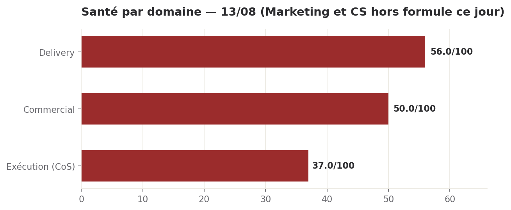

# Brief quotidien — 13 août 2026

**Statut** : constat consolidé du CEO digital à partir des rapports directeurs du jour, avec vérifications directes (base decisions, dépôt Delivery, site public). Sam tranche les 5 décisions de la section 5.

## Ce qu'il faut retenir

- **Santé 51/100 (rouge)** — chiffre en hausse par rapport à hier (43) mais **ce n'est pas une amélioration** : c'est le retrait mécanique de Marketing (2/100, sans rapport aujourd'hui) de la formule. Domaine par domaine, rien ne s'est amélioré ; l'Exécution s'est même dégradée (47→37).
- **Le dépôt Delivery est silencieux depuis 3 jours pleins** (aucun commit depuis le 10/08 13h01), vérifié en direct par le CEO. C'est la cause mécanique de l'immobilité sur le BUILD, le correctif B2 et le cloisonnement B3.
- **Trois décisions restent réellement en attente de ton arbitrage** malgré des rapports qui les citent comme tranchées : sécurité B2 (DEC-2026-0810-09), BUILD (DEC-2026-0809-03), plafond cash (DEC-2026-0810-10). Reconfirmé ce jour, inchangé depuis 2 jours. 2-3 minutes suffisent à lever le doute.
- **Le CoS a corrigé son propre manquement** : les pages légales, absentes des 3 sites depuis début août, n'avaient jamais donné lieu à une décision d'exécution malgré 3 rondes de constat. C'est fait ce jour (DEC-2026-0813-03), échéance 14/08.
- **Le Juridique a trouvé deux nouveaux écarts** sur Sophie (prix obsolète dans le prompt public et les CGV, durée de rétention RGPD contradictoire) — sans exposition réelle aujourd'hui, mais à corriger avant toute mise en service du concierge.

---

## 1. Santé globale

**Score : 51/100 — statut rouge — tendance +8 vs le 12/08, à lire avec réserve (voir ci-dessous)**

**Calcul** : Delivery 56×0,30=16,80 ; Commercial 50×0,25=12,50 ; Exécution 37×0,10=3,70. Somme=33,00, divisée par 0,65 (poids restants après exclusion de Marketing et CS) = 50,77 → **51**.

**Deux domaines exclus aujourd'hui, pour deux raisons différentes** :
- **Marketing** — aucune ronde fraîche ce jour, dernier rapport daté du 12/08 (~24h). Premier jour d'absence constaté sur ce domaine. Sous le seuil d'alerte haute (48h), mais à traiter en alerte si toujours absent demain.
- **Customer Success** — rapport frais et complet reçu ce jour, mais domain_score structurellement non calculable (0 compte client réel, situation confirmée normale par Sam jusqu'en septembre). Ce n'est **pas** un défaut de ronde, à ne pas confondre avec le cas Marketing.

**Sur la hausse apparente (43→51)** : elle vient uniquement du retrait de Marketing (2/100) de la formule — retirer le plus mauvais chiffre gonfle mécaniquement la moyenne. Lu domaine par domaine : Delivery inchangé (56), Commercial inchangé (50), Exécution en recul (47→37, -10, premier déclenchement du malus « priorité sans activité à mi-semaine »). Rien ne s'est amélioré opérationnellement. Le statut reste **rouge**, pas ambre : un critique (B3) reste ouvert et l'Exécution s'est dégradée.

---

## 2. Hier, par domaine

**Delivery** — Services sains (health 200, redis connecté, 0 erreur 24h). Aucune exécution ni commit depuis 3 jours. Le rapport du 12/08 avait qualifié DEC-2026-0810-09 d'« accordée » à tort : c'est corrigé, elle reste attente_sam, comme DEC-2026-0809-03. N8N répond (healthz 200) mais les 3 workflows de supervision restent non vérifiables.

**Commercial** — Pipeline inchangé (11 entrées depuis le 10/08). Mesure du canal BOAMP : 44 avis « salesforce » depuis 2022, aucun ne correspond à l'ICP PME/ETI privé — à ne pas industrialiser pour la cible actuelle. Découverte d'un script de collecte BOAMP déjà construit (par qui, à recouper) mais illisible depuis ce conteneur (permission refusée sur signaux_collecte).

**Customer Success** — Toujours 0 compte client réel, 0 canal de tickets actif — normal avant septembre. Lecture Salesforce toujours absente du conteneur (3e jour de constat, non redemandé).

**Marketing** — Périmé. Dernier état connu (12/08) : score au plancher (2/100) pour la 3e journée, cause structurelle inchangée (jalon de réouverture du site).

**Exécution (CoS)** — Score à 37/100 (rouge, -10) : malus mi-semaine déclenché pour la première fois, retard AI Act à 1 jour du basculement, 3 décisions en risque d'oubli depuis 11 jours. Découverte majeure : le dépôt Delivery est silencieux depuis 3 jours pleins — vérifié indépendamment par le CEO. Écart brief/table réévalué à 11 décisions manquantes (vs 3 estimé hier).

---

## 3. KPIs

| KPI | Statut | Valeur |
| --- | --- | --- |
| Santé globale | 🔴 rouge | 51/100 (hausse méthodologique, pas réelle) |
| 3 GO orphelins (sécurité, BUILD, cash) | 🔴 critique | toujours attente_sam, 4e jour |
| Cloisonnement données clients (B3) | 🔴 critique | 0/48 tables protégées, chiffrage prêt |
| Dépôt Delivery | 🔴 critique | 0 commit depuis 3 jours pleins |
| Chaîne BUILD exec165/166/167 | 🟠 haute | 11e jour sans tentative, checkpoint à J-2 |
| Site public | 🟠 haute | Entracte, J+4 depuis le GO |
| Pages légales (3 sites) | 🔴 critique | absentes, décision d'exécution ouverte ce jour |
| Écarts Sophie (prix, rétention RGPD) | 🟠 haute | 0 exposition réelle, à corriger avant activation |
| Trésorerie | 🔴 rouge | cash_suivi inactif 7j, rapport_financier 4j |
| Score exécution | 🔴 rouge | 37/100, -10 vs hier |
| Marketing (rapport) | 🟡 ambre | périmé, 1er jour d'absence |
| Priorités de la semaine | 🟡 ambre | périmées depuis 63h |
| N8N supervision | 🟡 ambre | service joignable, workflows non vérifiables |

---

## 4. Priorités du jour

1. **ESCALADE** — Confirmer ou préciser les 3 GO orphelins (B2 sécurité, BUILD, plafond cash) — `sam`
2. Cloisonnement des données clients (B3) : choisir une option — `sam puis delivery`
3. Pages légales et réouverture du site — `delivery puis sam`
4. Deux écarts de conformité Sophie (prix, rétention RGPD) — `sam puis delivery/marketing`
5. Dossier Credit Logement : prix DEOS et garde-fou du curseur — `sam`

---

## 5. Décisions attendues (analyse complète)

### ① ESCALADE — DEC-2026-0810-09 + DEC-2026-0809-03 + DEC-2026-0810-10 — 3 GO crus toujours attente_sam
**Qui demande, depuis quand** : le CoS a escaladé le premier le 11-12/08 ; le CEO a étendu le constat et le reconfirme ce jour (2e jour d'immobilité totale depuis la découverte).
**Argument** : trois rapports différents citent ces décisions comme tranchées, mais leur statut réel en base est attente_sam pour les trois — vérifié à nouveau ce jour par requête directe.
**Argument contraire** : possible que ces GO aient été donnés oralement (déjà arrivé une fois avec PROP-2026-0805-01) — alors c'est un simple défaut d'enregistrement, pas un refus.
**Options** : CONFIRMER les trois · PRÉCISER lesquelles restent ouvertes · ARBITRER maintenant celles jamais discutées.
**Recommandation** : CONFIRMER si c'est le cas — 2-3 minutes lèvent un doute qui bloque 2 chantiers depuis 4 jours, checkpoint BUILD à J-2.
**Coût** : 2-3 min de Sam, 0 EUR, coût d'inaction non chiffrable mais structurel (2 fronts bloqués 11 jours de plus).

### ② DEC-2026-0812-01 — Cloisonnement des données clients (B3) : choisir une option
**Qui demande, depuis quand** : le directeur-delivery, chiffrage rendu le 12/08, un jour d'avance sur l'échéance.
**Argument** : 3 options chiffrées (filtre documentaire 15-25 USD ; séparation physique 30-60 USD ; protection base par paliers 40-80 USD). Le Delivery recommande l'option 1 seule pour commencer.
**Argument contraire** : l'option 1 seule laisse la donnée non protégée en base (RLS toujours désactivé sur 48/48 tables) — le défaut structurel déjà signalé par le Juridique.
**Options** : GO option 1 seule · GO option 1 + programmer le palier 1 de l'option 3 avant septembre · ATTENDRE la volumétrie documents clients.
**Recommandation** : option 1 maintenant + programmer le palier 1 de l'option 3 avant le premier client de septembre.
**Coût** : 5 min de Sam, 15-25 USD immédiat (40-80 USD à programmer), bloquant pour le calendrier client de septembre si rien ne bouge.

### ③ ESCALADE — DEC-2026-0809-01 + DEC-2026-0813-03 — Réouverture du site bloquée par les pages légales
**Qui demande, depuis quand** : constat croisé Marketing/CoS/Juridique ; DEC-2026-0813-03 ouverte et accordée ce jour par le CoS, échéance 14/08.
**Argument** : le GO de réouverture (09/08) est accordé mais non exécuté depuis 4 jours ; le geste hébergeur n'appartient qu'à Sam. Le Juridique conditionne de facto ce GO à la publication des 3 pages légales, prêtes depuis le 06/08 mais jamais déployées.
**Argument contraire** : aucun — les deux gestes sont déjà tranchés sur le fond, il ne manque que l'exécution.
**Options** : Sam bascule l'hébergeur dès que les pages sont en ligne (14/08) · Sam relance directement Delivery si rien ne bouge.
**Recommandation** : attendre la preuve d'exécution de DEC-2026-0813-03, puis basculer dans la foulée.
**Coût** : quelques minutes de Sam, 0 EUR, chaque jour de blocage décale le calendrier de contenu (11/13 rangs) et le J0 commercial.

### ④ DEC-2026-0813-01 + DEC-2026-0813-02 — Deux écarts de conformité sur Sophie
**Qui demande, depuis quand** : le directeur-legal, découvert et tracé ce jour.
**Argument** : le prompt public de Sophie et le brouillon CGV affichent encore 49€/BUILD (offre remplacée le 11/08). Le brouillon de politique annonce 12 mois de rétention des conversations alors que le code documente une intention de 90 jours jamais implémentée. Exposition réelle nulle aujourd'hui (aucun composant frontend n'appelle le concierge public).
**Argument contraire** : aucun désaccord de fond, seulement des écarts de synchronisation — le seul vrai arbitrage est le choix de la durée de rétention.
**Options** : trancher 90 jours (implémenter le cron) · trancher 12 mois (justifier, implémenter le cron correspondant) · corriger le prix sans attendre l'arbitrage rétention.
**Recommandation** : corriger le prix immédiatement (mécanique) et trancher 90 jours — déjà documenté dans le code, plus court, plus facile à défendre.
**Coût** : 5 min de Sam, 0 EUR direct (coût du cron non chiffré par le Juridique), coût d'inaction non chiffrable mais c'est exactement le type d'écart à prévenir avant tout client réel.

### ⑤ DEC-2026-0809-02 + DEC-2026-0811-02 — Dossier Credit Logement : prix DEOS et garde-fou
**Qui demande, depuis quand** : le Commercial (prix, 4 jours, sous le seuil de relance) et le CEO (garde-fou, 2 jours) — même échéance de fond.
**Argument** : valider la grille A (43 200-86 400 EUR/an) et un plafond de jours ; corriger deux axes du curseur qui ne se déclenchent pas comme annoncé — exactement ce qu'un DSI vérifie.
**Argument contraire** : le prix est sous le seuil de relance, mais Sam part bientôt en congés selon le Commercial, ce qui change le calcul de délai.
**Options** : traiter les deux avant la relecture · corriger seulement le garde-fou, différer le prix · attendre après les congés.
**Recommandation** : traiter les deux avant le départ en congés — 40 minutes au total, réversible et peu coûteux.
**Coût** : 40 min de Sam, 0 EUR, valeur de l'affaire 43 200-86 400 EUR/an.

---

## 6. Alertes

🔴 **Critique** — Dépôt Delivery silencieux depuis 3 jours pleins (0 commit depuis le 10/08 13h01, vérifié par le CEO). Explique l'immobilité de B2, B3 et de la chaîne BUILD.

🔴 **Critique** — Cloisonnement des données clients (B3) toujours sans protection technique effective, chiffrage prêt depuis le 12/08, aucun GO. Premier client réel dans ~3 semaines.

🔴 **Critique** — 3 décisions traitées ailleurs comme tranchées sont réellement toujours attente_sam (sécurité, BUILD, cash) — reconfirmé ce jour. Checkpoint BUILD à J-2.

🔴 **Critique** — Pages légales toujours absentes/mortes sur les 3 sites. Décision d'exécution enfin ouverte ce jour (DEC-2026-0813-03), échéance 14/08.

🟠 **Haute** — Deux nouveaux écarts de conformité sur Sophie (prix obsolète, rétention RGPD contradictoire). Exposition nulle aujourd'hui, à corriger avant activation.

🟡 **Moyenne** — Marketing sans ronde fraîche pour la 1ère fois. Sous le seuil de 48h, deviendra alerte haute si toujours absent demain.

🟠 **Haute** — Trésorerie non surveillée depuis 7 jours, rapport_financier vieux de 4 jours. Question du plafond mensuel sans réponse depuis 3 jours.

🔵 **Basse** — Priorités de la semaine périmées depuis 63h, à rafraîchir par le CoS.

---

## 7. Opportunités

- B2 code, option 1 du chiffrage B3 et le lancement BUILD partagent le même profil (déjà chiffrés, risque bas, bloqués uniquement par l'absence de GO) — un seul geste de clarification sur les 3 GO orphelins débloquerait les trois.
- Le canal BOAMP mesuré ce jour confirme, sans coût d'industrialisation, qu'il faut prioriser le canal recrutement Salesforce et le canal partenaire (30 signaux non exploités) plutôt que les appels d'offres publics pour l'ICP actuel.

---

## 8. Recommandation

**Clarifie d'abord les 3 GO orphelins (DEC-2026-0810-09, DEC-2026-0809-03, DEC-2026-0810-10) — 2 à 3 minutes.** C'est une porte à sens unique évitée par une simple vérification : depuis 4 jours, deux chantiers (sécurité B2, BUILD) restent bloqués sur la foi d'un arbitrage qui n'existe pas en base, et le checkpoint BUILD est désormais à J-2. Aucune autre décision de ce brief ne coûte aussi peu pour débloquer autant. Une fois cela fait, le GO sur le cloisonnement B3 (option 1, 5 minutes) est la deuxième urgence — c'est le seul point critique restant qui touche directement l'échéance client de septembre.

*Sources détaillées, JSON brut et vérifications : voir `brief-2026-08-13.json` et les rapports directeurs du 13/08.*
