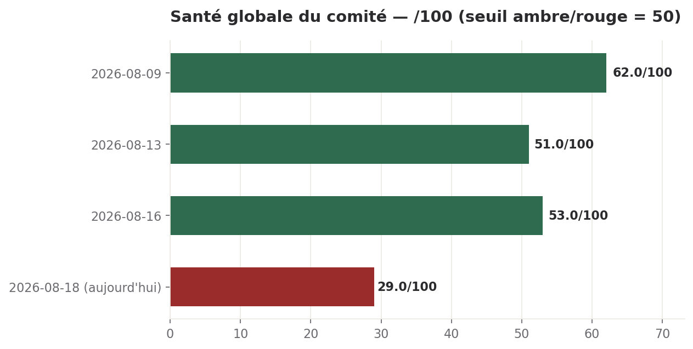

# Brief quotidien — 18 août 2026

**Statut** : constat + décisions à trancher. Consolidé par le CEO digital à partir des rondes du jour (ceo, delivery, growth) et de l'état vérifié du registre de décisions. Sam tranche les points de la section 5.

## Ce qu'il faut retenir

- **Le moteur de gouvernance qui applique les curseurs d'autonomie est mort** depuis le déploiement de la refonte V2 — vérifié quatre fois indépendamment aujourd'hui, dont une fois en direct pendant la préparation de ce brief. Aucune écriture d'aucune direction n'est plus contrôlée par les curseurs en ce moment.
- **Le brief quotidien lui-même a un trou de deux jours** : rien n'a été produit le 17/08, et la tentative automatique de ce matin a échoué en silence. C'est ce qui motive cette production manuelle.
- **Le cloisonnement RAG entre clients** (risque de fuite de données), accordé par Sam depuis six jours, reste bloqué par deux verrous techniques précis, pas par un désaccord.
- Le score de santé affiché (29/100) **mesure surtout l'absence de mesure fraîche** aujourd'hui, pas une dégradation opérationnelle nouvelle du même ordre — le détail est en section 1.
- Cinq décisions instruites vous attendent en section 5, toutes formulables en un mot ou presque.

---

## 1. Santé globale — 29/100, rouge (escalade sur la mesure elle-même)

**Le dispositif de mesure est en panne, pas seulement les indicateurs qu'il mesure.** Aujourd'hui, aucune direction n'a produit de score chiffré exploitable pour le calcul Gate 1 : Execution/CoS n'a produit aucun rapport (préflight en échec), et Delivery/Growth ont bien tourné mais dans un nouveau format narratif en cinq questions qui ne contient plus ni KPI, ni domain_score, ni statut. Le chiffre ci-dessous est donc calculé sur les dernières valeurs chiffrées connues, datées de deux jours, pas sur des données du jour.

**Calcul** : Delivery 68 (17/08) × 0,30 = 20,4 · Commercial 0 (17/08, mécanique — jour 1 d'une semaine neuve) × 0,25 = 0 · Marketing 0 (17/08, plancher réel depuis 6 mesures) × 0,15 = 0. Somme = 20,4. Execution/CoS exclu (aucun rapport aujourd'hui). CS exclu (condition structurelle permanente, aucun client réel avant septembre). Diviseur = 0,70. **20,4 / 0,70 = 29**.

**Tendance** : 29 contre 53 le 16/08 (dernier brief complet — rien le 17/08). Autant dire que la comparaison saute un jour.

**Domaines manquants** :
- *Execution (CoS)* — aucun rapport aujourd'hui, préflight NOT_READY (`bin/cloturer-prouvees.py` bloqué 10 s sur `--help`), alerte déjà créée (DEC-2026-0818-01).
- *Delivery et Growth* — rapport présent mais sans les champs chiffrés qu'exige la formule ; traité comme référence datée du 17/08.
- *Customer Success* — exclusion structurelle permanente, reconduite depuis le 16/08, pas un rapport manquant.

## 2. Hier — quatre faits par domaine

**Gouvernance du comité (nouveau, prioritaire)** — Le moteur de politique LOT-06 plante sur chaque appel d'outil (`ModuleNotFoundError: yaml`, `config/capacites.yaml` absent du dépôt) : le garde-fou retombe silencieusement sur l'ancien contrôle regex, pour toutes les directions. Preuve en direct : le curseur `ceo/écrire_base` est réglé à 3 (accord de Sam requis) et la commande qui a enregistré cette alerte est passée sans accord. Deux pannes associées, même chantier : la table `tasks` n'a jamais été créée sur la base du comité malgré trois migrations commitées, et la contrainte de statuts reste limitée aux cinq valeurs V1. Le commit du 17/08 annonçant « les onze lots intégrés, vérifiés de bout en bout » est contredit sur ce point précis par quatre vérifications indépendantes aujourd'hui. *(hooks.log, decisions#DEC-2026-0818-02/03, commit f97fa6c)*

**Delivery** — Backend sain. Reconfirme la panne de gouvernance ci-dessus depuis son propre poste. Sur le cloisonnement RAG (accordé le 13/08) : nouveau blocage identifié — `project_documents` refuse la lecture au rôle `deos_ro`, empêchant de vérifier si les données déjà indexées portent l'identifiant de projet. *(rondes/directeur-delivery-2026-08-18.json)*

**Growth (Commercial + Marketing, fusion temporaire)** — Rien n'a bougé sur les indicateurs depuis hier : pipeline à 11 entrées (7ᵉ jour immobile), 112 signaux inchangés depuis le 06/08, 0 article publié. La clé Ghost (accordée le 14/08) n'est toujours pas déposée, 4ᵉ jour. Le lot d'essai de 30 comptes reste bloqué à 11/30 — cause nommée (comptes restants hors ICP), pas un retard d'exécution. *(rondes/directeur-growth-2026-08-18.json)*

**Execution (CoS)** — Ronde non tenue aujourd'hui. Dernier état connu (17/08) : dette d'exécution à 46, score à 0/100. *(rondes-2026-08-18.log)*

## 3. KPIs

| KPI | Statut | Valeur |
| --- | --- | --- |
| Gouvernance V2 opérationnelle | Critique | Non — moteur mort, table absente, contrainte V1. Vérifié 4 fois. |
| Cloisonnement RAG clients | Critique | 6ᵉ jour sans exécution, nouveau verrou technique |
| Site public | Critique | Toujours Entracte, J-14 avant le 01/09 |
| Fournisseur de modèle / DGX Spark | Haute | Décision attendue avant J-2 |
| Correctifs sécurité non poussés | Haute | Escalade SSH, 3ᵉ occurrence |
| Pipeline commercial | Rouge | 11 entrées, 8ᵉ jour immobile |
| Publication marketing | Rouge | 0 article, clé Ghost non déposée depuis 4 jours |
| En attente de ton arbitrage | Info | 12 |
| Accordées, en attente d'exécution | Rouge | 48 |

## 4. Priorités du jour

1. **ESCALADE** — Le moteur de gouvernance V2 est mort : plus aucune écriture n'est contrôlée par les curseurs d'autonomie (DEC-2026-0818-01, -02, -03).
2. Cloisonnement RAG entre clients : accordé depuis 6 jours, deux verrous techniques précis à lever (DEC-2026-0812-01, DEC-2026-0811-02).
3. Fournisseur de modèle : trancher avant l'arrivée du DGX Spark dans 2 jours (DEC-2026-0816-01).
4. Session technique unique de Sam — site, Pricing.tsx, SSH, clé Ghost (DEC-2026-0813-06, -0817-02, -0817-01).
5. Growth — trancher le lot d'essai à 11/30 (DEC-2026-0818-05).

## 5. Décisions attendues — instruites

**① DEC-2026-0818-02 / -03 — ESCALADE : le moteur de gouvernance V2 est mort**
*Demandeur* : constat CEO, reconfirmé par Delivery et Growth — panne découverte ce jour.
*Argument* : preuve en direct que les curseurs ne s'appliquent plus à aucune écriture — le trou que LOT-06 devait fermer est rouvert sans alerte.
*Argument contraire* : aucun désaccord de fond possible, c'est un bug vérifié quatre fois. Seul point d'attention : rejouer des migrations sur la base du comité dépasse le cran de toute direction.
*Options* : (a) autoriser CoS + Delivery à rejouer les 3 migrations et installer `pyyaml`/`capacites.yaml` maintenant · (b) différer, vivre avec le regex · (c) demander un diagnostic complémentaire d'abord.
**Recommandation : (a), maintenant.** Ce sont des migrations déjà conçues pour ce déploiement précis — une porte à double sens, pas un geste nouveau. Le risque est de laisser tourner un comité sans garde-fou pendant qu'on délibère.

**② DEC-2026-0812-01 (accordée le 13/08) — Cloisonnement RAG, nouveau verrou**
*Demandeur* : Delivery, GO déjà donné par Sam.
*Argument* : chiffrage déjà fait (Option 1, 4-6h, 15-25 USD, risque bas, rétroactif). Ce qui bloque n'est plus un choix : le garde-fou classe à tort une modification de fichier comme écriture prod (DEC-2026-0811-02, ouvert depuis le 11/08), et `project_documents` refuse la lecture à `deos_ro`.
*Argument contraire* : aucun — le principe est acquis. Le faux-classement du garde-fou pourrait avoir la même cause que ①, d'où l'intérêt de traiter les deux ensemble.
*Options* : (a) accorder un accès lecture ciblé sur `project_documents` et confirmer qu'une modification de fichier n'est jamais une écriture prod · (b) attendre que ① règle aussi ce point · (c) déroger pour ce correctif précis seulement.
**Recommandation : traiter dans le même geste que ①.** C'est un accès en lecture seule, chaque jour de retard prolonge une fuite de cloisonnement déjà identifiée le 12/08.

**③ DEC-2026-0816-01 — Fournisseur de modèle, échéance dans 2 jours**
*Demandeur* : Delivery, 16/08.
*Argument* : vLLM expose un point d'entrée compatible Anthropic — réponse potentielle au verrou déjà nommé par Sam le 13/08. Le DGX Spark arrive le 20/08.
*Argument contraire* : chantier d'ingénierie non trivial, comportement des sous-agents hors harnais à vérifier.
*Options* : (a) go pour tester avant le 20/08 · (b) différer après le 20/08 · (c) demander un chiffrage d'abord.
**Recommandation : (a), sur le principe du test seul**, pas d'une bascule complète — le principe est acquis depuis le 13/08.

**④ DEC-2026-0813-06 / -0817-02 / -0817-01 — Session technique unique**
*Demandeur* : Delivery/Legal/CoS, le plus ancien depuis le 13/08.
*Argument* : un seul créneau (~2h) débloque Marketing, Commercial/Growth et Legal, et sécurise 2 correctifs de sécurité restés locaux. Escalade SSH à sa 3ᵉ occurrence sans mouvement.
*Argument contraire* : aucun sur le fond, seule l'identité du porteur du geste hébergeur n'est pas tranchée depuis le 08/08.
*Options* : (a) fixer le créneau cette semaine · (b) déléguer l'accès hébergeur à Delivery · (c) attendre encore.
**Recommandation : (a).** Trois relances sans effet sur le SSH signifient un problème de mandat, pas de mémoire — seul Sam le lève.

**⑤ DEC-2026-0818-05 — Growth : lot d'essai bloqué à 11/30**
*Demandeur* : Growth, ce jour.
*Argument* : les 19 comptes restants sont hors ICP (grands comptes exclus par la fiche du 12/08), aucune autre source disponible en lecture.
*Argument contraire* : aucun.
*Options* : (a) fournir 19 comptes de remplacement · (b) élargir exceptionnellement l'ICP · (c) clôturer le lot à 11/30.
**Recommandation : (c).** Forcer des comptes hors ICP nuirait plus au pipeline que renoncer à un chiffre rond.

## 6. Alertes

- 🔴 **Critique** — Moteur de gouvernance V2 mort : curseurs d'autonomie non appliqués, pour toutes les directions, vérifié en direct. *(hooks.log, DEC-2026-0818-03)*
- 🟠 **Haute** — Deux pannes associées : table `tasks` absente, contrainte de statuts V1. Ronde CoS non tenue aujourd'hui. *(DEC-2026-0818-01, -02)*
- 🟠 **Haute** — Le brief quotidien complet a un trou de 2 jours (rien le 17/08, échec silencieux ce matin). *(briefs/daily-2026-08-18.meta.json, 0 octet)*
- 🔴 **Critique** — Cloisonnement RAG toujours absent en production, 6ᵉ jour, nouveau verrou technique. *(DEC-2026-0812-01)*
- 🟠 **Haute** — Site public toujours en Entracte, J-14 avant le 01/09. *(curl vérifié ce jour)*
- 🟠 **Haute** — 2 correctifs de sécurité toujours non poussés au dépôt canonique, escalade 3ᵉ occurrence. *(DEC-2026-0817-01)*

## 7. Opportunités

- Le chantier de remédiation V2 est un correctif borné et déjà conçu, pas un chantier à inventer — une fois autorisé, il devrait débloquer d'un coup la ronde CoS, `deos-tasks`, et l'application réelle des curseurs.
- Le chiffrage du cloisonnement RAG est déjà fait et déjà accordé depuis 6 jours : il ne manque qu'un accès lecture et un routage de garde-fou corrigé pour passer à l'exécution.

## 8. Ma recommandation

**Autoriser maintenant la remédiation du moteur de gouvernance V2** (DEC-2026-0818-02 et -03) plutôt que d'attendre un diagnostic plus complet. C'est une porte à double sens, pas une décision irréversible : les trois migrations manquantes (`tasks`, statuts V2, capacités) sont déjà écrites et commitées pour ce déploiement précis — il s'agit d'achever un chantier déjà décidé, pas d'en ouvrir un nouveau. Le coût de l'attente est asymétrique : chaque jour où ce moteur reste mort, c'est un jour où aucune direction n'opère réellement sous les curseurs que vous avez conçus — le principe même du comité — sans que rien ne le signale. Je recommande de traiter dans le même geste l'accès lecture bloquant le cloisonnement RAG (point ②), car il s'agit du même ordre de risque (lecture seule, réversible) et il prolonge une exposition de sécurité déjà connue depuis le 12/08.

---

## Réserves

- Le score de santé (29/100) mélange des données vieilles de deux jours et une composante mécaniquement nulle (Commercial, jour 1 de semaine) — il ne doit pas être lu comme une dégradation opérationnelle du même ordre que sa valeur numérique le suggère.
- Les 48 décisions « accordées, en attente d'exécution » n'ont pas été revérifiées une par une aujourd'hui, faute de `deos-tasks` fonctionnel — même réserve méthodologique que celle posée par le Chief of Staff le 17/08, aggravée aujourd'hui par l'incident de gouvernance.
- CS, Legal et Financier ne tournent pas aujourd'hui (mardi) par construction du nouveau roster à 4 directions quotidiennes (ceo, chief-of-staff, delivery, growth) — leurs derniers rapports (17/08, 13/08, 09/08) sont traités comme courants selon leur propre cadence, pas comme des silences.

## Annexe — vérifications effectuées

| Affirmation | Vérifiée contre |
| --- | --- |
| decisions : accordée=40, attente_sam=12, clos=91, en_execution=8, refusée=4 | `psql COMITE_DB_DSN GROUP BY statut`, 18/08 |
| Les 4 demandes de statut de la note du 06/08 sont toutes closes | `psql COMITE_DB_DSN`, 18/08 |
| Moteur de politique en échec sur mes propres commandes de cette session | `python3 -c "import yaml"` (échec) ; hooks.log |
| digital-humans.fr renvoie 200, 6330 octets | `curl`, 18/08 |
| Table `tasks` absente, `config/capacites.yaml` absent | hooks.log ; texte intégral DEC-2026-0818-02/03 |
| Aucun brief le 17/08 ; tentative du 18/08 vide | `ls briefs/` ; `wc -c` sur les fichiers meta/err |
| Rondes du 18/08 : ceo/delivery/growth tenues, chief-of-staff NOT_READY | `rondes-2026-08-18.log` |

*Non vérifié aujourd'hui* : l'état détaillé des 48 décisions accordées/en_execution au-delà de celles citées nommément — `deos-tasks` indisponible pour un audit exhaustif.
