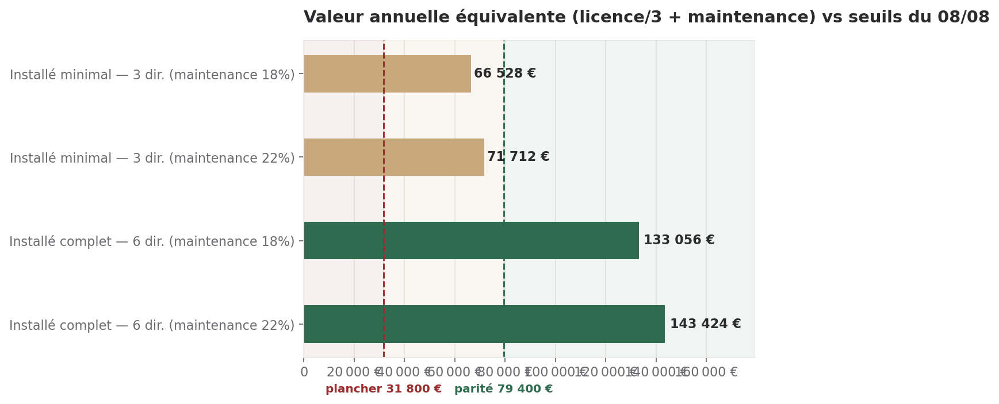

# DEOS installé chez le client — complément à l'étude grands comptes

> Directeur Commercial · 09/08/2026 · Complète `deos_grands_comptes_2026-08-08.md`, ne le remplace pas.
> Déclenché par la lecture de Sam le 09/08 : l'étude du 08/08 supposait une livraison en SaaS, ce qui
> exclut d'emblée un compte comme Crédit Logement — internalisation de doctrine, contrat LLM Microsoft
> déjà signé.
> **Statut : proposition. Aucun chiffre ci-dessous n'existe dans l'offre canonique. DH-CRO-002
> s'applique — Sam tranche, je propose.**

## Ce qu'il faut retenir

1. **L'installé est un second mode de livraison, pas un correctif du premier.** Le SaaS de l'étude du
   08/08 reste la bonne réponse pour les comptes qui veulent commencer petit et monter en charge.
   L'installé s'adresse à ceux qui érigent la gouvernance en cœur de contrôle interne et refusent de la
   confier à un tiers — Crédit Logement, et « beaucoup de DSI de grands groupes » selon Sam.
2. **Le modèle proposé est licence + maintenance**, benchmarké sur le logiciel d'entreprise on-premise :
   maintenance annuelle à 18–22 % de la licence est la norme du secteur, licence dimensionnée sur la
   règle usuelle des trois ans de valeur SaaS équivalente. *Hypothèse*, faute de données internes — voir
   §1.
3. **Le temps de Sam augmente nettement sur la première affaire installée, puis revient au niveau du
   SaaS dès la deuxième.** Marge à 38,6 % sur l'affaire qui construit l'intégration technique manquante,
   55,0 % sur celle qui la réutilise — contre 56,9 % en SaaS (§4.2 de l'étude du 08/08). L'écart n'est
   pas structurel, il est ponctuel, et il porte un nom : l'intégration Azure OpenAI.
4. **Point bloquant vérifié dans le code, pas supposé** : `backend/config/llm_routing.yaml` ne contient
   aucune occurrence d'Azure OpenAI. Le profil `on-premise` existant route vers des modèles locaux
   (Ollama), pas vers le LLM sous contrat du client. Ce n'est pas un préalable à la vente de fin août —
   la démonstration et le cadrage n'en dépendent pas — mais c'est une condition de livraison, à chiffrer
   par le Directeur Delivery avant tout contrat d'installation.
5. **Le cadrage à 8 000 € tient. La fourchette 40–90 k€ ne tient plus telle quelle.** Pour l'installé, il
   faut deux nombres séparés, pas un seul : un montant d'entrée (licence + installation, de l'ordre de
   130 000 à 260 000 €) et une maintenance annuelle (de l'ordre de 23 000 à 57 000 €/an) — *Hypothèse*,
   à valider avant toute mention en réunion (§5).

---

## 1. Le modèle économique de l'installé

### 1.1 Ce que dit le marché du logiciel d'entreprise installé

Deux repères, tous deux vérifiés sur plusieurs sources indépendantes et convergents :

- **La maintenance annuelle d'un logiciel installé se situe à 18–22 % du prix de la licence**, chez les
  grands éditeurs (SAP, Oracle) comme chez les GRC spécialisés — jusqu'à 25 % chez certains
  ([NPI Financial](https://www.npifinancial.com/blog/on-premise-vs-saas-enterprise-software-pricing-considerations-and-negotiation-insights) ;
  [ERP Research](https://www.erpresearch.com/en-us/erp-licensing-models-explained)).
- **Une licence perpétuelle se fixe usuellement autour de trois années de l'abonnement SaaS
  équivalent** — c'est le seuil de rentabilité couramment cité entre éditeur et client pour qu'aucune
  des deux parties ne soit lésée par le changement de mode de paiement
  ([Kellblog](https://www.kellblog.com/perpetual-money-vs-perpetual-license-subscription-saas-and-perpetual-business-models/)).

Appliqué à l'approche A du 08/08 (1 200 €/direction/mois) :

| Périmètre | Valeur SaaS équivalente | Licence (règle des 3 ans) | Maintenance annuelle (18–22 %) |
|---|---:|---:|---:|
| 3 directions (minimum) | 43 200 €/an | **129 600 €** | 23 328 – 28 512 €/an |
| 6 directions (complet) | 86 400 €/an | **259 200 €** | 46 656 – 57 024 €/an |

**Ce que je ne cherche pas à cacher : je n'ai aucune donnée de consentement à payer pour un DEOS
installé, ni comparable interne.** Ces niveaux sont construits par analogie de marché, pas mesurés.
Ils gardent toutefois un ancrage utile : le marché du GRC installé, déjà cité dans l'étude du 08/08
pour sa variante SaaS, se négocie aussi en **20 000 à 150 000 $/an tout compris** en version installée
([Centraleyes](https://www.centraleyes.com/grc-software-pricing-what-it-costs/) ;
[Security Boulevard](https://securityboulevard.com/2026/05/grc-software-pricing-what-it-actually-costs-in-2026/)) —
nos maintenances annuelles (23–57 k€) tombent confortablement dans cette fourchette.

### 1.2 L'alternative plus simple, et pourquoi je ne la recommande pas en premier

Une licence annuelle unique (tout compris, sans capital de licence séparé) existe aussi sur ce
marché et éviterait à Digital·Humans un engagement de support à durée indéterminée — risque réel pour
un éditeur qui n'a encore rien installé chez personne. Je la mentionne pour mémoire mais ne la chiffre
pas dans ce complément : elle ne répond pas à ce que demande Sam ce jour (le modèle licence +
maintenance), et la trancher maintenant serait construire une troisième option avant d'avoir validé la
première. Si Sam préfère cette voie, je la chiffre dans la foulée — coût : une demi-journée.

### 1.3 L'installation, distincte de la licence

L'approche B de l'étude du 08/08 chiffrait déjà une **installation dans le SI du client (VPC ou sur
site) à 25 000 €** — ce poste existait avant même de savoir qu'il deviendrait la norme plutôt
qu'une option. Je le retiens comme base, porté à **30 000–50 000 €** pour la première affaire : la
fourchette haute couvre le fait que cette installation doit aussi combler l'écart Azure OpenAI (§4),
ce qui n'était pas dans le périmètre initial. Chiffrage à affiner par le Directeur Delivery, pas par
moi — je n'ai pas la compétence d'ingénierie pour le sourcer plus finement.

---

## 2. Ce que ça change à la marge

`cost_to_serve_calculator.py`, même méthode d'imputation qu'au 08/08 (overhead 10 % de la recette,
constance d'imputation Horngren), sur le scénario minimal (3 directions, maintenance à 18 %,
installation à 30 000 € → recette année 1 : 182 928 €) :

| Scénario | Coût direct | Coût chargé total | **Marge réelle** |
|---|---:|---:|---:|
| Première affaire installée (intégration Azure OpenAI à construire) | 94 000 € | 112 293 € | **38,6 %** |
| Affaire installée suivante (intégration réutilisée) | 64 000 € | 82 293 € | **55,0 %** |
| *Pour mémoire — DEOS en SaaS (étude du 08/08, §4.2)* | *32 720 €* | *37 240 €* | *56,9 %* |

**Ce que ce tableau répond à la question de Sam.** Le temps de Sam par affaire **augmente** sur la
première affaire installée — l'écart de marge (38,6 % contre 56,9 %) tient presque entièrement à
33 000 € de travail d'intégration technique qui n'existe pas encore dans le produit. Il **revient au
niveau du SaaS** dès la deuxième affaire installée (55,0 %, à un point de marge du SaaS), parce que
cette intégration devient un actif réutilisable et non une dépense récurrente. **La bonne nouvelle est
donc conditionnelle : elle suppose une deuxième affaire installée pour amortir la première.** Vendre
un DEOS installé unique sans suite ne fait pas ce pari — il paie la totalité de l'intégration seul.

---

## 3. La comparaison change

L'étude du 08/08 positionnait DEOS contre les plateformes américaines de gouvernance IA en SaaS
(100–500 000 $/an, IBM watsonx.governance, Credo AI, ModelOp — §2.2 de cette étude). Cette comparaison
ne tient plus pour un DSI qui exclut le SaaS par doctrine : il compare DEOS installé à d'autres
**logiciels d'entreprise installés dans son SI** — GRC on-premise (SAP GRC, IBM OpenPages en version
installée), cœur bancaire, outils de conformité déjà internalisés chez lui.

**Ce déplacement joue plutôt en notre faveur sur le prix acceptable, pour une raison que la littérature
sur le sujet documente** : sur cinq ans, le coût total d'une licence perpétuelle plus maintenance
rejoint celui d'un abonnement SaaS équivalent
([NPI Financial](https://www.npifinancial.com/blog/on-premise-vs-saas-enterprise-software-pricing-considerations-and-negotiation-insights)) —
l'installé n'est pas structurellement moins cher, il est structurellement **plus engageant**, et
c'est précisément ce qu'un DSI de banque recherche pour un dispositif appelé à devenir le cœur de son
contrôle interne : un coût de changement de fournisseur élevé n'est pas un défaut de l'offre, c'est ce
qu'on lui demande d'apporter. Le prix acceptable se déplace donc **vers le haut**, pas vers le bas — à
la condition de le justifier par le contrôle et la conformité, pas par l'infrastructure.

---

## 4. Le point technique bloquant : Azure OpenAI

**Vérifié ce jour dans `backend/config/llm_routing.yaml`** (aucune investigation supplémentaire
demandée, lecture directe du fichier cité par la mission) :

- Trois profils de déploiement existent déjà : `cloud`, `on-premise`, `freemium`. L'abstraction
  provider/modèle est réelle — un profil se change sans toucher au code des agents.
- Le profil `on-premise` route déjà tout vers des modèles **locaux** (Ollama, `mixtral` et
  `mistral:7b-instruct`), avec un principe explicite dans le fichier : *« Pas de fallback vers
  anthropic/openai : exfiltration de données interdite. »*
- **Aucune occurrence d'Azure OpenAI** dans le fichier ni ailleurs dans le code vérifié
  (`grep -ri azure` sur le dépôt ne remonte qu'un champ `git_provider: azure_devops`, sans rapport).
  Le provider `openai` existe dans le fichier mais est **désactivé** (`enabled: false`) et pointe vers
  l'API OpenAI grand public, pas vers un tenant Azure OpenAI d'entreprise.

**Ce que cela signifie, précisément — et ce n'est pas la même chose que « brancher une clé API ».** Le
profil `on-premise` actuel répond à un besoin différent de celui de Crédit Logement : il suppose un
LLM local, hébergé par le client, sans aucune sortie vers un cloud — la confidentialité totale. Crédit
Logement ne demande pas ça : il demande à utiliser **son propre contrat cloud** (Microsoft/Azure
OpenAI) depuis une plateforme installée chez lui. **C'est un troisième mode de déploiement, pas une
variante du deuxième** : infrastructure installée, mais LLM du client sous contrat existant. Il
faudrait un nouveau provider (client Azure OpenAI, authentification par point de terminaison et nom de
déploiement plutôt que par identifiant de modèle global — chaque tenant Azure nomme ses déploiements
lui-même, ce qui ne se configure pas une fois pour toutes dans le YAML comme pour Anthropic) et un
profil de déploiement supplémentaire distinct de `on-premise`.

**Est-ce un préalable à la vente ou une condition de livraison ?** Une condition de livraison, pas un
préalable. La démonstration et le cadrage payant de fin août (§5) ne promettent aucune installation —
DH-CRO-004 l'exclut déjà explicitement. Ce point devient bloquant seulement si un contrat
d'installation se signe, ce qui, au rythme du cycle de vente grand compte (`H1`, 180 jours), n'arrive
pas avant 2027.

**Ce que je ne peux pas chiffrer moi-même** : le coût de ce développement. Je n'ai pas la compétence
technique pour l'estimer sérieusement, et je ne vais pas deviner un nombre de jours pour remplir une
case. Je le remonte au **Directeur Delivery** — c'est une question d'ingénierie, pas un arbitrage de
Sam — avec la demande précise : un ordre de grandeur en jours pour (a) un provider Azure OpenAI
générique et (b) son intégration au sélecteur de profil, à horizon du cadrage Crédit Logement s'il se
concrétise fin février 2027.

---

## 5. Ce qu'on vend fin août, corrigé

**Le cadrage à 8 000 € reste la bonne proposition, et son périmètre s'élargit sans coût
supplémentaire.** Il devra désormais documenter, en plus de la cartographie des décisions à déléguer
(prévue au 08/08) : le mode de déploiement souhaité par le client et, s'il penche vers l'installé, son
infrastructure cible et son contrat LLM existant. C'est exactement le travail qu'un cadrage sérieux
fait déjà — je ne lui ajoute rien, je le nomme.

**La phrase de prix change, en revanche.** L'ancienne phrase (« entre 40 et 90 000 € par an ») supposait
un abonnement ; elle ne s'applique plus si Crédit Logement confirme vouloir internaliser. Proposition
de phrase corrigée, à valider avant emploi :

> « Un dispositif installé dans votre infrastructure combine une licence de mise en œuvre et une
> maintenance annuelle. Sur le périmètre de trois à six directions gouvernées, la licence se situe,
> à titre indicatif, entre 130 000 et 260 000 €, la maintenance annuelle entre 23 000 et 57 000 € par
> an. Le périmètre exact, c'est ce qu'un cadrage détermine. »

Elle ne remplace pas l'ancienne dans l'absolu : **les deux coexistent**, à sortir selon ce que le
client confirme sur son mode de livraison souhaité — une question qu'il faut poser avant de répondre
sur le prix, pas après.

---

## Réserves

- **Aucune donnée de consentement à payer, ni aucun comparable interne, ne soutient les niveaux de
  licence proposés.** Ils sont construits par analogie de marché (règle des trois ans, maintenance
  18–22 %), pas mesurés sur un client. C'est la même limite que celle déjà posée au 08/08, elle ne
  s'est pas résorbée.
- **Le coût de l'écart Azure OpenAI n'est pas chiffré** — je l'ai décrit techniquement, je ne l'ai pas
  estimé en jours ni en euros. Sans ce chiffre, le calcul de marge du §2 sous-estime probablement le
  coût réel de la première affaire installée, qui devra aussi absorber ce développement produit.
- **Je ne sais toujours pas si Crédit Logement utilise Salesforce** — question posée au 08/08 (§4.5 de
  l'étude), toujours sans réponse à ma connaissance. Elle ne change rien à ce complément mais reste
  ouverte.
- **L'alternative de licence annuelle unique (§1.2) n'est pas chiffrée.** Si elle intéresse Sam, elle
  demande un nouveau passage, pas une extrapolation de ce document.

---

## Ce que je fais ensuite, sans attendre personne

1. J'ajoute au dossier de démonstration Crédit Logement (déjà prêt au 08/08) une page de bascule :
   la question « SaaS ou installé ? » à poser avant toute mention de prix, et les deux phrases de prix
   correspondantes, prête lundi 10/08.
2. Je documente le périmètre élargi du cadrage à 8 000 € (mode de déploiement, infrastructure cible)
   dans le brouillon de proposition déjà en préparation.

## Ce que je demande, et à qui

**Au Directeur Delivery** — un ordre de grandeur en jours pour le provider Azure OpenAI et son
branchement au sélecteur de profil (§4). Ce n'est pas un arbitrage, c'est une estimation technique
qu'il est seul à pouvoir produire.

**À Sam** — une seule chose, parce que c'est la seule qui soit réellement bloquante : valider ou
corriger les deux fourchettes du §5 (licence 130–260 k€, maintenance 23–57 k€/an) et la phrase de prix
corrigée, avant qu'elle ne soit prononcée devant Crédit Logement. *Coût : 15 minutes. Coût de
l'inaction :* la question du mode de livraison tombera dans la même réunion que celle du prix, et je
n'ai pas de réponse validée à donner aux deux à la fois.

---

## Annexes

### Graphique — valeur annuelle équivalente vs seuils du 08/08



*Lecture : licence/3 (amortissement sur trois ans, §1.1) + maintenance annuelle, comparé aux seuils
déjà établis et sourcés au 08/08 (plancher 31 800 €/compte/an, parité 79 400 €/compte/an — §4.2 de
l'étude du 08/08). Le périmètre minimal (3 directions) se situe entre les deux seuils, comme son
équivalent SaaS. Le périmètre complet (6 directions) dépasse largement la parité — sous réserve des
réserves ci-dessus sur l'absence de données de consentement à payer.*

### Données machine-lisibles

```json
{
  "type": "EtudePricingComplement",
  "agent": "commercial",
  "date": "2026-08-09",
  "objet": "DEOS installé chez le client — complément à l'étude grands comptes du 08/08",
  "complete_document": "config/commercial/deos_grands_comptes_2026-08-08.md",
  "declencheur": "Lecture de Sam le 09/08 : le SaaS est exclu pour Crédit Logement (doctrine d'internalisation, contrat LLM Microsoft existant).",
  "modele_propose": {
    "structure": "licence + maintenance",
    "licence_3_directions_eur": 129600,
    "licence_6_directions_eur": 259200,
    "maintenance_pct_min": 18,
    "maintenance_pct_max": 22,
    "installation_eur": [30000, 50000],
    "statut": "Hypothese, non arbitree, DH-CRO-002"
  },
  "marge_cost_to_serve": {
    "premiere_affaire_installee_pct": 38.6,
    "affaire_installee_suivante_pct": 55.0,
    "reference_saas_08_08_pct": 56.9
  },
  "point_bloquant_technique": {
    "constat": "Aucune occurrence Azure OpenAI dans backend/config/llm_routing.yaml, verifie le 09/08",
    "nature": "Troisieme mode de deploiement (infra installee + LLM cloud sous contrat client), distinct du profil on-premise existant (LLM local Ollama, zero sortie cloud)",
    "prealable_vente_aout": false,
    "condition_livraison": true,
    "escalade": "Directeur Delivery — estimation en jours"
  },
  "escalades": [
    "Directeur Delivery : estimation Azure OpenAI",
    "Sam : validation des fourchettes licence/maintenance et de la phrase de prix corrigee"
  ],
  "sources_marche": [
    "https://www.npifinancial.com/blog/on-premise-vs-saas-enterprise-software-pricing-considerations-and-negotiation-insights",
    "https://www.erpresearch.com/en-us/erp-licensing-models-explained",
    "https://www.kellblog.com/perpetual-money-vs-perpetual-license-subscription-saas-and-perpetual-business-models/",
    "https://www.centraleyes.com/grc-software-pricing-what-it-costs/",
    "https://securityboulevard.com/2026/05/grc-software-pricing-what-it-actually-costs-in-2026/"
  ]
}
```

### Sorties brutes — `cost_to_serve_calculator.py`

Jeux d'entrée conservés dans `/workspace/tmp/ch_deos_installe_annee1.json` et
`/workspace/tmp/ch_deos_installe_regime.json`. Même méthode d'imputation qu'au 08/08 (overhead 10 %
de la recette).

```json
{
  "premiere_affaire": {
    "direct_total": 94000.0,
    "overhead_total": 18292.8,
    "total_loaded_cost": 112292.8,
    "true_gross_margin_pct": 38.61
  },
  "affaire_suivante": {
    "direct_total": 64000.0,
    "overhead_total": 18292.8,
    "total_loaded_cost": 82292.8,
    "true_gross_margin_pct": 55.01
  }
}
```

### Sources

**Vérification interne du 09/08/2026** — `backend/config/llm_routing.yaml` (lecture intégrale) ;
`grep -ri azure` sur le dépôt (aucune occurrence pertinente) ; `config/offre_dh.md` (tier Enterprise
« on-premise, sur devis » — le principe existe déjà pour Digital·Humans, non chiffré à ce jour) ;
`config/commercial/deos_grands_comptes_2026-08-08.md` (seuils plancher/parité, comparaison
plateformes SaaS, approche B/installation).

**Sources publiques**
- [NPI Financial — On-Premise vs. SaaS: Enterprise Software Pricing Considerations](https://www.npifinancial.com/blog/on-premise-vs-saas-enterprise-software-pricing-considerations-and-negotiation-insights)
- [ERP Research — ERP Licensing Models Explained 2026](https://www.erpresearch.com/en-us/erp-licensing-models-explained)
- [Kellblog — Perpetual Money vs. Perpetual License](https://www.kellblog.com/perpetual-money-vs-perpetual-license-subscription-saas-and-perpetual-business-models/)
- [Centraleyes — GRC Software Pricing: What It Actually Costs in 2026](https://www.centraleyes.com/grc-software-pricing-what-it-costs/)
- [Security Boulevard — GRC Software Pricing: What It Actually Costs in 2026](https://securityboulevard.com/2026/05/grc-software-pricing-what-it-actually-costs-in-2026/)
