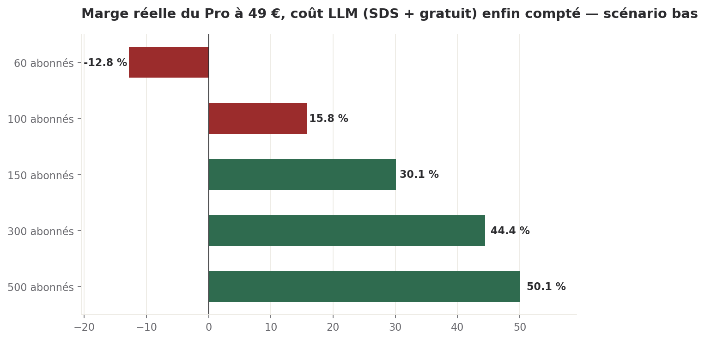
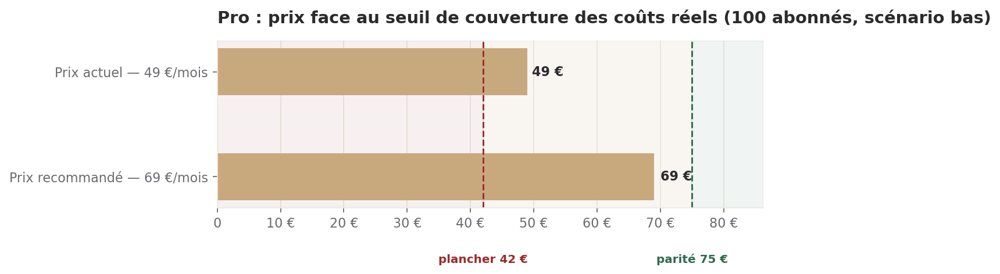

# Contre-proposition tarifaire — l'offre complète de Digital·Humans

> Directeur Commercial · 09/08/2026 · Commandé par Sam : « à combien faudrait-il mettre le prix du
> Pro pour couvrir les frais du Free et avoir une marge acceptable ? », avec carte blanche pour
> revoir l'offre complète à titre d'exercice.
> **Statut : proposition. Aucun prix ci-dessous n'existe dans l'offre canonique. DH-CRO-002
> s'applique — Sam tranche, je propose.**

## Ce qu'il faut retenir

1. **Le Pro à 49 €/mois ne couvre pas ses coûts réels, et personne ne le savait** : l'étude du 08/08
   qui a établi sa marge de 10,1 % ne comptait **aucun coût de jetons LLM** — ni pour les 2 SDS/mois
   inclus, ni pour le tier Free. Une fois ce coût ajouté à partir de données réelles, la marge à
   60 abonnés devient **négative (-12,8 % à -134,7 % selon le scénario)**, pas positive.
2. **Deux réglages contradictoires existent dans le code aujourd'hui**, non arbitrés : le tier Free
   tourne-t-il sur Haiku (comme le dit `subscription.py`) ou sur Sonnet (comme le dit
   `llm_routing.yaml`) ? Et le downgrade Pro qui réserve Opus au seul Marcus est **écrit mais pas
   branché** — toutes les exécutions réelles à ce jour, y compris celles qui fondent mon chiffrage,
   tournent en Opus complet, non filtré par palier.
3. **Je recommande de porter le Pro à 69 €/mois** — ce prix couvre les coûts réels dans le scénario
   bas dès 100 abonnés (marge ≈ 33 %) et ramène la marge à 60 abonnés de -12,8 % à +17,0 %. Il ne
   suffit pas dans le scénario haut : si les deux points du §2 restent non résolus, aucun prix
   raisonnable ne sauve le Pro.
4. **Le vrai levier n'est pas seulement le prix, c'est l'ingénierie** : faire aboutir le downgrade
   Pro déjà écrit dans `llm_routing.yaml` et trancher Free sur Haiku (3 à 5 fois moins cher que
   Sonnet) pèsent plus sur la marge que n'importe quel ajustement de prix dans la fourchette
   raisonnable pour ce tier.
5. **C'est le bon moment pour changer** : zéro client signé, donc zéro grand-père tarifaire à gérer.
   Une fois les premiers abonnés Pro entrés en septembre, changer de prix ou de modèle de routage
   devient un sujet de rétention, pas un sujet de calcul.

---

## Méthode, et ce qui est réel contre ce qui est hypothèse

Trois sources, distinguées partout :

- **Vérifié en base ou dans le code** — requête ou chemin de fichier cité.
- **Trouvé publiquement, daté et sourcé** — URL citée.
- **Hypothèse** — écrite comme telle, avec ce qui la fonderait ou la démentirait.

Le compteur déterministe de jetons n'existe pas : je travaille par fourchette basse/haute partout où
un chiffre dépend d'un comportement non instrumenté (le chat Free notamment). Là où j'ai une donnée
réelle — les exécutions SDS complètes en base — je pars d'elle plutôt que d'une estimation à l'aveugle,
et je le montre.

---

## 1. Le coût réel du gratuit

### 1.1 Ce que le tier Free fait, et sur quel modèle — la contradiction trouvée dans le code

`config/offre_dh.md` et `subscription.py` (backend, docstring vérifiée) : Free = Sophie + Olivia en
chat uniquement, pas d'upload, pas de mémoire persistante, pas de livrable. Jusqu'ici, cohérent.

**Sur le modèle, le code se contredit lui-même** :

| Source | Modèle affecté au tier Free |
|---|---|
| `backend/app/models/subscription.py` (TIER_FEATURES, validé Sam 26+29 avril 2026) | `llm_haiku: True, llm_sonnet: False, llm_opus: False` — **Haiku uniquement** |
| `backend/config/llm_routing.yaml` (`tier_overrides.free`, commentaire daté du 8 juin) | « Sophie/Olivia en Sonnet : **jamais Opus, jamais Haiku** » |

Les deux fichiers sont réels, tous deux lus par le routeur applicatif, et ils s'excluent mutuellement.
Le commentaire du 8 juin est postérieur à la validation d'avril, ce qui suggère qu'il l'emporte dans
l'intention — mais `subscription.py` n'a pas été corrigé en conséquence. **Je ne tranche pas lequel
est « le vrai » : je chiffre les deux bornes**, parce que l'écart de coût entre Haiku et Sonnet est
de 3 à 5 fois (barème ci-dessous) et que la question n'est pas cosmétique.

### 1.2 Le barème réel des jetons (source : `llm_routing.yaml`, prix Anthropic vérifiés 18-25/04/2026)

| Modèle | Entrée / 1M jetons | Sortie / 1M jetons |
|---|---:|---:|
| Claude Haiku 4.5 | 1,0 $ | 5,0 $ |
| Claude Sonnet 5 | 3,0 $ | 15,0 $ |
| Claude Opus 5 | 5,0 $ | 25,0 $ |

### 1.3 Le coût d'une conversation gratuite — construit sur l'architecture réelle, pas une estimation en l'air

Aucune conversation Free (Sophie+Olivia, in-app) n'est encore instrumentée séparément. La
`sophie_concierge_service.py` — le widget public du site, architecture la plus proche connue —
donne trois faits réels directement transposables :

- **`HISTORY_TURNS_MAX = 20`** — plafond dur, redirige vers un email au-delà. Coïncide avec le
  « borné à 10-20 échanges » de la mission : je retiens 10 (bas) et 20 (haut) comme bornes du nombre
  d'échanges.
- **`max_tokens: 500`** par tour (mode `concierge`, `sophie_pm.yaml`) — plafond de sortie réel.
- **Aucun cache de prompt nulle part dans le code backend** (`grep cache_control` : zéro résultat
  hors SDK). `_render_history()` renvoie l'historique complet à chaque tour. **Chaque tour paie donc
  l'intégralité de la conversation précédente en entrée, pas seulement le delta.**

Bloc système mesuré directement sur `sophie_pm.yaml` (mode `concierge`, une seule persona) :
1 832 caractères de `system_prompt` + 1 690 caractères de gabarit de prompt statique = 3 522
caractères ≈ **880 jetons par tour**, avant tout historique. *Hypothèse* pour le Free in-app : deux
personas (Sophie **et** Olivia) chargées ensemble ≈ **1 800 jetons** de socle fixe par tour — je
double la mesure réelle faute de fichier de prompt Free dédié à lire.

Avec un message visiteur moyen ≈ 40 jetons et une réponse moyenne ≈ 300 jetons (sous le plafond
mesuré de 500) :

| Bornes | Haiku (basse) | Sonnet (haute) |
|---|---:|---:|
| 10 échanges | 0,045 € | 0,136 € |
| 20 échanges | 0,122 € | 0,367 € |

*Hypothèse* de fréquence, faute de donnée d'usage réelle sur ce parcours non encore mesuré : 2
sessions/mois par utilisateur Free actif. Cela donne un **coût par utilisateur Free et par mois de
0,09 € (bas) à 0,73 € (haut)**.

### 1.4 L'hypothèse qui commande tout : combien d'utilisateurs gratuits par abonné Pro

Aucune donnée interne (le Free n'a pas de compteur de conversion aujourd'hui). Je m'appuie sur le
repère de marché du skill `pricing-strategist` (`saas_pricing_canon.md`, ligne 85) : **« freemium
converts 2-5% on average »**. Un taux de conversion de 2 % à 5 % implique **19 à 49 utilisateurs
Free soutenus par abonné Pro payant** — c'est la charge que le Pro doit couvrir s'il subventionne le
Free, ce qui est le cadrage même de la question de Sam.

**Coût Free alloué par abonné Pro et par an : 20,52 € (bas) à 429,24 € (haut).** L'écart est large
parce qu'il combine deux incertitudes indépendantes (modèle et taux de conversion) — je le garde
ouvert plutôt que de le resserrer artificiellement.

---

## 2. Le coût réel du Pro

### 2.1 Ce que dit le code sur le routage Pro — et ce qui n'est pas branché

`llm_routing.yaml`, `profiles.cloud.tier_overrides.pro` (décision actée 29 avril 2026, commentaire en
clair) : pour le tier Pro, Sophie/Olivia/Emma passent en Sonnet, **Marcus reste en Opus** — vitrine
technique du SDS, « 56 % du coût SDS à lui seul » selon le commentaire du fichier.

**Mais** : ce même fichier précise que les tier_overrides « seront branchés en Phase 3 backend, en
même temps que le wiring Stripe + propagation tier user → request » — **pas encore fait**. Vérifié :
aucune exécution actuellement en base ne porte de `subscription_tier`. Toutes tournent sur le profil
`cloud` par défaut, où **tous** les orchestrateurs (Sophie, Olivia, Marcus, Emma) sont en Opus, pas
seulement Marcus.

Conséquence directe pour ce chiffrage : **les données réelles dont je dispose reflètent le coût
d'AVANT le downgrade Pro, pas le coût réel du Pro une fois le palier appliqué.** C'est une deuxième
fourchette naturelle, indépendante de celle du Free.

### 2.2 Le coût réel d'un SDS complet — donnée mesurée, pas devinée

`v_deos_executions` (lecture seule, DEOS_RO_DSN), exécutions `status='COMPLETED'` et
`last_completed_phase` ∈ {`sds`, `phase6_export`} — un SDS de bout en bout, 18 exécutions réelles :

| Mesure | Valeur |
|---|---:|
| Jetons totaux — médiane | 579 714 |
| Jetons totaux — moyenne | 642 853 |
| Jetons totaux — min / max | 171 585 / 1 169 276 |

6 de ces 18 exécutions portent un `total_cost` réel non nul (calculé par `budget_service.py` au
barème en vigueur) : **5,87 € · 6,49 € · 8,86 € · 9,75 € · 12,20 € · 21,79 €** — médiane ≈ 9,3 €.
Une 7ᵉ exécution affiche 29,83 € pour un volume de jetons pourtant modéré (267 796) et une durée
anormalement courte (401 s) : signalée comme anomalie (probablement une boucle de reprise coûteuse),
exclue de la fourchette centrale mais gardée en annexe. **12 exécutions sur 18 portent un coût à
zéro** — non gratuites, simplement non tracées à l'époque : un manque de donnée, pas un fait à zéro.

Le taux implicite (coût / jetons totaux) des 6 valeurs propres tombe entre 7,7 $/M et 19,0 $/M —
cohérent avec un mix pondéré 56 % Opus / 44 % Sonnet (≈ 18 $/M attendu), ce qui confirme
indépendamment le chiffre du commentaire `llm_routing.yaml` cité en §2.1.

### 2.3 L'ajustement pour le jour où le downgrade sera branché

En croisant `v_deos_sections` (longueur de contenu produit par type de livrable, proxy du volume de
sortie) avec l'attribution par agent (préfixe `architect_*` = Marcus, `research_analyst_*` = Emma,
`pm_*` = Sophie, `business_analyst_*`/`ba_*` = Olivia), la répartition réelle du volume de sortie sur
32,2 M caractères cumulés est : **Emma 37,7 % · Marcus 29,8 % · workers 27,2 % · Sophie 3,4 % ·
Olivia 1,9 %**. En repondérant le coût de sortie pour ne garder Marcus en Opus (Sophie/Olivia/Emma
repassant en Sonnet, les workers restant en Sonnet dans les deux cas), le coût total attendu tombe à
**≈ 80,7 %** du coût actuel non filtré.

**Fourchette retenue pour un SDS sous le régime Pro réellement configuré (une fois le downgrade
branché) : 4,74 € (basse) à 17,58 € (haute)**, contre 5,87–21,79 € aujourd'hui (régime non filtré).

### 2.4 Ce que ça change à 2 SDS/mois inclus

2 SDS/mois/abonné × 12 = 24 SDS/an/abonné. Au niveau bas (4,74 €), 113,76 €/an/abonné. Au niveau haut
(17,58 €), 421,92 €/an/abonné — **avant tout autre coût**. C'est déjà, à lui seul, l'équivalent de 2
à 9 mois du prix actuel du Pro (49 €×12 = 588 €/an).

---

## 3. Le prix qui tient

### 3.1 Le point que l'étude du 08/08 avait manqué — vérifié sur son propre fichier d'entrée

`tmp/ch_pro.json`, l'entrée réelle qui a produit la marge de 10,1 % du 08/08 : `marketing_attribution
24000`, `support_attribution 3000`, `tooling_attribution 1200`. **Aucune ligne pour le coût de calcul
des SDS ni pour le Free.** Le script `cost_to_serve_calculator.py` lui-même n'a pas de case dédiée à
ça dans ses `DIRECT_COST_KEYS` — j'ai donc glissé mon estimation dans `tooling_attribution`, la case
la plus proche, et je le signale explicitement pour que la comparabilité avec Team/DEOS (§4) reste
sous réserve du même angle mort probable.

### 3.2 La marge corrigée, recalculée avec le même script, même méthode d'imputation (10 % de frais généraux)

| Abonnés | Marge annoncée le 08/08 | Marge corrigée — scénario bas | Marge corrigée — scénario haut |
|---:|---:|---:|---:|
| 60 | 10,1 % | **-12,8 %** | **-134,7 %** |
| 100 | 42,0 % | **15,8 %** | **-106,1 %** |
| 150 | 58,0 % | **30,1 %** | **-91,8 %** |
| 300 | 74,0 % | **44,4 %** | **-77,5 %** |
| 500 | 80,4 % | **50,1 %** | **-71,8 %** |

*Scénario bas = downgrade Pro branché (§2.3) + Free sur Haiku + conversion 5 % (19 free/Pro).
Scénario haut = downgrade non branché (régime actuel réel) + Free sur Sonnet + conversion 2 %
(49 free/Pro).*



*Lecture : la courbe « marge qui s'améliore avec l'échelle » de l'étude du 08/08 reste vraie — le
coût marketing fixe (24 000 €) se dilue toujours avec le nombre d'abonnés — mais le plafond est
nettement plus bas qu'annoncé, parce qu'une partie importante du coût (les jetons) est **variable**
et grossit aussi vite que le chiffre d'affaires, contrairement au coût marketing.*

**Le scénario haut ne se rattrape à aucune échelle.** Si le downgrade Pro n'est jamais branché et si
Free reste sur Sonnet avec une conversion à 2 %, aucun volume d'abonnés ne rend le Pro rentable au
prix actuel ni à un prix raisonnable pour ce tier — le problème n'est alors plus tarifaire, il est
produit et ingénierie.

### 3.3 Le prix recommandé, et pourquoi

Au seuil de 100 abonnés (proche de l'objectif visible dans `okr_h2`), scénario bas :

- **Seuil de couverture (marge nulle) : ≈ 42 €/mois.**
- **Prix pour une marge de 40 % : ≈ 75 €/mois.**
- **Prix pour une marge de 30 % : ≈ 61 €/mois.**



**Je recommande 69 €/mois.** Justification en trois points :
1. Il ramène la marge à 60 abonnés de -12,8 % à **+17,0 %** — le Pro cesse de détruire de la valeur
   dès le premier palier d'abonnés, pas seulement à grande échelle.
2. Il atteint **≈ 33 % de marge à 100 abonnés**, proche de l'objectif de marge de 30-40 % usuel pour
   un tier d'entrée SaaS.
3. Il reste un prix d'entrée déclamable — 69 € contre 49 € est une hausse de 41 %, pas un
   doublement, ce qui laisse le Pro lisible face à Team (1 490 €, facteur ×21,6 au lieu de ×30,4).

**Ce prix ne suffit pas dans le scénario haut.** À 69 €/mois et 100 abonnés en scénario haut, la
marge reste largement négative (le coût direct dépasse déjà la recette). Dans ce cas, le vrai levier
n'est pas le prix — il est dans les deux réserves d'ingénierie du §1.1 et du §2.1, qui pèsent plus
lourd sur la marge que tout ajustement de prix resterait raisonnable pour ce tier.

### 3.4 Ce qui rend 69 € acceptable pour un acheteur

Le Pro reste, à 69 €, sous tous les repères de marché déjà cités au 08/08 pour DEOS (bien plus haut
en gamme) et cohérent avec l'ancrage d'un outil de production documentaire à SDS inclus plutôt qu'un
simple chat IA. La hausse se justifie en面 client par ce qui change réellement : mémoire persistante,
upload, et un livrable structuré (SDS) — pas par une explication de coût interne, qu'on ne montre
jamais au client (`sophie_pm.yaml` l'interdit explicitement : « NE FAIS JAMAIS APPARAÎTRE nos coûts,
nos marges »).

---

## 4. L'offre complète revue

### 4.1 Le gratuit — borné, pas illimité dans le temps

Aujourd'hui Free n'a pas de limite calendaire, seulement une limite de tour (20, non appliquée
uniformément selon la réserve du §1.1). Avec un coût par utilisateur de 0,09 à 0,73 €/mois et un
volume potentiellement grand (19 à 49 fois le nombre d'abonnés payants), **je recommande un Free
borné dans le temps** (ex. 14 jours ou un nombre de conversations cumulé, pas juste 20 tours par
session) plutôt qu'un accès permanent — la vitrine et la qualification n'ont pas besoin de
permanence, seulement d'une première impression complète. Ce changement ne coûte rien à décider
aujourd'hui ; il coûterait une communication de restriction après coup.

### 4.2 Un ou deux niveaux d'entrée ?

Compte tenu de l'écart entre le coût observé d'un SDS (4,74 à 21,79 € selon le scénario) et un usage
« 2 SDS/mois » qui peut aussi bien coûter 9,5 € que 43,6 €/mois selon le projet, **je recommande de
garder un seul point d'entrée payant (Pro)** mais de **remplacer l'inclusion forfaitaire de 2 SDS par
un système de crédits** (voir §4.5) plutôt que d'ajouter un second niveau Free/Pro — la variance vient
du projet, pas du profil d'utilisateur, un second niveau ne la résorberait pas.

### 4.3 Team à 1 490 € — probablement aussi sous-compté, mais moins fragile

Le même angle mort (aucune ligne de coût LLM dans `tmp/ch_team.json`) existe pour Team. Je ne l'ai
pas quantifié ici — hors du périmètre demandé — mais je le signale : Team fait tourner la même chaîne
d'agents, plus le BUILD (Apex/LWC/Admin), donc un coût de jetons probablement supérieur en absolu à
celui du Pro. La différence structurelle qui protège Team : son prix (1 490 €) est 30 fois celui du
Pro, ce qui absorbe une variance de coût bien plus grande avant de menacer la marge. **Réserve, pas
un fait chiffré — à instruire si Sam le demande.**

### 4.4 Le palier manquant entre Pro et Team

L'écart Pro(69€)–Team(1490€) est un facteur ×21,6 — large. Signal en faveur d'un palier
intermédiaire : le Pro plafonne à 2 SDS/mois, ce qui exclut d'emblée un consultant indépendant ou une
petite ESN qui en produirait 5 à 10/mois sans avoir besoin du BUILD de Team. *Hypothèse, non
chiffrée ici, faute de mandat explicite* : un palier « Studio » autour de 200-400 €/mois, 5-8 SDS
inclus, toujours sans BUILD — à dimensionner si Sam veut l'instruire.

### 4.5 Abonnement ou usage ?

**Je recommande un modèle hybride : abonnement de base + crédits SDS**, pas un forfait « 2 inclus »
figé. Raison directement tirée de la donnée du §2.2 : la variance réelle observée sur le coût d'un
SDS (171 585 à 1 169 276 jetons, un facteur ×6,8) est trop large pour qu'un forfait fixe soit honnête
dans les deux sens — soit le prix couvre le pire cas et surfacture les projets simples, soit il
couvre la moyenne et perd de l'argent sur les projets complexes. Un système de crédits (1 SDS ≈
1 crédit, crédits additionnels au tarif réel + marge) répercute la variance sur celui qui la crée. Ce
n'est chiffrable proprement qu'une fois le compteur déterministe de jetons construit — en attendant,
le forfait actuel est un pari sur une moyenne que la plateforme ne mesure pas encore fiablement (12
exécutions sur 18 sans coût tracé, §2.2).

### 4.6 DEOS — reste à part

Confirmé par les deux études précédentes (08/08 §4.1, 09/08 installé) et rien ici ne le change :
acheteur différent (DSI vs dirigeant de PME), échelle de prix différente (×5 à ×500 sur le prix),
cycle de vente différent (180 jours contre 7). DEOS SaaS et DEOS installé sont deux modes de livraison
d'une même offre à part, pas des niveaux de la grille Pro/Team/Enterprise.

---

## 5. La migration

**Zéro client signé aujourd'hui — c'est le meilleur moment pour changer, et Sam a raison de le dire
avant le lancement.** Trois choses deviennent nettement plus coûteuses après les premiers abonnés :

1. **Changer de prix.** Avant client : un fichier à corriger. Après : soit on augmente pour tous
   (irritant, risque de churn immédiat sur une base qui vient d'arriver), soit on grand-père les
   premiers (dette de gestion permanente, deux prix à maintenir indéfiniment).
2. **Trancher la contradiction Free (§1.1) et brancher le downgrade Pro (§2.1).** Avant client : un
   changement de configuration invisible. Après : un changement de modèle perçu par un abonné actif
   comme une dégradation de service, même s'il ne le remarque jamais techniquement — le risque de
   perception existe dès qu'il y a quelqu'un pour le remarquer.
3. **Passer du forfait « 2 SDS inclus » à un système de crédits (§4.5).** Avant client : une
   définition de produit. Après : un retrait perçu de fonctionnalité, quel que soit l'argument
   économique.

Aucune de ces trois choses n'est urgente pour la démonstration Crédit Logement (DEOS, périmètre
disjoint) — mais toutes les trois sont urgentes pour le lancement Pro de septembre, et moins chères à
faire maintenant qu'après.

---

## Réserves

- **Le chat Free in-app n'est pas instrumenté.** Le modèle du §1.3 s'appuie sur l'architecture du
  widget public (`sophie_concierge_service.py`) comme analogie la plus proche, pas sur une mesure du
  parcours réel — je le dis explicitement à chaque usage de ce chiffre.
- **La contradiction Haiku/Sonnet sur Free (§1.1) et le non-branchement du downgrade Pro (§2.1) sont
  vérifiés dans le code au 09/08, mais je ne sais pas depuis quand ni si un correctif est déjà en
  cours côté Delivery.** Question posée ci-dessous.
- **12 exécutions SDS réelles sur 18 n'ont pas de coût tracé** (`total_cost = 0`, §2.2) : la
  fourchette du §2.2 repose sur 6 valeurs seulement, plus une anomalie exclue. C'est peu pour une
  moyenne, mais c'est strictement plus que zéro donnée — ce que j'avais au 08/08.
- **L'hypothèse de fréquence des sessions Free (2/mois, §1.3) et l'hypothèse de conversion freemium
  (2-5 %, §1.4) sont les deux plus grandes sources d'incertitude de tout ce document.** Elles se
  combinent multiplicativement : c'est pour ça que la fourchette du Free va de 20 € à 429 € par
  abonné Pro et par an, pas un chiffre unique.
- **Team et Enterprise n'ont pas reçu le même traitement (§4.3)** : je signale l'angle mort, je ne le
  chiffre pas — hors périmètre de la question posée le 09/08.
- **Aucune donnée de consentement à payer** pour 69 €/mois côté Pro — comme pour DEOS au 08/08, ce
  prix est construit par le coût et la comparaison, pas mesuré sur un prospect réel.

---

## Ce que je fais ensuite, sans attendre personne

1. Je mets à jour le brouillon de page pricing (déjà en préparation) avec la fourchette 42-75 €
   plutôt qu'un chiffre unique, pour que la discussion avec Sam parte d'un intervalle documenté.
2. Je documente le principe de crédits SDS (§4.5) comme direction produit dans le brouillon de
   proposition Pro, sans le chiffrer davantage tant que Sam n'a pas tranché sur le principe.

## Ce que je demande, et à qui

**Au Directeur Delivery** — deux questions techniques précises, pas un arbitrage :
1. Le downgrade Pro de `llm_routing.yaml` (§2.1) est-il planifié pour septembre, ou faut-il compter
   sans lui au lancement ? C'est la variable qui détermine si le scénario bas ou haut du §3.2 sera la
   réalité.
2. La contradiction Haiku/Sonnet sur Free (§1.1) — lequel des deux fichiers reflète l'intention
   actuelle ? Question de fait sur le code, pas de goût.

**À Sam** — la décision de prix elle-même (DH-CRO-002) : 69 €/mois comme proposition centrale, avec
la réserve explicite que ce chiffre suppose que les deux points ci-dessus se résolvent dans le sens
du scénario bas. Coût de l'attente : chaque semaine sans réponse sur le downgrade Pro est une semaine
où, si le lancement de septembre arrivait tel quel, le Pro perdrait de l'argent dès le premier
abonné.

---

## Annexes

### Données machine-lisibles

```json
{
  "type": "EtudePricing",
  "agent": "commercial",
  "date": "2026-08-09",
  "objet": "Contre-proposition tarifaire sur l'offre complete Digital.Humans",
  "declencheur": "Question de Sam le 09/08 : prix du Pro pour couvrir le Free + marge acceptable, exercice sur l'offre complete",
  "constats_code_verifies": {
    "contradiction_free_modele": {
      "subscription_py": "llm_haiku true, llm_sonnet false, llm_opus false (valide 26+29 avril 2026)",
      "llm_routing_yaml": "tier_overrides.free.orchestrator_default = anthropic/claude-sonnet, jamais haiku, jamais opus (commentaire date 8 juin)",
      "statut": "contradiction non resolue au 09/08"
    },
    "downgrade_pro_non_branche": {
      "constat": "tier_overrides ecrits dans llm_routing.yaml mais non appliques (subscription_tier jamais propage dans LLMRequest a ce jour)",
      "consequence": "toutes les executions reelles actuelles tournent en Opus complet (Sophie+Olivia+Marcus+Emma), pas seulement Marcus"
    },
    "cout_pro_08_08_omis": {
      "fichier": "tmp/ch_pro.json",
      "constat": "aucune ligne de cout LLM/calcul dans les couts directs du canal Pro utilise le 08/08"
    }
  },
  "cout_sds_reel": {
    "source": "v_deos_executions, 18 executions COMPLETED, last_completed_phase in (sds, phase6_export)",
    "jetons_mediane": 579714,
    "jetons_moyenne": 642853,
    "jetons_min_max": [171585, 1169276],
    "couts_reels_non_nuls_eur": [5.87, 6.49, 8.86, 9.75, 12.20, 21.79],
    "anomalie_exclue_eur": 29.83,
    "executions_sans_cout_trace": 12,
    "fourchette_ajustee_post_downgrade_eur": [4.74, 17.58]
  },
  "cout_free_par_utilisateur_mois_eur": {
    "haiku_10_echanges": 0.045,
    "haiku_20_echanges": 0.122,
    "sonnet_10_echanges": 0.136,
    "sonnet_20_echanges": 0.367,
    "hypothese_sessions_par_mois": 2,
    "fourchette_retenue": [0.09, 0.73]
  },
  "conversion_freemium_pct": [2, 5],
  "free_users_par_pro_abonne": [19, 49],
  "marge_corrigee_pct": {
    "60_abonnes": [-12.8, -134.7],
    "100_abonnes": [15.8, -106.1],
    "150_abonnes": [30.1, -91.8],
    "300_abonnes": [44.4, -77.5],
    "500_abonnes": [50.1, -71.8]
  },
  "prix_recommande_eur_mois": 69,
  "prix_actuel_eur_mois": 49,
  "seuil_couverture_100_abonnes_bas_eur": 42,
  "prix_marge_40pct_100_abonnes_bas_eur": 75,
  "escalades": [
    "Directeur Delivery : statut du downgrade Pro (llm_routing.yaml tier_overrides) pour septembre",
    "Directeur Delivery : quel fichier fait foi entre subscription.py et llm_routing.yaml pour le modele Free",
    "Sam : arbitrage du prix Pro (DH-CRO-002)"
  ]
}
```

### Sorties brutes — `cost_to_serve_calculator.py`, scénarios bas/haut par palier d'abonnés

Entrées et sorties conservées dans `/tmp/pro_*_BASSE.json` et `/tmp/pro_*_HAUTE.json` (10 fichiers,
un par combinaison palier × scénario). Méthode d'imputation identique à celle du 08/08 : overhead
10 % de la recette, `marketing_attribution` fixe à 24 000 €, `support_attribution` à 50 €/abonné/an,
`tooling_attribution` = 1 200 € (base, inchangée du 08/08) + coût SDS annuel (24 × coût unitaire ×
abonnés) + subvention Free annuelle allouée (coût par utilisateur Free × ratio free/Pro × abonnés).

| Abonnés | Scénario | Coût chargé total | Marge réelle |
|---:|---|---:|---:|
| 60 | Basse | 39 785 € | -12,8 % |
| 60 | Haute | 82 798 € | -134,7 % |
| 100 | Basse | 49 508 € | 15,8 % |
| 100 | Haute | 121 196 € | -106,1 % |
| 150 | Basse | 61 662 € | 30,1 % |
| 150 | Haute | 169 194 € | -91,8 % |
| 300 | Basse | 98 124 € | 44,4 % |
| 300 | Haute | 313 188 € | -77,5 % |
| 500 | Basse | 146 740 € | 50,1 % |
| 500 | Haute | 505 180 € | -71,8 % |

### Répartition réelle du volume de sortie par agent sur un SDS (source : `v_deos_sections`)

| Agent | Part du volume de sortie (caractères cumulés) |
|---|---:|
| Emma (research_analyst) | 37,7 % |
| Marcus (architect) | 29,8 % |
| Workers (apex/lwc/admin/qa/data/devops/trainer/system) | 27,2 % |
| Sophie (pm) | 3,4 % |
| Olivia (business_analyst/ba) | 1,9 % |

### Sources

**Vérification interne du 09/08/2026** :
- `backend/app/models/subscription.py` (TIER_FEATURES, lecture intégrale)
- `backend/config/llm_routing.yaml` (profils, tier_overrides, barème de prix, lecture intégrale)
- `backend/app/services/sophie_concierge_service.py` et `backend/prompts/agents/sophie_pm.yaml`
  (mode `concierge`, mesure directe des tailles de prompt)
- `backend/app/utils/feature_access.py` (contrôle d'accès par tier)
- `psql "$DEOS_RO_DSN"` — `v_deos_executions`, `v_deos_sections` (18 exécutions SDS réelles, 33
  types de livrables)
- `tmp/ch_pro.json`, `tmp/ch_team.json`, `tmp/mix_pro.json` (entrées réelles de l'étude du 08/08)
- `grep -ri cache_control backend/app` (aucune occurrence — absence de cache de prompt confirmée)

**Sources publiques** :
- `.claude/skills/pricing-strategist/references/saas_pricing_canon.md` — benchmark de conversion
  freemium (2-5 %)

**Documents internes complétés** :
- `config/commercial/deos_grands_comptes_2026-08-08.md` (étude de référence, marges non corrigées
  du 08/08)
- `config/commercial/deos_installe_2026-08-09.md` (complément DEOS installé)
