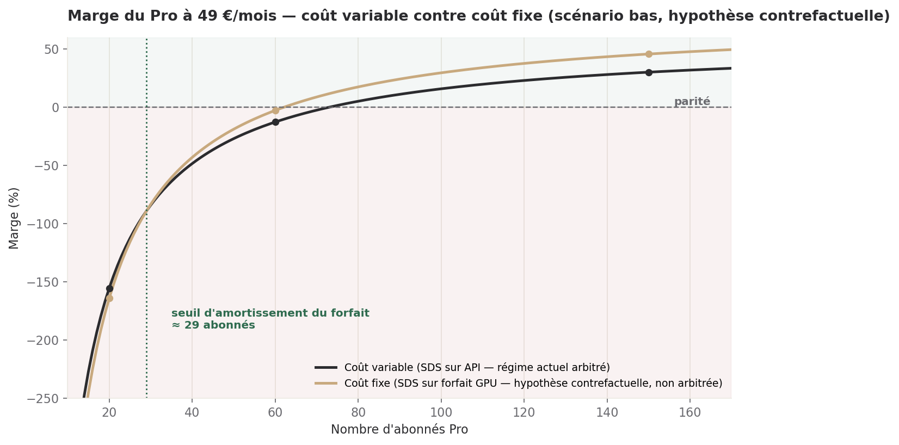

# Complément — le forfait GPU ne change pas le prix du Pro

> Directeur Commercial · 09/08/2026, fin d'après-midi · Complément à la revue tarifaire du
> 09/08 10h58 (`offre_revue_2026-08-09.md`), suite à la mission sur le forfait Packet.ai.
> **Statut : constat + hypothèse chiffrée. Aucune décision de prix à prendre ici — celle du
> matin (69 €/mois) n'est pas remise en cause.**

## Ce qu'il faut retenir

1. **Le forfait GPU ne touche pas le moteur de coût du Pro.** L'arbitrage transmis avec cette
   mission (point 3) maintient Sophie, Olivia, Emma et Marcus sur API — ce sont exactement les
   quatre agents qui produisent le SDS du Pro. Le coût que j'ai chiffré ce matin reste donc
   entièrement variable ; rien à corriger dans la marge ni dans le prix recommandé.
2. **Ce qui devient fixe, c'est le budget du comité (358 $/mois), pas le coût de service du Pro.**
   Ce sont deux lignes budgétaires différentes, portées par des agents différents, sur des
   infrastructures différentes.
3. **J'ai quand même fait le calcul demandé, en hypothèse contrefactuelle** : si un jour le SDS
   du Pro basculait en local, le forfait s'amortirait face au seul coût SDS variable à partir
   d'environ **29 abonnés** — mais la marge totale à 60 abonnés resterait proche de zéro
   (-2,8 % contre -12,8 % en variable), le poste marketing fixe dominant encore à cette échelle.
4. **Le gratuit ne devient pas un actif.** Sophie et Olivia, qui portent le chat Free, sont
   elles aussi maintenues sur API par le même arbitrage. Le coût marginal d'un utilisateur
   gratuit ne tend pas vers zéro : il reste celui calculé ce matin (0,09 à 0,73 €/mois).
5. **Le seul seuil de bascule réel aujourd'hui est celui du comité**, pas celui du Pro : 299 $
   contre 358 $/mois, une décision qui n'est pas la mienne à trancher.

---

## 1. Pourquoi le calcul demandé ne s'applique pas tel quel

La mission liste, au point 3, qui reste sur API et qui peut basculer :

| Reste sur API (données client) | Peut basculer (métadonnées ou pas de donnée client) |
|---|---|
| Sophie, Olivia, Emma, Marcus, Jordan, Aisha | Le comité entier, Lucas, Diego, Raj, Zara, Elena |

Le Pro, dans l'offre canonique (`config/offre_dh.md`) : *« Équipe complète + upload + mémoire.
Livrable = SDS. »* L'« équipe complète » du Pro, c'est précisément Sophie (PM), Olivia (BA),
Emma (recherche) et Marcus (architecte) — les quatre noms de la colonne de gauche. Le Free,
c'est Sophie + Olivia en chat (`config/offre_dh.md`) — deux noms de la même colonne.

**Le forfait GPU à 299 $/mois s'applique au comité de direction (ce dispositif-ci, celui qui
écrit ce document), à Lucas, et — sous réserve de l'avis juridique déjà rendu — à Diego, Raj,
Zara, Elena.** Aucun de ces six agents ne produit le SDS facturé au Pro. Le forfait ne réduit
donc aucune des lignes de coût que j'ai chiffrées ce matin (§2 et §3 de la revue de 10h58).

Je ne recalcule donc pas la marge du Pro « en coût fixe » comme un fait : ce serait affirmer un
changement de coût qui ne se produit pas dans le régime arbitré aujourd'hui. Je fais le calcul
en hypothèse déclarée — utile si l'arbitrage venait à changer, ou pour éclairer le Directeur
Delivery sur ce que vaudrait une telle bascule côté produit — sans le confondre avec un fait.

---

## 2. Le calcul contrefactuel : si le SDS du Pro basculait en local

*Hypothèse de départ, non arbitrée : Sophie/Olivia/Emma/Marcus tournent sur le forfait GPU au
lieu de l'API, pour la seule génération de SDS. Hypothèse de taux de change (aucune source
interne) : 1 $ ≈ 0,92 €, donc 299 $/mois ≈ 275 €/mois.*

Je remplace, dans le modèle de coût de la revue de 10h58 (`cost_to_serve_calculator.py`,
scénario bas), la seule ligne SDS variable (113,76 €/abonné/an) par une ligne fixe de
3 300 €/an (275 €×12), partagée par tous les abonnés. Tout le reste — marketing fixe (24 000 €),
support (50 €/abonné/an), tooling (1 200 €), subvention Free (20,52 €/abonné/an, toujours
variable, voir §3) — est inchangé.

| Abonnés | Marge — coût variable (matin, bas) | Marge — coût fixe (hypothèse contrefactuelle) | Écart |
|---:|---:|---:|---:|
| 20 | -155,6 % | -164,3 % | -8,7 pts |
| 60 | -12,8 % | -2,8 % | +10,0 pts |
| 150 | 30,1 % | 45,7 % | +15,6 pts |

*Lecture : à 20 abonnés, le forfait fixe coûte plus cher que le variable — il n'est pas encore
amorti (seuil ≈ 29 abonnés pour la seule ligne SDS). Au-delà, il devient progressivement
avantageux, mais la marge totale reste dominée par le coût marketing fixe (24 000 €) jusqu'à un
volume d'abonnés à trois chiffres : le forfait GPU améliore la pente, il ne rend pas le Pro
rentable à lui seul en dessous de ~75 abonnés.*

Dans le scénario haut (downgrade non branché, Free sur Sonnet), le même remplacement améliore la
marge de +62 à +68 points selon l'échelle, mais elle reste négative aux trois paliers demandés :
le forfait fixe ne rattrape jamais, seul, un scénario où le reste de l'ingénierie (§1.1 et §2.1
de la revue de 10h58) n'a pas été corrigé.

---

## 3. Le prix du Pro : confirmé, pas révisé

Le prix recommandé ce matin — **69 €/mois** — repose sur le coût variable réel du SDS, qui reste
le régime arbitré. Rien dans ce complément ne le change. La fourchette de marché citée dans la
mission (79-149 $ en micro-SaaS, source `dh-references-marche`) reste, comme ce matin, une
donnée qui *situe* la décision sans la dicter : 69 € reste sous ce plancher, ce qui laisse de la
marge de manœuvre si le scénario bas ne se confirme pas entièrement.

Le point 5 de la mission (retirer toute référence à ISO 42001 du positionnement) ne demande
aucune correction de ma part : la revue de 10h58 justifiait déjà 69 € par la mémoire persistante,
l'upload et le SDS livré — jamais par une case de conformité.

---

## 4. Le gratuit : pas d'actif, même hypothèse contrefactuelle

Le point 3 de la mission demande si le coût marginal d'un Free devient nul. Réponse : **non**,
et pour la même raison qu'au §1 — Sophie et Olivia, qui portent le chat Free, restent sur API
dans l'arbitrage transmis. Même en poussant l'hypothèse contrefactuelle jusqu'au bout (Sophie et
Olivia elles aussi en local), le chat Free reste à faible volume par échange (500 jetons max,
`sophie_pm.yaml`) mais à fréquence potentiellement élevée (19 à 49 gratuits par Pro payant,
§1.4 de la revue de 10h58) — un forfait GPU partagé avec le SDS du Pro n'est pas dimensionné pour
ça sans mesure de charge, qui n'existe pas aujourd'hui. Je ne transforme pas une hypothèse non
mesurée en actif : le gratuit reste un coût, borné comme recommandé ce matin (§4.1 de la revue).

---

## 5. Le seul seuil de bascule réel : celui du comité, pas le mien à trancher

299 $/mois pour le forfait contre 358 $/mois au rythme actuel du comité (`bin/couts.py`,
14 jours, JOURNAL du 09/08) : le forfait est déjà moins cher, **dès le premier mois**, à qualité
de raisonnement égale. C'est une économie de 59 $/mois (16 %) sur un poste qui n'est pas le mien
— le budget du comité relève du Chief-of-staff et de Sam, pas du commercial.

Ce que j'observe, sans trancher : si la bascule a lieu, le mandat de la mission (comité entier,
puis Lucas, puis Diego/Raj/Zara/Elena après avis juridique) suggère de commencer par le comité —
déjà autorisé, déjà chiffré, sans dépendance juridique — avant Team/BUILD, qui attend encore la
validation de qualité sur Gemma/Qwen pour du code Apex/LWC produit à un client. Le Pro et le Free
ne font partie d'aucune des deux vagues : ils resteront sur API tant que Sophie/Olivia/Emma/Marcus
y restent.

---

## Réserves

- **Le taux de change 1 $ ≈ 0,92 € est une hypothèse sans source interne** — je ne l'utilise que
  pour comparer des ordres de grandeur, jamais pour une facturation.
- **Le calcul du §2 est contrefactuel par construction** : il suppose un arbitrage qui n'existe
  pas et pourrait ne jamais exister. Je le garde pour éclairer une décision future, pas pour
  orienter celle d'aujourd'hui.
- **Je n'ai pas vérifié la qualité de Gemma/Qwen sur les tâches du comité** (qualification,
  scoring, rédaction de dossiers) — ce n'est pas mon domaine technique, c'est celui de Delivery.
  Le chiffre de 299 $/mois ne vaut que si la qualité tient ; je ne peux pas l'affirmer moi-même.
- **La ligne « tooling_attribution » de la revue de 10h58 contient déjà mon estimation du coût
  SDS** (§3.1 de cette revue) : si le comité bascule sur forfait fixe, ça ne change rien à cette
  ligne, qui concerne le Pro, pas le comité — deux budgets distincts, à ne pas fusionner en
  reporting.

---

## Annexes

### Détail du calcul contrefactuel (§2)

Modèle de coût total annuel, n = nombre d'abonnés Pro, prix = 49 €/mois (comme la table de
10h58) :

- Variable (bas, matin) : `25 200 + 243,08 n` € — marge = `(588n - 25 200 - 243,08n) / 588n`
- Fixe (hypothèse) : `28 500 + 129,32 n` € — marge = `(588n - 28 500 - 129,32n) / 588n`
- Seuil d'amortissement (ligne SDS seule) : `3 300 / 113,76 ≈ 29 abonnés`

Composantes inchangées entre les deux modèles : marketing fixe 24 000 €/an, tooling base
1 200 €/an, support 50 €/abonné/an, subvention Free 20,52 €/abonné/an (bas), frais généraux
10 % de la recette. Seule la ligne SDS change : 113,76 €/abonné/an (variable) devient
3 300 €/an partagée (fixe, 275 €×12).

### Sources

- Mission du 09/08 fin d'après-midi (ce document répond point par point à ses points 1 à 5) —
  forfait Packet.ai (299 $/mois, RTX PRO 6000 Blackwell 96 Go), benchmarks Gemma/Qwen, arbitrage
  sur les agents autorisés à basculer, avis juridique du jour sur Diego/Raj/Zara/Elena.
- `config/offre_dh.md` — périmètre exact du Free et du Pro par agent.
- `config/fiches_agents_dh.md` — rôle de chaque agent (Sophie, Olivia, Emma, Marcus, Lucas…).
- `offre_revue_2026-08-09.md` (10h58, ce même jour) — coût SDS réel, subvention Free, modèle de
  marge variable, prix recommandé de 69 €.
- JOURNAL.md, 09/08 — `bin/couts.py`, rythme du comité mesuré à 358 $/mois sur 14 jours de
  données réelles (commit `3073059`).
- `.claude/skills/dh-references-marche` — fourchette 79-149 $ en micro-SaaS, citée sans changer
  la recommandation de prix (§3).
