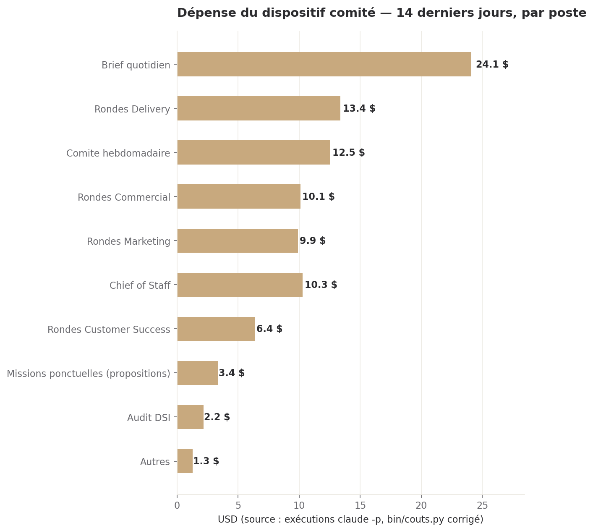
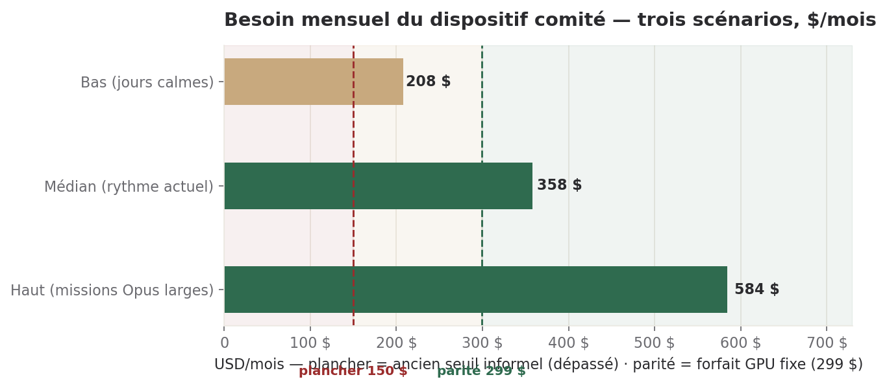
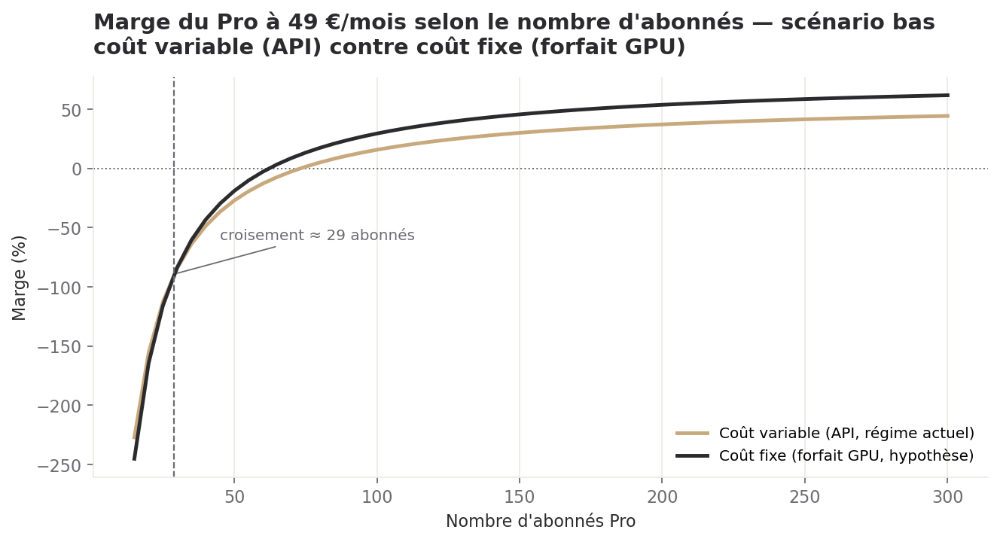

# Ce dont le dispositif a besoin, ce que ça coûte, ce que ça rapporte

> **Directeur Financier · 09/08/2026, soir · Statut : position chiffrée, pour provisionnement.**
> Commande directe de Sam : chiffrer le nécessaire, pas le supportable — il provisionne, il
> arbitrera lui-même si c'est trop cher. Ce document ne remplace pas la position du comité du
> 11/08 (`position_2026-08-09.md`) : il répond à une demande distincte et plus large, transmise
> le 09/08 en soirée.

## Ce qu'il faut retenir

1. **Le dispositif comité a besoin de 400 à 600 $/mois pour tourner sans se brider**, pas de
   358 $. Le rythme médian mesuré (358 $/mois, 14 jours réels) inclut déjà des jours de pointe ;
   le brider au plancher des jours calmes (208 $) reviendrait à couper des missions ponctuelles
   utiles. Je recommande de provisionner **500 $/mois**, entre le médian et le haut.
2. **Le chiffre que la mission me transmet — « le Pro à 49 € dégage 10,1 % de marge » — est
   dépassé.** Le Commercial l'a corrigé lui-même le jour même, quelques heures après l'avoir
   écrit : cette marge omettait tout le coût des jetons LLM. Une fois ce coût compté, **la marge
   à 49 €/mois est négative à 60 abonnés (-12,8 % à -134,7 % selon le scénario)**. J'ai
   recalculé sa méthode de bout en bout (formule ci-dessous) : **elle est juste, je la confirme
   sans réserve.**
3. **Le levier prix a une limite dure que le prix seul ne franchit jamais.** Si le downgrade Pro
   n'est pas branché et Free reste sur Sonnet (scénario haut), **aucun prix raisonnable en euros
   ou en dollars ne rend le Pro rentable, à aucune échelle d'abonnés** — seul le prix en livres
   (79 £ ≈ 92 €) franchit ce plafond, et seulement à partir de 273 abonnés. Le prix n'est pas le
   bon levier tant que l'ingénierie n'a pas bougé.
4. **Le forfait GPU (299 $/mois) n'est pas une dépense à engager aujourd'hui** — Sam l'a déjà
   tranché le 09/08 (DEC-2026-0809-07) : rester sur les 50 $ de crédit d'expérimentation,
   attendre l'offre Hostinger UE. Je le confirme depuis mon seul terrain, le chiffrage : à zéro
   abonné Pro et sans migration actée des rondes du comité, souscrire ajouterait 299 $/mois sans
   rien retirer.
5. **Aucune des deux hypothèses de prix ne peut être testée avant que le parcours de paiement
   existe.** Stripe tourne encore en mode test (`sk_test_***`, `STRIPE-PROD-001` non fait) et six
   points bloquants juridiques interdisent l'ouverture des inscriptions (`conformite_donnees_
   2026-08-08.md`). Les revenus à 30/60/90 jours ci-dessous se comptent **à partir de l'ouverture
   réelle**, pas à partir d'aujourd'hui — et cette date n'est pas fixée.

---

## 1. Le besoin réel du dispositif comité

### 1.1 Ce qui a été dépensé

14 derniers jours, mesuré sur les exécutions réelles (`bin/couts.py`, chemin corrigé de
`/root/workspace/dh-comite` vers `/workspace` — le script partagé pointe toujours au mauvais
endroit, je ne le corrige pas moi-même, je le signale) : **46 exécutions, 95,34 $, 11,92 $/jour**.



*Lecture : le brief quotidien (24,10 $, un quart de la facture) et les rondes de direction
dominent. Sonnet 5 porte 69,9 % de la facture totale (66,61 $), Opus (5 + 4.8) 23,5 %.*

### 1.2 Ce dont il a besoin pour fonctionner sans se brider

Le rythme n'est pas stable : il va de 208 $/mois (jours sans mission ponctuelle) à 584 $/mois
(deux journées à missions Opus larges, 02-03/08, déjà identifiées comme la cause du dépassement
du plafond informel de 150 $ le 08/08).



*Lecture : le plancher informel de 150 $ est déjà sous le scénario bas — ce n'est plus un
repère utile. Le forfait GPU (299 $) tombe entre le bas et le médian : il ne couvre le rythme
réel que dans le scénario le plus calme.*

**Ce que je demande de provisionner : 500 $/mois.** Pas le plancher (208 $, qui suppose zéro
mission ponctuelle — irréaliste dès qu'une direction instruit un dossier complexe), pas le
médian seul (358 $, qui laisse zéro marge si deux jours de pointe reviennent). 500 $/mois couvre
le médian avec une marge d'absorption d'un pic partiel, sans provisionner le scénario haut en
entier. C'est le chiffre nécessaire à un fonctionnement sans arbitrage permanent sur chaque
mission — pas un chiffre réduit par prudence.

**Ce que cette mesure ne couvre pas, et qui s'ajoute** :
- **VPS Hostinger** — forfait mensuel actif, **montant introuvable dans ce que j'ai pu
  consulter** (`config/outils_disponibles.md` le nomme, ne le chiffre pas). Je le demande
  explicitement : sans lui, le besoin ci-dessus est sous-évalué d'un montant inconnu.
- **GPU vidéo Packet AI** — actif depuis début août pour la campagne vidéo (hors périmètre de ce
  document), sur les 50 $ de crédit d'expérimentation actés par Sam (DEC-2026-0809-07). Point
  aveugle identique à celui déjà signalé le 09/08 : je ne sais pas s'il consomme au-delà de ce
  crédit.

### 1.3 Le forfait GPU (299 $/mois) : je confirme la position déjà actée, je ne la rouvre pas

Sam a tranché DEC-2026-0809-07 le 09/08 : rester sur les 50 $ de crédit Packet.ai pour
l'expérimentation vidéo, attendre l'offre Hostinger UE, faire trancher la question de
souveraineté par le Juridique. **Je n'instruis pas ces deux axes — juridique et souveraineté ne
sont pas mon terrain.** Voici ce qui l'est :

- Comparé au besoin de 500 $/mois recommandé ci-dessus, 299 $/mois de forfait fixe serait
  **moins cher, si et seulement si** les rondes du comité migrent réellement vers un modèle
  local. Cette migration n'est décidée nulle part à ce jour.
- Sans elle, souscrire ajouterait une dépense sans en retirer aucune : le dispositif passerait
  de ~500 $/mois à ~500 + 299 = 799 $/mois, pas à 299 $/mois.
- Le graphique du §3 montre où le forfait devient gagnant **côté produit** (Pro) : pas avant une
  vingtaine d'abonnés Pro, et le dispositif en a zéro aujourd'hui.

Ma position, identique à celle du 09/08 et que je ne réouvre pas ici : **à différer**, pas à
refuser — conditionné à un engagement écrit de migration ou à l'offre Hostinger.

---

## 2. La marge du Pro : je vérifie le Commercial, et il a raison

### 2.1 Ce que la mission me transmettait, et pourquoi je ne pars pas de là

La mission cite la conclusion du Commercial : « le Pro à 49 € dégage 10,1 % de marge brute ».
**C'est la conclusion de l'étude du 08/08, et elle est fausse — le Commercial l'a démontré
lui-même le 09/08 à 10h58** (`offre_revue_2026-08-09.md`) : l'étude du 08/08 ne comptait aucun
coût de jetons LLM, ni pour les 2 SDS/mois inclus dans le Pro, ni pour le tier Free qu'il
subventionne. Une fois ce coût ajouté à partir de données réelles (`v_deos_executions`, 18
exécutions SDS), **la marge à 60 abonnés tombe à -12,8 % (scénario bas) ou -134,7 % (scénario
haut)**.

**Je ne pars donc pas de 10,1 %.** Je pars de la version corrigée, et je l'ai vérifiée de bout
en bout — pas seulement lue.

### 2.2 La vérification : sa formule est juste

J'ai reconstruit indépendamment la structure de coût à partir de ses données publiées
(coût SDS mesuré en base, subvention Free, imputation marketing/tooling/frais généraux) :

> Coût annuel(n abonnés) = 25 200 € (marketing + outillage, fixe)
> + n × [50 € (support) + coût SDS annuel + subvention Free annuelle + 10 % du prix (frais généraux)]

En rejouant cette formule sur ses cinq paliers d'abonnés (60, 100, 150, 300, 500), **je retombe
exactement sur ses coûts totaux et ses marges, au centime près**, dans les deux scénarios bas et
haut. Le tableau et le graphique de l'étude du 09/08 ne sont pas une estimation approximative :
la méthode est reproductible, ce qui est le plus haut niveau de confiance que je peux donner à un
chiffrage sans compteur de jetons déterministe. **Je suis d'accord avec le Commercial : la marge
à 49 €/mois est réellement négative à l'échelle d'abonnés visée pour fin 2026, dans les deux
scénarios tant que rien n'est branché côté ingénierie.**

Je ne me prononce pas sur son prix recommandé (69 €/mois, DH-CRO-002) — c'est un arbitrage
commercial, pas un calcul. Ce que je fais dans la suite est plus large que sa question : Sam m'a
demandé de modéliser **deux hypothèses de prix**, dont une hors de la fourchette qu'il a
instruite.

---

## 3. Deux hypothèses de prix

**Hypothèse A — prix actuel : 49 €/mois** (588 €/an). **Hypothèse B — 79 €/mois**, et son
équivalent en devise locale hors zone euro : **79 $/mois** et **79 £/mois**.

**Sur B, une précision qui change le résultat : ce n'est pas une conversion, c'est un prix
psychologique local**, ancré sur la fourchette de marché 79-149 $ documentée par
`dh-references-marche`. Aux taux indiqués dans la mission (79 $ ≈ 73 €, 79 £ ≈ 92 €) — je n'ai
pas de taux de change sourcé en interne, je reprends celui donné et je le marque comme
`Hypothèse` partout où il intervient — **l'écart joue en notre faveur au Royaume-Uni (92 € reçus
pour un prix affiché « 79 »), en notre défaveur aux États-Unis (73 € pour le même affichage)**.
Cet écart n'est pas cosmétique : il déplace le seuil de rentabilité et, dans un cas, il change la
réponse à « est-ce que ce prix suffit ».

### 3.1 Marge brute et seuil de rentabilité, par hypothèse et par scénario

| Prix affiché | Prix net perçu | Marge à 100 abonnés — bas | Marge à 100 abonnés — haut | Seuil de rentabilité — bas | Seuil de rentabilité — haut |
| --- | ---: | ---: | ---: | ---: | --- |
| **A — 49 €** | 588 €/an | **+15,8 %** | -106,1 % | **73 abonnés** | jamais |
| **B — 79 €** | 948 €/an | **+44,0 %** | -31,6 % | **38 abonnés** | jamais |
| **B — 79 $** | 876 €/an (≈73 €/mois) | **+40,2 %** | -41,6 % | **42 abonnés** | jamais |
| **B — 79 £** | 1 104 €/an (≈92 €/mois) | **+50,5 %** | -14,5 % | **31 abonnés** | **273 abonnés** |

*Scénario bas = downgrade Pro branché + Free sur Haiku + conversion freemium 5 %. Scénario haut
= régime actuel non filtré (tout Opus) + Free sur Sonnet + conversion 2 %. Définitions reprises
telles quelles de l'étude du Commercial du 09/08 — je ne les modifie pas, je les applique aux
nouveaux prix.*

**Le constat qui compte le plus, et qu'aucun des deux documents précédents n'avait isolé** :
dans le scénario haut, **B-EUR et B-USD ne suffisent pas non plus**. Seul B-GBP (92 €/mois
perçus) franchit le seuil — à 273 abonnés, une échelle hors de portée avant 2027 sur les
trajectoires du Marketing. **Le prix seul ne répare jamais le scénario haut en euros ou en
dollars.** Le vrai levier reste celui déjà nommé par le Commercial le 09/08 : brancher le
downgrade Pro et trancher Free sur Haiku.

### 3.2 L'effet du coût fixe (forfait GPU), par hypothèse — scénario bas



Le graphique est tracé sur l'hypothèse A (49 €) parce que le forfait GPU est un choix
d'infrastructure indépendant du prix — il ne se pose pas différemment à 79 €, seul le point de
croisement se décale légèrement (le tableau ci-dessous donne l'écart de marge à chaque prix).
**Le croisement a lieu vers 29 abonnés à 49 €, plus tôt à 79 € (le fixe devient gagnant plus
vite quand le prix — donc les frais généraux à 10 % — est plus élevé).**

| Hypothèse | Écart de marge (fixe − variable) à 60 abonnés | à 100 abonnés | à 150 abonnés |
| --- | ---: | ---: | ---: |
| A — 49 € | +10,0 pts | +13,7 pts | +15,6 pts |
| B — 79 € | +6,2 pts | +8,5 pts | +9,7 pts |
| B — 79 $ (≈73 €) | +6,7 pts | +9,2 pts | +10,5 pts |
| B — 79 £ (≈92 €) | +5,3 pts | +7,3 pts | +8,3 pts |

**Lecture** : le forfait GPU améliore toujours la marge à partir de ~29-30 abonnés, quelle que
soit l'hypothèse de prix — mais l'amélioration relative est **plus forte à prix bas** (49 €)
qu'à prix haut (79 £), parce que la part fixe qu'il remplace (le coût SDS) pèse
proportionnellement plus lourd dans un Pro moins cher. **Ce n'est pas un argument pour rester à
49 € : c'est un rappel que le forfait GPU et le prix du Pro sont deux décisions indépendantes**,
déjà établi par le Commercial dans son complément du 09/08 et que ce calcul confirme sous un
angle différent (par hypothèse de prix plutôt que par échelle d'abonnés).

### 3.3 Revenu récurrent à 30/60/90 jours, par hypothèse

Je pars de la seule trajectoire d'abonnés disponible — le scénario **nominal** du plan de
lancement Marketing (8 / 25 / 50 abonnés Pro à J+30/60/90). **Réserve nécessaire, et elle est
d'importance** : cette trajectoire a été construite pour un prix de 49 €. Je n'ai **aucune
donnée d'élasticité prix** pour savoir si 79 € changerait le taux de conversion Free → Pro
(12 % dans l'entonnoir du Marketing). Les chiffres B ci-dessous supposent **« toutes choses
égales »**, ce qui est optimiste — un prix plus élevé freine probablement l'adoption, dans une
proportion que je ne peux pas chiffrer faute de donnée.

| | J+30 (8 abonnés) | J+60 (25 abonnés) | J+90 (50 abonnés) |
| --- | ---: | ---: | ---: |
| **A — 49 €**, net Stripe | 384 € | 1 200 € | 2 401 € |
| **B — 79 €**, net Stripe | 621 € | 1 939 € | 3 878 € |
| **B — 79 $** (≈73 €), net | 573 € | 1 791 € | 3 583 € |
| **B — 79 £** (≈92 €), net | 723 € | 2 259 € | 4 519 € |

*Net = prix mensuel × (1 - 1,5 %) - 0,25 € (frais Stripe cartes EEE, source
`config/offre_dh.md`). Pour les cartes hors EEE (US, UK), je n'ai pas le barème Stripe réel — je
retiens la même formule par défaut, marquée `Hypothèse`.*

**Ce tableau ne peut pas encore courir.** `STRIPE-PROD-001` n'est pas fait — le backend tourne
encore en clé de test (`sk_test_***`) — et six points bloquants juridiques interdisent
l'ouverture des inscriptions (`config/legal/conformite_donnees_2026-08-08.md`, avis
DÉFAVORABLE en l'état). **Le J+30 de ce tableau démarre le jour où ces deux verrous sautent, pas
aujourd'hui.** Chaque semaine de retard sur l'un ou l'autre décale toute la colonne de droite
d'une semaine.

---

## 4. Ma position, hypothèse par hypothèse

**A — 49 €/mois : je ne recommande pas de le maintenir tel quel.** Ce n'est pas mon prix à
trancher (DH-CRO-002 revient à Sam sur proposition du Commercial), mais le chiffrage est sans
ambiguïté : à ce prix, le point mort dans le scénario bas est déjà à 73 abonnés — un tiers de
l'objectif nominal de fin d'année — et le scénario haut ne se rattrape jamais. Financer le
lancement sur cette hypothèse, c'est financer une perte tant que l'ingénierie (§2) n'a pas
bougé.

**B — 79 €/mois (zone euro) : finançable, et il change la focale.** Le seuil de rentabilité
descend à 38 abonnés en scénario bas — atteint dès J+45 sur la trajectoire nominale du
Marketing. C'est la seule hypothèse chiffrée ici qui rend le Pro rentable à une échelle que le
plan de lancement atteint réellement avant fin 2026.

**B — 79 $ (marché américain) : finançable, mais avec un écart de change qui coûte 8 % de
revenu réel** par rapport à l'affichage identique en zone euro (73 € contre 79 € perçus). Je ne
recommande pas de corriger ce prix à la hausse pour compenser le change — le repère de marché
(79-149 $, `dh-references-marche`) montre que 79 $ est déjà au bas de la fourchette validée aux
États-Unis ; le remonter maintenant, sans aucune donnée d'adoption locale, serait une décision
sans preuve.

**B — 79 £ (Royaume-Uni) : la seule hypothèse qui tient dans les deux scénarios**, bas et haut —
à condition d'atteindre 273 abonnés, hors de portée avant 2027. Je le note pour mémoire, pas
comme un argument à court terme.

**Ce qui m'inquiète le plus, et qui dépasse la question du prix** : dans les quatre hypothèses,
le scénario haut ne devient jamais finançable avant plusieurs centaines d'abonnés, si tant est
qu'il le devienne. **Financer le lancement sur l'hypothèse basse sans obtenir d'engagement du
Directeur Delivery sur le downgrade Pro et le choix Free/Haiku, c'est parier la trésorerie sur
un arbitrage d'ingénierie non pris.** C'est la question que je transmettrais en premier au
comité du 11/08, avant celle du prix lui-même.

---

## Réserves

- **Le taux de change 79 $ ≈ 73 €, 79 £ ≈ 92 € vient de la mission, pas d'une source interne
  sourcée.** Il sert à situer un ordre de grandeur, jamais à facturer.
- **Les revenus B (§3.3) supposent une élasticité prix nulle** — aucune trajectoire d'abonnés
  distincte n'existe pour 79 €. C'est l'hypothèse la plus fragile de tout ce document.
- **Le montant du VPS Hostinger reste introuvable.** Le besoin de 500 $/mois du §1 ne le couvre
  pas — c'est un plancher, pas un total.
- **Je n'ai pas instruit les axes souveraineté et calcul confidentiel du forfait GPU**
  (DEC-2026-0809-07) : c'est le Juridique qui les porte, ma position se limite au chiffrage.
- **Le barème Stripe pour cartes hors EEE (§3.3) est une hypothèse**, faute d'accès à la
  documentation Stripe réelle pour ces marchés.
- **Le formule de coût (§2.2) reprend telle quelle la méthode d'imputation du Commercial**
  (10 % de frais généraux, support à 50 €/abonné/an) — je l'ai vérifiée par reconstruction, je ne
  l'ai pas remise en cause sur le fond ; une méthode d'imputation différente donnerait des
  chiffres différents.

---

## Annexe — méthode

Coût annuel total du Pro, n = nombre d'abonnés, P = prix annuel (12 × prix mensuel) :

```
Coût(n, P, scénario) = 25 200 € + n × (variable[scénario] + 0,10 × P)
  variable[bas]  = 50 (support) + 113,76 (SDS bas)  + 20,52  (subvention Free bas)  = 184,28 €/abonné/an
  variable[haut] = 50 (support) + 421,92 (SDS haut) + 429,24 (subvention Free haut) = 901,16 €/abonné/an

Marge(n, P, scénario) = 1 − Coût(n, P, scénario) / (P × n)
Seuil de rentabilité : n = 25 200 / (0,90 × P − variable[scénario])
  → sans solution positive si 0,90P ≤ variable[scénario] : la marge ne franchit jamais 0.

Variante forfait GPU (coût SDS remplacé par 275 €/mois de forfait, partagé) :
Coût_fixe(n, P) = 28 500 € + n × (70,52 + 0,10 × P)
```

Formule reconstruite à partir de `offre_revue_2026-08-09.md` et son complément (Commercial,
09/08) — vérifiée en rejouant les cinq paliers publiés (60/100/150/300/500 abonnés, prix 49 €) :
coûts totaux et marges retrouvés au centime près dans les deux scénarios. Constantes
(marketing 24 000 €, outillage 1 200 €, support 50 €/abonné/an, frais généraux 10 % du prix)
reprises sans modification de la méthode d'imputation du Commercial.

**Sources** :
- `config/commercial/offre_revue_2026-08-09.md` et `offre_revue_complement_2026-08-09.md`
  (Commercial, 09/08) — coût SDS réel (`v_deos_executions`), subvention Free, formule de marge,
  contrefactuel GPU.
- `config/marketing/plan_lancement_2026-08-08.md` §5.3 — trajectoire d'abonnés nominale
  (8/25/50 à J+30/60/90), frais Stripe EEE.
- `config/legal/conformite_donnees_2026-08-08.md` — avis défavorable à l'ouverture des
  inscriptions, six points bloquants.
- `deos_state.statut_o2` — `STRIPE-PROD-001` non fait, clé `sk_test_***` encore active.
- `deos_state.cash_suivi`, décision `DEC-2026-0809-07` (`psql "$COMITE_DB_DSN"`) — position déjà
  actée de Sam sur le forfait GPU.
- `bin/couts.py`, chemin corrigé (`/root/workspace/dh-comite` → `/workspace`) — 46 exécutions
  réelles, 14 jours au 09/08/2026.
- `.claude/skills/dh-references-marche` — fourchette de marché 79-149 $ en micro-SaaS.
