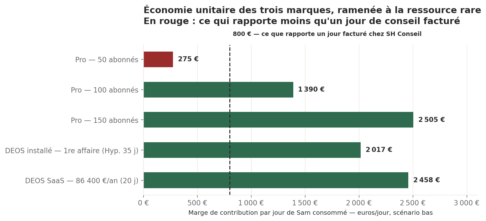
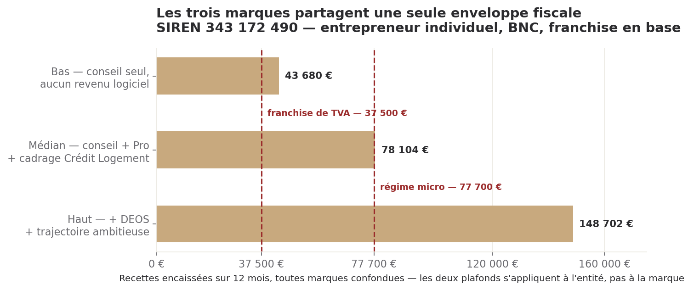
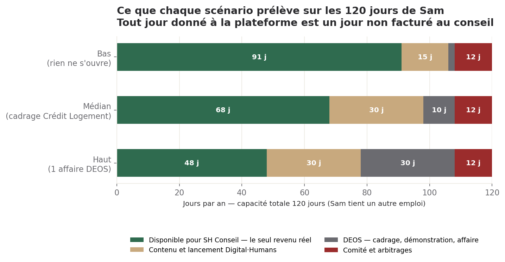
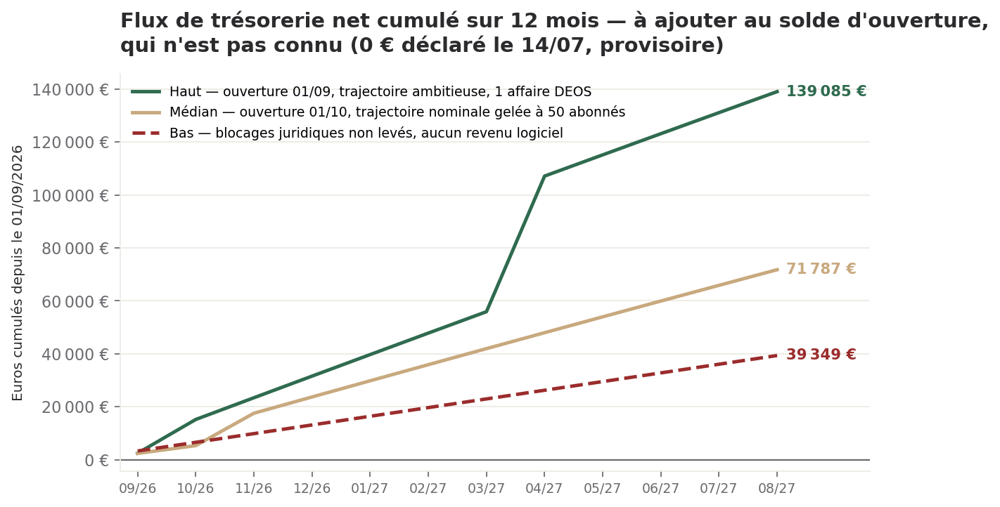

# Dossier de revue externe — SH Conseil · Digital·Humans · DEOS

> **Direction financière · 10/08/2026 · Statut : dossier soumis à revue externe.**
> Destinataire : directrice financière en entreprise, sollicitée par Sam Hatit pour un
> avis indépendant. Périmètre : les trois marques portées par une seule personne et,
> comme on le verra au §2, par une seule entité juridique.
> **Chaque chiffre porte sa source ou la mention `Hypothèse`.** Ce qui n'est pas mesuré
> est signalé comme tel, y compris quand c'est gênant.

## Ce qu'il faut retenir

1. **Le revenu récurrent est nul et le revenu réel n'est pas mesuré.** Zéro abonné,
   zéro euro récurrent (`deos_state.cash_suivi.mrr_reel`, maj 02/08). Le seul revenu
   réel est le conseil facturé par Sam — et **son montant ne figure nulle part au
   dossier.** C'est la donnée manquante n°1, avant même le solde bancaire.
2. **Ce n'est pas une entreprise à court de trésorerie, c'est une entreprise à court de
   jours.** La dépense mesurée est de **360 $/mois** (`bin/couts.py`, 68 exécutions sur
   30 jours au 10/08). Le vrai coût est ailleurs : sur les 120 jours annuels de Sam,
   **52 sont déjà engagés dans le scénario médian, 72 dans le scénario haut.** À ce
   niveau de burn, un « nombre de mois de piste » n'a aucun sens : la contrainte est le
   calendrier, pas la caisse.
3. **Les trois marques partagent une seule enveloppe fiscale, et elle sature.** Une
   seule entité (SIREN 343 172 490, entrepreneur individuel, BNC, franchise en base).
   La franchise de TVA (37 500 €) vaut **47 jours de Sam facturés**, le plafond micro
   (77 700 €) en vaut **97** — et sa capacité intégralement facturée produirait
   96 000 €. **Le régime est dimensionné pour moins que sa propre capacité.** La
   franchise tombe dans les trois scénarios, le plafond micro dans deux sur trois.
4. **Ce qui bloque le revenu logiciel ne coûte pas d'argent.** Six constats bloquants
   juridiques, établis par preuve technique le 08/08, interdisent l'ouverture des
   inscriptions ; je n'ai trouvé au dossier **aucune preuve de levée à ce jour**. Tant
   qu'ils tiennent, toute projection de revenu logiciel vaut zéro.
5. **Ce qu'on demande à cette revue** : un avis sur **la structure** (une entité pour
   trois marques, et à quel seuil scinder), sur **la séquence** de développement, et
   sur **la méthode de projection** d'une activité mono-personne. **On ne demande pas
   de financement** — il n'y a rien à lever pour un burn de 331 €/mois.

---

## 1. Synthèse — où on en est

| | Valeur | Source |
| --- | ---: | --- |
| Revenu récurrent | **0 €** | `cash_suivi.mrr_reel`, maj 02/08 |
| Clients payants, toutes marques | **0** | idem ; zéro référence client (étude 08/08) |
| Revenu de conseil (SH Conseil) | **non mesuré** | aucune donnée au dossier — demandé |
| Solde bancaire déclaré | **0 €, provisoire** | `cash_suivi`, déclaré le 14/07, non mis à jour depuis 27 j |
| Dépense mesurée du dispositif | **360 $/mois** (11,99 $/j) | `bin/couts.py` 30 j au 10/08, 68 exécutions |
| Capacité du fondateur | **~120 j/an** | mission Sam ; `H2` étude 08/08 |
| Coût d'opportunité d'un jour | **800 €** | `H3` étude 08/08 (réf. marché portage) |
| Décisions en attente d'arbitrage | **3** (contre ~20 le 07/08) | table `decisions`, `$COMITE_DB_DSN` |
| Blocages juridiques ouverts | **6 sur 6** | `conformite_donnees_2026-08-08.md` |

**Le seul élément de traction vérifiable est interne, pas commercial.** Le 10/08,
34 lignes de la table `decisions` ont reçu une validation de Sam : la file d'attente est
passée d'une vingtaine de décisions gelées jusqu'à 27 jours à **trois**. Le dispositif
de gouvernance qu'on vend (§2.3) vient de faire la preuve de son propre usage.

**Ce qui inquiète, dans l'ordre.** Le revenu de conseil n'est pas mesuré, donc rien
n'est projetable sérieusement (§4). L'enveloppe fiscale unique sature avant que la
plateforme n'ait un seul client (§2.4). Et la mention « SH Conseil », sous laquelle il
est prévu de facturer 8 000 € à un établissement financier, **ne correspond à aucune
entité documentée** — point soulevé par la direction juridique le 08/08, escaladé à
Sam, non résolu.

---

## 2. Une entité, trois marques

### 2.1 Ce que chacune rapporte par jour de Sam

Le seul dénominateur commun aux trois marques n'est ni le chiffre d'affaires ni la
marge : c'est **le jour de Sam**, seule ressource qu'elles se disputent réellement.

*Lecture : en rouge, ce qui rapporte moins qu'un jour facturé chez SH Conseil (800 €).
Sources : marge Pro reconstruite depuis la formule vérifiée le 09/08 ; DEOS SaaS =
86 400 €/an à 56,9 % de marge sur 20 jours (étude 08/08 §4.2) ; DEOS installé =
182 928 € de recette an 1 à 38,6 % (étude 09/08 §2), sur **35 jours — `Hypothèse`** :
le nombre de jours de la première affaire installée n'est pas chiffré au dossier.*

| Marque | Ce qu'elle est | Économie unitaire | État |
| --- | --- | --- | --- |
| **SH Conseil** | pratique de conseil, prestation de jours | **800 €/jour facturé** (`H3`) | **seul revenu réel**, montant non mesuré |
| **Digital·Humans** | plateforme en libre-service, Pro 79 €/mois, Team 1 490 €/mois | Pro : **+44,0 % à 100 abonnés** (bas), −31,6 % (haut) ; seuil **38 abonnés** | 0 client · gatée par Salesforce · 6 blocages |
| **DEOS** | gouvernance d'agents, SaaS ou installé | **2 458 €/jour** à 86 400 €/an ; plancher **31 800 €**, parité Team **79 400 €** | 0 client, 0 référence, 0 installation |

*Prix Pro : 79 €/mois, tarif de lancement 59 € le premier mois (DEC-2026-0809-13,
accordée, `validation_par = sam`). Net encaissé 77,56 €/mois après frais de carte
(0,985 × prix − 0,25 €, barème EEE, `config/offre_dh.md`).*

**Un chiffre est systématiquement mal lu, et je le corrige ici.** On lit ailleurs que
« le Pro perd de l'argent en dessous de 38 abonnés ». C'est vrai **en coût complet et
faux en trésorerie** : le coût fixe de 25 200 €/an qui produit ce seuil se compose de
24 000 € de **temps de Sam** (30 jours de production de contenu à 800 €) et de 1 200 €
d'outillage. **C'est un coût d'opportunité, pas une sortie de caisse.**

| Scénario d'ingénierie | Coût variable par abonné | Contribution nette mensuelle |
| --- | ---: | ---: |
| **Bas** — downgrade Pro branché, Free sur Haiku | 15,36 €/mois | **+62,20 €** |
| **Haut** — régime actuel non filtré, Free sur Sonnet | 75,10 €/mois | **+2,46 €** |

*Source : structure de coût variable du 09/08 (184,28 €/abonné/an en bas, 901,16 € en
haut), rapportée au mois.*

**Ce tableau dit où est le vrai levier, et ce n'est pas le prix.** La contribution d'un
abonné varie d'un facteur 25 entre les deux scénarios, et aucun prix raisonnable en
euros ou en dollars ne rend le Pro rentable dans le scénario haut. **Financer un
lancement sur l'hypothèse basse sans obtenir l'engagement d'ingénierie correspondant
(downgrade du Pro, modèle du tier gratuit), c'est parier la trésorerie sur une décision
non prise.**

### 2.2 Ce que chacune apporte aux deux autres — la dispersion

C'est le reproche attendu : trois marques pour une personne. La réponse honnête est
**qu'il y a une synergie réelle et une dispersion réelle, sur deux axes différents.**

**La synergie est du côté des actifs, et elle est vérifiable.** Le dispositif de
gouvernance que DEOS vend *est* le comité de direction qui produit ce dossier :
36 curseurs d'autonomie en base, un registre de 108 décisions, un journal des refus. La
démonstration prévue au Crédit Logement ne montre pas une maquette, elle montre l'outil
en service. Rien n'a été construit deux fois. Et la relation qui ouvre ce compte — le
DSI est connu personnellement de Sam — est un actif de SH Conseil, pas de la plateforme.

**La dispersion est du côté du calendrier et de l'enveloppe fiscale.** Les trois marques
ne se disputent pas des clients : elles se disputent des jours (§3) et un seul plafond
de recettes (§2.4).

**Le sens des portes, tranché le 08/08** : DEOS → Digital·Humans oui (un client DEOS
équipé de Salesforce est un client Team naturel) ; l'inverse non (l'acheteur Team est un
dirigeant de PME, il n'a pas de comité à gouverner). L'expansion est à sens unique et
part du haut de gamme.

**Ce qui se casserait si l'une disparaissait**, et la réponse n'est pas celle qu'on
attend : sans **SH Conseil**, tout s'arrête (seul revenu, seule relation grand compte,
seul véhicule de facturation). Sans **DEOS**, on perd l'accès aux grands comptes — c'est
la seule offre non gatée par Salesforce — et la meilleure marge par jour. Sans la
**plateforme Digital·Humans**, les deux autres survivent : DEOS repose sur le dispositif
de gouvernance, pas sur la chaîne de delivery Salesforce. **La marque la plus fragile
est donc celle qui porte le nom de l'ensemble** — zéro client, six blocages juridiques,
et la seule dont la disparition ne casserait rien.

### 2.3 DEOS installé — ce qui est chiffré et ce qui ne l'est pas

Pour les grands comptes qui refusent le SaaS par doctrine (cas du Crédit Logement :
internalisation, contrat LLM Microsoft déjà signé), le modèle est licence + maintenance :
**licence 129 600 à 259 200 €**, **maintenance 23 000 à 57 000 €/an**, installation
30 000 à 50 000 €, marge 38,6 % sur la première affaire et 55,0 % sur la suivante
(étude 09/08). Trois réserves, que je préfère poser moi-même :

- **Aucun consentement à payer n'a été mesuré** : ces niveaux viennent d'analogies de
  marché (maintenance à 18–22 % de la licence, licence à trois ans de valeur SaaS), pas
  d'un client interrogé.
- **Une condition de livraison n'est pas chiffrée** : le connecteur Azure OpenAI
  n'existe pas (vérifié dans `backend/config/llm_routing.yaml` le 09/08). Sans effet sur
  la démonstration d'août ; bloquant le jour d'un contrat.
- **La marge de la première affaire suppose une deuxième affaire** pour amortir
  l'intégration. Une affaire installée unique en paie seule la totalité.

### 2.4 Le point que je place au centre du dossier : une seule entité

**Les trois marques ne sont pas trois entités. Il n'y en a qu'une.**

| Élément | Valeur | Source |
| --- | --- | --- |
| Forme | entrepreneur individuel, micro-entreprise, BNC | Guichet Unique J00242553667, validée INSEE/URSSAF 19/05/2026 |
| SIREN / SIRET | 343 172 490 / 343 172 490 00033 | idem |
| Nom commercial déclaré | **Digital-Humans** | idem |
| TVA | franchise en base (art. 293 B CGI) | idem |
| « SH Conseil » | **aucune entité documentée** | `conformite_donnees_2026-08-08.md` §4.2 — escaladé à Sam, non résolu |

*Lecture : les recettes de chaque scénario du §4, comparées aux deux plafonds légaux
applicables à l'entité — franchise de TVA 37 500 € (seuil majoré 41 250 €) et régime
micro 77 700 € (`pages_legales_2026-08-06.md` §5.1, impots.gouv.fr). Le conseil, les
abonnements et le cadrage s'additionnent dans le même compteur.*

1. **La franchise de TVA tombe dans les trois scénarios**, y compris le plus bas où la
   plateforme ne vend rien : 47 jours de conseil facturés suffisent. Ce n'est pas un
   risque de croissance, c'est un fait d'exploitation.
2. **Le plafond micro tombe dans deux scénarios sur trois** — dès 12 mois en médian
   (78 104 €), largement en haut (148 702 €). Franchi deux années consécutives, il fait
   basculer au régime de la déclaration contrôlée.
3. **Le revenu du conseil consomme le plafond du logiciel.** Chaque jour facturé retire
   800 € de la marge de manœuvre disponible pour les abonnements. C'est l'argument le
   plus solide en faveur d'une scission — plus solide que l'optimisation fiscale.

**Ma recommandation, en distinguant le motif du déclencheur.** Le motif décisif de
passer en société n'est pas fiscal : c'est **la responsabilité illimitée sur le
patrimoine personnel** dans un contrat d'installation avec un établissement financier
supervisé. Le déclencheur, lui, est chiffrable : **instruire dès 30 000 € de recettes
cumulées sur l'année civile** (l'indicateur n°6 du plan de lancement du 08/08 pose déjà
ce seuil), **trancher avant 41 250 €** — au-delà, la TVA devient exigible le jour même
du dépassement. *Ce point relève de l'expert-comptable et de l'avocat ; je pose
l'arithmétique, je ne rends pas l'avis.*

**Et une échéance à trois semaines que personne n'a rapprochée du reste** : au
**1er septembre 2026**, toute entreprise doit être en capacité de *recevoir* des
factures électroniques (aife.economie.gouv.fr, via l'étude juridique du 06/08). C'est la
semaine de la démonstration Crédit Logement.

---

## 3. Le temps de Sam — la seule ressource véritablement rare

Sam tient un autre emploi. Sa capacité est d'environ **120 jours par an**, et son jour
vaut **800 €** de conseil non facturé ailleurs.

*Lecture : postes chiffrés depuis les plans existants — 30 jours/an de production de
contenu (les 24 000 € de « coût marketing fixe » de l'étude du 09/08), 12 jours/an de
comité et d'arbitrage (`Hypothèse` : un jour par mois), 2 à 30 jours de DEOS selon qu'on
s'arrête au cadrage (8 jours) ou qu'on porte une affaire complète (20 jours, `H2`). Le
solde est ce qui reste disponible pour facturer du conseil.*

**Ce que ce graphique dit plus vite qu'un tableau** : dans le scénario haut — celui où
tout marche — **il ne reste que 48 jours pour la seule activité qui rapporte de l'argent
aujourd'hui.** Le succès de la plateforme et de DEOS se paie en revenu de conseil perdu.
Ce n'est pas un argument pour ne rien faire : c'est la raison pour laquelle la séquence
(§7) compte plus que l'ambition.

**Une contradiction dans les sources, que je signale plutôt que de la lisser.** La
mission de Sam pose 120 jours comme sa capacité **totale**. L'hypothèse `H2` de l'étude
commerciale du 08/08 pose 120 jours **pour Digital·Humans et DEOS réunis**, « le reste »
allant à SH Conseil. Les deux lectures sont incompatibles et l'écart vaut plusieurs
dizaines de milliers d'euros de projection. **J'ai retenu la lecture de Sam, la plus
contraignante.** C'est une question à trancher.

---

## 4. La trésorerie — trois scénarios, hypothèses déclarées

**Réserve à lire avant les chiffres : je ne projette pas un solde, je projette un
flux.** Le solde bancaire déclaré est de 0 € au 14/07, qualifié de provisoire par Sam
lui-même (compte professionnel en cours d'ouverture), non mis à jour depuis 27 jours.
Le graphique donne donc le flux net cumulé, **à ajouter au solde d'ouverture réel —
inconnu**. Tout chiffre de « mois restants » serait une fausse précision.

| | **Bas** | **Médian** | **Haut** |
| --- | ---: | ---: | ---: |
| Recettes 12 mois | 43 680 € | 78 104 € | 148 702 € |
| dont abonnements Pro | 0 € | 37 464 € | 74 462 € |
| Dépenses 12 mois | 4 331 € | 6 317 € | 9 618 € |
| **Flux net cumulé** | **+39 349 €** | **+71 787 €** | **+139 085 €** |
| Recettes en régime de croisière (année pleine) | 43 680 € | 79 179 € | 106 810 € |

**Hypothèses communes** : jour de Sam à 800 € (`H3`) ; taux d'occupation du conseil
**60 %** (`Hypothèse`, aucune source) ; dépense API mesurée à 360 $/mois convertie à
1 $ ≈ 0,92 € (`Hypothèse`, reprise du 09/08) ; VPS Hostinger à **30 €/mois**
(`Hypothèse` — montant réel introuvable, demandé depuis le 09/08) ; frais de carte
0,985 × prix − 0,25 €.

- **Bas** — les six blocages ne sont pas levés : aucune inscription, aucun revenu
  logiciel, le cadrage Crédit Logement ne se conclut pas. 91 jours restent disponibles
  pour le conseil, dépense API stable.
- **Médian** — ouverture le 01/10 (un mois après le plan, au vu des six blocages),
  trajectoire nominale du plan marketing (8 / 25 / 50 abonnés à J+30/60/90), **gelée à
  50 faute de trajectoire documentée au-delà** ; cadrage encaissé 8 000 € en novembre ;
  aucune licence DEOS ; dépense API doublant linéairement sur 12 mois.
- **Haut** — ouverture le 01/09 comme prévu, trajectoire ambitieuse (15 / 45 / 90),
  cadrage encaissé en octobre, **une affaire DEOS SaaS signée fin février 2027** (cycle
  grand compte de 180 jours, `H1`), encaissée 43 200 € en avril ; forfait GPU souscrit.

**Les trois fragilités, par ordre d'importance :**

1. **Le taux d'occupation du conseil est une hypothèse sans aucune source.** Entre 40 %
   et 80 %, le résultat médian bouge de **21 760 €** — soit **58 % de tout ce que le
   lancement du Pro rapporte dans le même scénario.** La variable la plus déterminante
   de ce dossier n'est pas le prix du logiciel : c'est le carnet de commandes du
   conseil, et il n'est pas documenté.
2. **L'élasticité prix n'est pas mesurée.** La trajectoire d'abonnés a été construite
   pour un prix de 49 € et s'applique ici à 79 €. C'est l'hypothèse la plus optimiste
   du dossier.
3. **Aucune recette logicielle ne peut courir aujourd'hui.** Le parcours de paiement
   tourne en clé de test (`STRIPE-PROD-001` non fait, constat du 09/08 — non revérifié
   ce jour, voir Réserves) et les six blocages interdisent l'ouverture. **Chaque semaine
   de retard décale toute la colonne.**

**Ce que la trésorerie ne montre pas, et qu'il faut dire** : dans les trois scénarios le
flux est positif et le burn dérisoire. **Cette entreprise ne peut pas manquer d'argent
au sens habituel — elle ne peut manquer que de jours de Sam.** C'est pourquoi le §3
précède celui-ci.

---

## 5. Les indicateurs à suivre — et où on en est

Règle appliquée : un indicateur qui ne déclenche aucune décision n'a rien à faire sur un
tableau de bord. Sept suffisent.

| # | Indicateur | Où on en est | Décision qu'il déclenche |
| --- | --- | --- | --- |
| 1 | **Jours de conseil facturés / mois** | **non mesuré** | c'est le revenu réel : sous 3 j/mois, arrêter tout investissement de temps dans la plateforme |
| 2 | **Recettes cumulées de l'entité, année civile** (3 marques) | non mesuré | > 30 000 € : instruire la société ; > 37 500 € : préparer la TVA |
| 3 | Solde bancaire déclaré | 0 €, provisoire, 27 j sans mise à jour | sous 50 € : alerte (seuil confirmé par Sam le 03/08) |
| 4 | **Blocages juridiques ouverts** | **6 sur 6** | tant que > 0 : aucune projection de revenu logiciel n'est opposable |
| 5 | Abonnés Pro actifs | 0 (inscriptions fermées) | sous 60 % de la courbe nominale 2 semaines de suite : changer d'angle |
| 6 | Dépense du dispositif | 11,99 $/j, 360 $/mois | au-delà de 500 $/mois : brider les missions ponctuelles |
| 7 | Décisions en attente > 20 jours | 0 (3 en attente, la plus ancienne du 09/08) | une seule : le goulot est l'arbitrage, pas la production |

**Pourquoi ceux-là.** Les métriques classiques du logiciel — revenu récurrent, attrition,
coût d'acquisition, ratio valeur/coût client — sont **inapplicables à zéro client** : les
calculer produirait des ratios sur des dénominateurs nuls, définition d'un tableau de
bord décoratif. Les deux premiers indicateurs ne sont pas des indicateurs de logiciel :
ce sont ceux d'une pratique de conseil qui finance un produit, et c'est ce que cette
entreprise est aujourd'hui. **Les indicateurs 1, 2 et 4 ne sont pas mesurés : c'est le
principal défaut de pilotage de ce dossier, plus grave que n'importe lequel des chiffres
qui précèdent.**

---

## 6. Les risques, hiérarchisés

| # | Risque | Portée | Ce qu'on en fait |
| --- | --- | --- | --- |
| **R1** | **Concentration totale sur une personne** — un porteur, une source de revenu, aucun salarié | perte de 100 % du revenu en cas d'indisponibilité | non couvert. Aucune assurance, aucun second porteur. À poser à la revue |
| **R2** | **Six blocages juridiques gatent 100 % du revenu logiciel** (identifiants clients en clair, cloisonnement non prouvable, pages légales non publiées) | tout le §4 hors conseil | chemin critique. Ne coûte pas d'argent, coûte des jours |
| **R3** | **L'enveloppe fiscale unique sature** (37 500 € / 77 700 € partagés par les 3 marques) | régime, facturation, CGV, forme juridique | instruire à 30 000 €, trancher avant 41 250 € (§2.4) |
| **R4** | **Le revenu réel n'est pas mesuré**, solde bancaire non suivi depuis 27 jours | toute décision d'engagement | demande n°1 à Sam. Sans ce chiffre, aucun arbitrage n'est fondé |
| **R5** | **La marge du Pro dépend d'un arbitrage d'ingénierie non pris** | facteur 25 sur la contribution par abonné (§2.1) | obtenir l'engagement technique **avant** d'ouvrir les inscriptions |
| **R6** | **Le canal Team est indisponible** — chaîne BUILD en échec, exécution 165, échec encore constaté au 10/08 | le palier à 1 490 €/mois, soit 18,9 abonnés Pro par client | exclu des projections du §4. Aucun revenu Team supposé |
| **R7** | **DEOS : zéro référence, zéro installation, connecteur Azure OpenAI inexistant et non chiffré** | la seule offre ouverte aux grands comptes | ne rien promettre en août au-delà de la démonstration et du cadrage |
| **R8** | **« SH Conseil » n'est pas une entité documentée** alors qu'on prévoit de facturer sous ce nom | le cadrage à 8 000 € et le contrat de sous-traitance | à clarifier **avant** la réunion de fin août |

**Ce qui n'est pas dans ce tableau et devrait inquiéter une lectrice extérieure** : il
n'y a aucun risque de marché — non parce qu'il n'y en a pas, mais parce qu'avec zéro
client, **aucune hypothèse de marché n'a encore été confrontée à un acheteur.** Le
premier risque réel de ce dossier est peut-être celui qu'il ne peut pas encore nommer.

---

## 7. Ce qu'on attend de cette revue

**Trois demandes, par ordre de valeur. Ce ne sont pas les mêmes questions.**

1. **La structure — priorité 1.** Une entité pour trois marques, deux plafonds partagés,
   une responsabilité illimitée face à un contrat bancaire. La question n'est pas
   « faut-il une société ? » mais **à quel seuil, sous quelle forme, et quelle marque y
   met-on d'abord ?** Notre proposition — instruire à 30 000 €, trancher avant 41 250 €,
   motif = responsabilité et non fiscalité — mérite d'être attaquée.
2. **La séquence — priorité 2.** L'ordre que nous retenons : (a) lever les six blocages
   juridiques, parce qu'ils ne coûtent pas d'argent et bloquent tout ; (b) DEOS en
   cadrage payant, parce que c'est la meilleure marge par jour, que l'encaissement est
   proche et qu'il ne dépend pas de la chaîne BUILD ; (c) le Pro, seul revenu qui ne
   consomme plus de temps une fois livré, mais dont le seuil est à 38 abonnés ; (d) Team
   en dernier **malgré la meilleure marge unitaire**, parce que le produit est en échec.
   **Est-ce le bon ordre ?** C'est un avis de dirigeante que nous cherchons, pas un
   calcul.
3. **La méthode de projection — priorité 3.** Nous projetons le revenu de conseil par
   « capacité × taux d'occupation », faute de carnet de commandes. Est-ce la bonne façon
   de modéliser une activité mono-personne, ou faut-il exiger un carnet daté avant toute
   projection ? La réponse changerait la construction du §4, pas seulement ses chiffres.

**Ce que nous ne demandons pas, pour ne pas gaspiller son temps :**

- **Pas d'avis sur le financement.** Le burn est de 331 €/mois. Il n'y a rien à lever,
  et une levée répondrait à un problème que nous n'avons pas.
- **Pas d'avis sur le prix du Pro.** Instruit sur quatre hypothèses et arbitré par Sam
  le 10/08 (79 €, lancement à 59 € le premier mois). Le dossier est disponible si elle
  veut le contredire, mais nous ne le rouvrons pas de nous-mêmes.
- **Pas de conseil fiscal ou juridique définitif** — c'est le rôle d'un expert-comptable
  et d'un avocat. Nous cherchons un jugement de dirigeante sur la structure.

---

## Réserves

- **Le revenu de SH Conseil n'est pas mesuré.** C'est le trou le plus important du
  dossier : le seul revenu réel de l'entreprise y figure comme une hypothèse de taux
  d'occupation. Tout le §4 en dépend.
- **Le solde bancaire d'ouverture est inconnu** (0 € déclaré le 14/07, provisoire).
  Aucun « nombre de mois de piste » n'est donné, volontairement.
- **Le montant du VPS Hostinger reste introuvable** malgré une demande du 09/08 ; retenu
  à 30 €/mois en `Hypothèse`. La dépense du §4 est un plancher, pas un total.
- **Le taux de change 1 $ ≈ 0,92 €** vient de la mission du 09/08, pas d'une source
  interne datée.
- **Les 35 jours de Sam de la première affaire DEOS installée sont mon hypothèse**,
  déduite de la projection à 12 mois de l'étude du 08/08. Le chiffre exact n'est pas au
  dossier.
- **La marge de Team n'est pas chiffrée de façon fiable** : le Commercial a signalé le
  09/08 que son coût de jetons n'avait jamais été compté, comme celui du Pro avant
  correction. Aucun revenu Team n'est projeté, ce qui rend le scénario haut **prudent**
  sur ce point précis.
- **Je n'ai pas pu revérifier l'état du parcours de paiement aujourd'hui.** La requête a
  été refusée par le garde-fou d'autonomie (curseur `engager_depense` réglé sur
  « Observe »), déclenché par un mot-clé présent dans la commande. Je rapporte le refus
  au lieu de le contourner. **Le filtre est trop large** : il bloque une lecture de
  configuration comme il bloquerait un paiement — même nature de défaut que celui
  corrigé le 04/08 sur les mots `updated_at`/`deleted`. À signaler au dispositif ; ce
  n'est pas à moi de modifier le garde-fou.
- **Je n'ai pas instruit le fond juridique** des six constats bloquants ni la
  souveraineté du serveur GPU : terrains de la direction juridique. Je ne reprends que
  ce qu'ils déplacent économiquement.

---

## Annexe — méthode et sources

**Dépense mesurée.** `bin/couts.py`, chemin corrigé de `/root/workspace/dh-comite`
(inexistant ici) vers `/workspace` — **le script partagé pointe toujours au mauvais
endroit ; je le signale pour la troisième fois plutôt que de le modifier sans revue.**
Fenêtre de 30 jours au 10/08/2026, fichiers `*/*.json` portant un `total_cost_usd` :
**68 exécutions, 143,83 $, 11,99 $/jour**. Par modèle, imputé au prorata des jetons de
sortie comme dans le script : Sonnet 5 72,7 %, Opus (5 + 4.8) 20,3 %, Fable 5 6,9 %.
Cette mesure couvre les exécutions du comité — **ni le VPS, ni le serveur vidéo, ni
d'éventuels frais bancaires.**

**Marge du Pro.** Formule du Commercial, vérifiée par reconstruction indépendante le
09/08 et rejouée ici à 79 € : `Coût(n) = 25 200 € + n × (variable + 0,10 × prix annuel)`,
variable = 184,28 €/an (bas) ou 901,16 €/an (haut). Contrôle de cohérence : la marge
calculée à 100 abonnés (**44,0 %**) retombe exactement sur celle publiée le 10/08 — la
reconstruction est fidèle.

**Modèle de trésorerie.** 12 mois, septembre 2026 → août 2027. Recettes = (jours
disponibles × 60 % × 800 €)/12 + abonnés × 77,56 € + cadrage + encaissement DEOS.
Dépenses = API (331 €/mois, × facteur linéaire 1 → 2 hors scénario bas) + VPS 30 € +
forfait GPU 275 € en scénario haut seulement. Trajectoires d'abonnés : celles du plan de
lancement du 08/08 (nominale 8/25/50, ambitieuse 15/45/90), **gelées à leur dernier
point mesurable** — aucune extrapolation au-delà de J+90.

**Sources internes**, toutes datées, consultées le 10/08 :
`financier/position_2026-08-09.md` · `besoins_et_projections_2026-08-09.md` ·
`long_terme_2026-08-10.md` · `commercial/offre_revue_2026-08-09.md` et son complément ·
`deos_grands_comptes_2026-08-08.md` · `deos_installe_2026-08-09.md` ·
`dossier_demo_credit_logement_2026-08-10.md` · `deos_positionnement.md` ·
`marketing/plan_lancement_2026-08-08.md` §5.3, §5.5, §6 ·
`legal/conformite_donnees_2026-08-08.md` · `identite_legale.md` ·
`pages_legales_2026-08-06.md` §5 · `offre_dh.md` · `sh-conseil/_note_classement.md`.

**Bases interrogées** (`psql "$COMITE_DB_DSN"`, lecture seule) : table `decisions`
(108 lignes — 55 accordées, 41 closes, 5 en exécution, 4 refusées, 3 en attente de Sam ;
34 lignes portant une validation de Sam datée du 10/08) ; `deos_state.cash_suivi` (solde
déclaré 0 € au 14/07, revenu récurrent 0, aucune échéance connue, seuil d'alerte 50 €,
plafond de recharge API 100 $ avec recharge automatique depuis le 02/08).

**Sources publiques**, citées via les études internes : impots.gouv.fr et
bofip.impots.gouv.fr (seuils micro et TVA) · aife.economie.gouv.fr (facturation
électronique) · RH Solutions (tarif journalier d'un profil technique senior) ·
NPI Financial, ERP Research, Kellblog, Centraleyes (économie du logiciel installé).

**Graphiques** : `charte.py` du skill `dh-charte-documents`. Les graphiques 2 et 4 sont
en variante locale de la charte (couleurs et police inchangées) : le gabarit partagé code
le dépassement d'un seuil en vert « favorable », ce qui est faux pour un plafond fiscal —
franchir 77 700 € est une contrainte, pas un succès.
