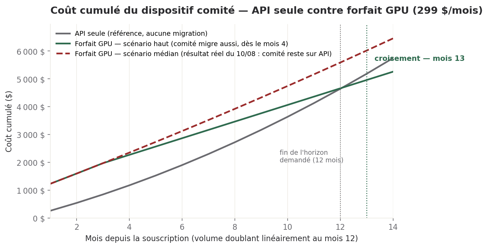

# Le forfait GPU sur douze mois, le prix américain, la séquence de lancement

> **Directeur Financier · 10/08/2026, soir · Statut : position chiffrée, pour arbitrage de Sam.**
> Répond à trois instructions : la demande de Sam du 09/08 au soir (« je veux voir le gain sur le
> LONG TERME »), et deux décisions du comité déjà **accordées** aujourd'hui — DEC-2026-0809-12
> (grille de prix par marché, pas de conversion unique) et DEC-2026-0809-13 (séquence de lancement
> 59 €/79 €, rechiffrage demandé). Le prix du Pro reste un arbitrage de Sam (DH-CRO-002) ; je
> chiffre, je ne tranche pas.

## Ce qu'il faut retenir

1. **Le test GPU d'aujourd'hui coupe l'argument économique en deux, pas en un.** Techniquement,
   le local fonctionne sans accroc (23 appels, 80 000 jetons, 0 $ de coût de jetons). Mais **le
   comité échoue sur le fond** — zéro famille d'analyse croisée sur quatre — et reste sur API.
   Conséquence directe : sur la facture du dispositif comité (258 $/mois au rythme actuel), **seuls
   ~195 $/mois peuvent basculer**, pas les 258 $ en entier — cohérent avec l'estimation d'environ
   180 $/mois communiquée à l'issue du test.
2. **Sur douze mois, avec le résultat réel d'aujourd'hui, le forfait est perdant** : il coûte entre
   5 588 $ et 10 784 $ sur l'année selon l'effort de surveillance de Sam, contre 4 644 $ en restant
   sur API. **Même dans le meilleur cas imaginable** (le comité finit par basculer aussi, zéro
   heure de surveillance facturée), le forfait ne redevient gagnant qu'**à partir du mois 13** — un
   mois hors de l'horizon demandé. Ce n'est pas un verdict définitif contre le GPU : c'est un
   verdict contre le **timing**, au rythme d'usage actuel.
3. **99 $/mois aux États-Unis rapporte plus que 79 € en zone euro** : environ 91 € perçus contre
   79 €, soit +12 €. L'écart de change qui coûtait 8 % de revenu réel sur l'hypothèse à 79 $ (note
   du 09/08) **se retourne en avantage** avec l'ancrage culturel à 99 $. Le seuil de rentabilité de
   cette hypothèse (32 abonnés, scénario bas) est aussi le meilleur des quatre chiffrés à ce jour,
   USD ou EUR.
4. **DEC-2026-0809-12 demande de chiffrer aussi 49 € et 59 € pour l'Europe continentale** — c'est
   fait : 79 € reste le prix qui atteint le plus vite un seuil de rentabilité accessible (~J+76 sur
   la trajectoire du Marketing, contre ~J+97 à 59 € et ~J+118 à 49 €). Le chiffrage confirme
   l'orientation déjà validée par Sam (DEC-2026-0809-13), il ne la découvre pas.
5. **La séquence de lancement (59 € un mois, puis 79 €) coûte environ 158 € de trésorerie le
   premier mois, sur la cohorte des 8 abonnés nominaux — et rien de plus après.** Le seuil de
   rentabilité annuel n'en bouge pas de façon mesurable. C'est un prix d'urgence à l'inscription, pas
   un sacrifice de marge.

---

## 1. Le test d'aujourd'hui — ce qu'il permet d'affirmer, ce qu'il ne permet pas

**Mesuré (Packet.ai, RTX PRO 6000 96 Go, Gemma 4 31B / Qwen 3.6 27B, 8 bits) :**

| Résultat | Valeur |
| --- | --- |
| Coût de la journée de test, mise en route comprise | **3 $** |
| SDS complet en local, échecs techniques | **0 sur 23 appels** (80 000 jetons, 0 $ de jetons) |
| Comité en local, familles d'analyse croisée réussies | **0 sur 4** — reste sur API |

**Ce que ça veut dire pour le calcul, immédiatement** : le local est prouvé *techniquement* sur les
tâches mécaniques (exécution SDS), pas encore sur le *jugement* (synthèse croisée du comité). Les
rondes quotidiennes des six directions et le brief quotidien n'ont **pas été testés séparément
aujourd'hui** — je ne sais pas s'ils se comportent comme le comité (échec) ou comme le SDS
(succès). Je les traite ci-dessous comme *basculables sous réserve*, pas comme acquis.

### 1.1 La ventilation actuelle — bin/couts.py, 14 jours, chemin corrigé

Même bug que le 09/08 : le script pointe vers `/root/workspace/dh-comite`, chemin inexistant ici.
Les données réelles sont sous `/workspace/*/*.json`. Je recalcule avec la même méthode, sur le bon
chemin — 53 exécutions, 02/08 au 10/08 (aucune trace avant le 02/08 dans les fichiers disponibles).

| Poste | 14 jours | Bascule si le local est validé ? |
| --- | ---: | --- |
| Comité hebdomadaire (2 séances : 12,53 $ puis 16,92 $, +35 % en une semaine) | 29,45 $ | **Non — échec confirmé aujourd'hui** |
| Brief quotidien (7 occurrences) | 24,10 $ | Sous réserve (non testé isolément) |
| Rondes des six directions (Delivery, Commercial, CoS, Marketing, CS, Legal) | 66,82 $ | Sous réserve (non testé isolément) |
| Missions ponctuelles (hors récurrent — propositions, audit DSI) | 5,52 $ | Hors périmètre de cette projection |
| **Total récurrent (14 j)** | **120,38 $** | |

Extrapolé au mois (×30/14, même méthode que le 09/08) : **258 $/mois** de rythme récurrent, dont
**63 $/mois pour le seul comité** (non basculable) et **195 $/mois** pour le brief + les rondes —
cohérent avec l'estimation d'environ 180 $/mois donnée à l'issue du test. Je retiens 180 $/mois pour
la suite, parce qu'elle vient de l'essai réel d'aujourd'hui plutôt que d'une fenêtre de mesure plus
large que la mienne.

**Un deuxième chiffre du test compte autant que le premier** : le comité du 09/08 a coûté 16,92 $,
dont **3,50 $ seulement pour le modèle principal** — les sous-agents (les cinq directions,
invoquées à l'intérieur de la séance) pèsent quatre fois plus. **Basculer seulement l'orchestrateur
vers le local ne retirerait qu'un cinquième de la facture.** Toute bascule doit porter sur les
sous-agents, pas sur le modèle qui les appelle — c'est là que se trouve la dépense.

---

## 2. Le gain sur douze mois — trois scénarios, et l'effet du volume

**Hypothèse commune aux trois scénarios, demandée par Sam** : le volume double linéairement sur
douze mois (plus d'exécutions BUILD, plus de directions, plus de contenu). Elle s'applique aussi
bien à la facture API qu'au résidu qui reste sur API dans chaque scénario.

*Lecture : la courbe grise est la facture API si rien ne change. La courbe verte est le forfait
GPU dans le meilleur cas retenu ici (le comité finit par basculer aussi, à partir du mois 4,
aucune heure de surveillance facturée). Même dans ce cas favorable, le forfait ne devient moins
cher **en cumulé** qu'à partir du mois 13 — un mois après l'horizon demandé. Unité : dollars US,
coût mesuré du dispositif comité (hors plateforme de production, hors VPS).*

| Scénario | Ce qui bascule | Coût cumulé sur 12 mois | Contre la référence API (4 644 $) | Mois où le forfait devient moins cher (cumulé) |
| --- | --- | ---: | ---: | --- |
| **Bas** — le test ne va pas plus loin ; brief et rondes ne passent pas non plus, par prudence | Rien | 4 644 $ (référence, si on ne souscrit pas) | — | Ne pas souscrire dans ce cas |
| **Médian** — le résultat réel d'aujourd'hui : comité reste sur API, brief + rondes basculent | ~180 $/mois | 5 588 $ à 10 784 $ (selon la surveillance de Sam, voir §2.2) | **+944 $ à +6 140 $ (plus cher)** | Jamais dans les 12 mois |
| **Haut** — hypothèse : le comité finit par passer le test aussi, à partir du mois 4 | Tout le dispositif comité | 4 660 $ à 9 856 $ (selon la surveillance) | **quasi à l'équilibre (+16 $) à nettement plus cher (+5 212 $)** | Mois 13, seulement dans l'hypothèse basse de surveillance |

**Le scénario médian est celui qui s'est produit aujourd'hui — ce n'est plus une hypothèse.** Et il
est perdant sur les 12 mois, dans les deux hypothèses de surveillance. Le forfait ne se justifie
sur ce seul motif que si le comité franchit encore une étape qui a échoué ce matin.

### 2.1 L'effet du volume — le point que la mission demandait de faire ressortir

Le forfait est un coût **fixe** ; l'API est un coût **variable qui suit le volume**. C'est
exactement ce qui fait bouger la conclusion avec le temps :

- **Scénario haut, comparaison mensuelle (pas cumulée)** : au mois 4, l'écart est de 29 $/mois en
  faveur du forfait. Au mois 12, avec le volume qui a doublé, l'écart est de **217 $/mois** — near
  huit fois plus. **Le gain ne se voit pas au premier mois, il se voit dans la pente.**
- **Scénario médian** : au mois 4, le forfait coûte encore 51 $/mois de plus que l'API seule. Le
  croisement mensuel (pas cumulé) a lieu vers le **mois 7** — c'est le volume, pas une baisse de
  coût du forfait, qui produit ce basculement.
- **Conclusion opérationnelle** : le forfait devient d'autant plus défendable que le volume croît
  plus vite que mon hypothèse de doublement linéaire — si le Pro démarre et que le nombre
  d'exécutions BUILD suit, ce calcul se réévalue à la hausse pour le GPU. Avec zéro client
  aujourd'hui, ce n'est pas encore le cas.

### 2.2 Ce que je ne peux pas encore chiffrer sans réponse de Sam

Le seul poste qui fait basculer la conclusion d'"à l'équilibre" à "nettement perdant" est **le
temps de surveillance de Sam**, que la mission demande de chiffrer à 800 €/jour mais sans en donner
la fréquence. J'ai testé deux bornes, aucune sourcée en interne :

- **Sans surveillance récurrente** (seulement le jour d'installation, mois 1) : le scénario haut
  finit quasiment à l'équilibre sur 12 mois (+16 $), croise au mois 13.
- **0,25 jour/mois** (environ 2 heures/semaine) : le scénario haut ne croise plus du tout dans un
  horizon visible — l'écart se resserre d'environ 90 à 140 $ par mois mais reste négatif à 18 mois.

**Je demande cette donnée avant de trancher davantage** : combien de temps Sam pense-t-il consacrer
à la surveillance d'un serveur local, une fois l'installation faite ? C'est la variable qui décide
tout, pas le prix du forfait.

### 2.3 Ce que le gain finance — la question posée par la mission

**Réponse honnête : à ce stade, il n'y a pas de gain net à flécher cette année.** Le scénario réel
d'aujourd'hui (médian) coûte plus cher que le statu quo sur les 12 mois ; le meilleur cas (haut,
zéro surveillance) est à l'équilibre, pas en excédent. Il n'y a pas de "3 000 $ libérés" à ce jour —
c'est l'hypothèse de la mission, pas ce que je trouve une fois le test réel intégré.

**Ce qui justifierait quand même le forfait, hors économie pure** — puisque la mission demande de
le dire si l'économie seule ne suffit pas :

- **Le droit à l'erreur, maintenant.** Zéro client aujourd'hui : c'est le moment le moins coûteux de
  toute la vie de l'entreprise pour rater un test de modèle local. Attendre le premier client pour
  s'exercer serait plus risqué, pas moins cher.
- **L'usage vidéo déjà engagé sur Packet.ai** (budget distinct, crédit d'expérimentation de 50 $ acté
  par Sam le 09/08 — DEC-2026-0809-07). Si ce budget grossit, le forfait mutualise une infrastructure
  déjà utilisée, ce qui change le calcul de ce document sans que je puisse encore le chiffrer.
- **Se protéger d'une hausse tarifaire côté API.** Un coût fixe ne bouge pas si Anthropic, OpenAI
  ou Google relèvent leurs prix — c'est une option, pas une économie garantie.

**Ce qui ne le justifie pas, et que je signale sans l'adoucir** : l'argument de souveraineté ne
tient pas pour l'instant — le serveur testé est en **Californie**. Sans importance pour les données
internes du comité, mais contradictoire si l'argument doit un jour couvrir des données clients.

---

## 3. Le prix pour les États-Unis — l'hypothèse à 99 $ (DEC-2026-0809-12)

DEC-2026-0809-12 corrige l'angle du 09/08 : ne pas décliner un prix unique en devises, **fixer un
prix par marché**. Voici la grille demandée.

### 3.1 Zone euro — 49 €, 59 € et 79 € comparés (demande explicite de la décision)

Même méthode que le 09/08 (formule vérifiée du Commercial, coût SDS et subvention Free mesurés en
base) :

| Prix | Prix annuel | Seuil de rentabilité — scénario bas | Marge à 100 abonnés — bas | Marge à 100 abonnés — haut |
| --- | ---: | ---: | ---: | ---: |
| A — 49 € | 588 € | 73 abonnés (~J+118 sur la trajectoire nominale) | +15,8 % | -106,1 % |
| B — 59 € | 708 € | 56 abonnés (~J+97) | +28,4 % | -72,9 % |
| **B — 79 € (déjà accordé, DEC-2026-0809-13)** | 948 € | **38 abonnés (~J+76)** | **+44,0 %** | -31,6 % |

**79 € reste le prix qui atteint le plus vite un seuil accessible** sur la trajectoire du Marketing
(8/25/50 abonnés à J+30/60/90) — je confirme l'orientation déjà validée par Sam, je ne la découvre
pas. Dans le scénario haut, aucun des trois ne suffit — comme au 09/08, le levier reste
l'ingénierie (downgrade Pro, Free sur Haiku), pas le prix.

### 3.2 États-Unis — l'hypothèse C à 99 $

Au taux donné par la mission le 09/08 (79 $ ≈ 73 €, non sourcé en interne, repris à l'identique) :
**99 $ ≈ 91 € perçus** — c'est PLUS que les 79 € affichés en zone euro, alors que le prospect
américain voit un chiffre qui lui paraît normal (99, l'ancrage culturel du téléphone, de la télé,
d'internet — un 79 y signalerait un produit moins sérieux, pas un produit accessible).

| Hypothèse | Prix perçu (mensuel) | Seuil — bas | Seuil — haut |
| --- | ---: | ---: | ---: |
| B — 79 $ | 73 € | 42 abonnés | jamais |
| **C — 99 $** | **91 €** | **32 abonnés** | **309 abonnés** |

**C-99 $ est la meilleure hypothèse chiffrée à ce jour, USD ou EUR** : elle bat même 79 € (38
abonnés) sur le seuil bas, et c'est la seule hypothèse USD à percer le scénario haut (avant elle,
seul le Royaume-Uni à 79 £ y arrivait, à 273 abonnés — cf. étude du 09/08). Je recommande d'arrêter
99 $ comme prix américain, sous réserve de l'arbitrage de Sam (DH-CRO-002).

### 3.3 L'écart visible entre marchés — est-il tenable ?

**Oui, avec une réserve mineure.** Trois raisons :

1. Les pages de prix sont d'ordinaire localisées par devise (sélecteur de région) — un prospect ne
   voit pas les deux prix côte à côte, sauf s'il cherche activement.
2. **L'écart ne crée aucune incitation à l'arbitrage** : un client européen qui basculerait sur la
   facturation dollar paierait *plus* (91 € au lieu de 79 €), pas moins. Le risque classique du
   « pourquoi les Américains ont-ils une réduction ? » ne se pose pas ici — c'est l'inverse.
3. Un précédent existe déjà sans friction signalée depuis le 09/08 : le Royaume-Uni à 79 £ (≈92 €),
   plus cher que la zone euro en valeur perçue, sans qu'aucune remontée ne l'ait posé problème.

**La réserve** : un prospect qui compare activement « $99 » à « 79 € » sur la seule apparence des
chiffres pourrait croire l'Europe moins chère qu'elle ne l'est en valeur réelle. Risque cosmétique,
pas financier — à surveiller si le trafic international croise les pages, pas à corriger par
avance.

### 3.4 Royaume-Uni — je n'ai pas de source, je ne suppose pas

Sam demande si l'équivalent culturel du 99 $ est 79 £, 89 £ ou 99 £. **Je n'ai aucune donnée
interne ou de marché sur les terminaisons de prix B2B au Royaume-Uni** — `dh-references-marche` ne
couvre que les États-Unis sur ce point précis. Je ne devine pas. Je recommande de router la
question au Commercial ou au Marketing, qui ont déjà l'hypothèse 79 £ en main pour d'autres motifs
(seuil du scénario haut, §3.1 de l'étude du 09/08) — sans qu'elle soit validée comme ancrage
culturel plutôt que comme simple parité de prix.

---

## 4. La séquence de lancement — 59 € un mois, puis 79 € (DEC-2026-0809-13)

**Hypothèse d'interprétation, à confirmer par Sam** : je retiens que le prix de 59 € s'applique à
**une fenêtre calendaire d'un mois pour tout le monde**, et qu'ensuite **tous** les abonnés — y
compris ceux entrés pendant la fenêtre — repassent à 79 €. C'est la lecture la plus proche du texte
de la décision (« pendant un mois, puis retour à 79 € »). DEC-2026-0809-13 elle-même liste deux
autres lectures possibles (59 € à vie, ou 59 € pendant douze mois) qu'elle demande d'écarter
justement pour éviter d'attirer les clients les plus sensibles au prix — je ne les chiffre pas ici
parce que la décision les désigne déjà comme le piège à éviter, pas comme une option ouverte.

**Effet mesuré, sur la trajectoire nominale (8 abonnés à J+30)** :

| | Prix appliqué | Revenu net du mois (8 abonnés) |
| --- | ---: | ---: |
| Sans séquence de lancement | 79 € | 621 € |
| Avec séquence de lancement | 59 € | 463 € |
| **Manque à gagner, un seul mois** | | **≈158 €** |

À partir de J+60, tout le monde — la cohorte de lancement comme les nouveaux — paie 79 € : les
revenus à J+60 et J+90 sont **inchangés** par rapport à l'étude du 09/08 (1 939 € et 3 878 €).

**Effet sur le seuil de rentabilité annuel : négligeable.** 158 € répartis sur une base de coûts
fixes de 25 200 €/an ne déplace aucun seuil de façon mesurable — c'est le coût d'acquisition d'une
cohorte, pas une remise de fond. **La décision a raison sur le fond** : un tarif de lancement borné
dans le temps coûte peu et crée une raison de s'inscrire maintenant, sans le risque de rétention
que la référence `dh-references-marche` associe aux remises permanentes.

**Ce qui reste à trancher, transmis avec cette même décision** : le Marketing doit dire s'il
communique 59 € comme une remise affichée (79 € barré) ou comme un prix d'entrée simple — les deux
ne produisent pas le même profil de client, et ce n'est pas mon terrain.

---

## Réserves

- **Le brief quotidien et les rondes des six directions n'ont pas été testés séparément
  aujourd'hui.** Je les traite comme basculables sous réserve, en reprenant l'estimation ≈180 $/mois
  du test plutôt que ma propre mesure (≈195 $/mois) — l'écart entre les deux n'est pas résolu.
- **Le temps de surveillance de Sam n'est pas chiffré par Sam lui-même.** Toute la conclusion du §2
  bascule entre "quasi à l'équilibre au mois 13" et "jamais rentable sur l'horizon visible" selon
  cette seule donnée manquante.
- **L'hypothèse de doublement linéaire du volume est celle demandée par la mission, pas une mesure.**
  Si le Pro démarre réellement, la croissance pourrait être plus rapide (plus favorable au forfait)
  ou nulle (rien ne change) — je n'ai aucune trajectoire propre au dispositif comité lui-même.
- **Le taux de change (79 $ ≈ 73 €, 79 £ ≈ 92 €, 99 $ ≈ 91 €) vient de la mission, pas d'une source
  interne sourcée** — repris à l'identique du 09/08 pour rester comparable.
- **Le serveur testé est en Californie.** Je le redis parce que la mission demande de ne pas le
  masquer : sans conséquence pour les données internes du comité, contradictoire avec un futur
  argument de souveraineté sur des données clients.
- **Je n'ai pas de source sur l'ancrage de prix britannique** (§3.4) — je le dis plutôt que de
  deviner entre 79 £, 89 £ et 99 £.
- **Je n'ai pas instruit la question Marketing du dernier paragraphe** (affichage de la remise vs
  prix d'entrée) — hors de mon terrain.

---

## Annexe — méthode

**§1.1** : `bin/couts.py`, chemin corrigé de `/root/workspace/dh-comite` vers `/workspace`, fenêtre
de 14 jours au 10/08/2026, fichiers `*/*.json` contenant `total_cost_usd`. 53 exécutions retenues
(02/08 au 10/08). Catégorisation par préfixe de nom de fichier (`comite`, `daily`, `directeur-*`,
`chief-of-staff*`), après nettoyage des artefacts de l'expression régulière d'origine (suffixes
`-2026`, `-revision`, `-plan`).

**§2** : coût mensuel actuel = 258 $ (récurrent, extrapolé ×30/14) ; part comité = 63 $/mois ; part
basculable = 195 $/mois mesuré, 180 $/mois retenu (source : test du jour). Croissance : facteur
linéaire de ×1 (mois 1) à ×2 (mois 12), appliqué à toute charge encore sur API dans chaque
scénario. Forfait GPU : 299 $/mois. Installation : 866 $ (1 jour de Sam à 800 €, converti au taux
de la mission — 800 € ≈ 866 $). Surveillance récurrente : bornes testées 0 $ et 216,50 $/mois (0,25
jour), non sourcées, demandées à Sam.

**§3** : formule reprise du Commercial et déjà vérifiée par ce bureau le 09/08 — Coût annuel(n) =
25 200 € + n × [50 € + coût SDS annuel + subvention Free annuelle + 10 % du prix annuel]. Coût SDS
annuel : 113,76 € (bas) / 421,92 € (haut). Subvention Free annuelle : 20,52 € (bas) / 429,24 €
(haut) — chiffrages du 09/08, non repris ici en détail (`besoins_et_projections_2026-08-09.md`).

**§4** : formule de frais de carte (paiement en ligne, cartes zone EEE) = prix × 0,985 − 0,25 €,
identique à celle utilisée le 09/08 pour les projections à J+30/60/90. Trajectoire d'abonnés :
scénario nominal du plan de lancement Marketing (8/25/50 à J+30/60/90), non revérifiée depuis le
09/08 dans ce document.

**Sources des décisions citées** : DEC-2026-0809-12 et DEC-2026-0809-13, table `decisions`
(`$COMITE_DB_DSN`), statut `accordée`, `validation_par = sam`, `updated_at` 2026-08-10 14:05 —
interrogées via `psql` avant rédaction, conformément à la règle « interroger avant d'affirmer
qu'un sujet n'a jamais été tranché ».
