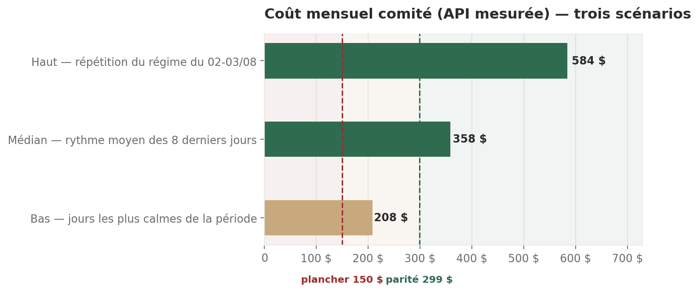

# Position Directeur Financier — comité du lundi 11/08

**Statut** : proposition, pour arbitrage de Sam au comité. Première production
de la direction, créée le 09/08.

## Ce qu'il faut retenir

1. **Le revenu est nul.** Zéro client, zéro euro récurrent. Toute dépense
   engagée l'est sur le temps personnel de Sam (SH Conseil), pas sur une
   trésorerie d'entreprise.
2. **Le dispositif coûte 358 $/mois au rythme actuel** (11,92 $/jour, mesuré
   sur les 8 derniers jours pleins — `bin/couts.py`), en hausse par rapport au
   diagnostic du 08/08. Le poste n°1 reste le brief quotidien (24,10 $, 25 %).
3. **Le GPU Packet.ai (299 $/mois) est déjà mathématiquement moins cher que le
   rythme médian mesuré** — mais l'écart ne se matérialise que si les rondes
   migrent réellement vers un modèle local. Sans ce couplage, c'est une
   dépense **ajoutée**, pas une dépense **remplacée**.
4. **Je ne peux pas répondre à « combien de temps le dispositif tient » —
   parce que le solde de trésorerie réel n'est pas connu.** `cash_suivi`
   affiche 0 € depuis le 14/07, déclaré par Sam lui-même comme provisoire
   (compte professionnel en cours d'ouverture). C'est la donnée manquante la
   plus urgente, pas un défaut de calcul de ma part.
5. **Un arbitrage déjà signalé par le Marketing le 08/08 n'a jamais été
   croisé avec le seuil de rentabilité du Pro** : le plafond micro-entreprise
   (77 700 €/an) tombe à 133 abonnés Pro, alors que le Commercial situe le
   seuil de rentabilité vers 120-150 abonnés. Les deux limites se touchent —
   ça mérite d'être vu ensemble, pas dans deux rapports séparés.

---

## 1. La dépense mesurée — 14 jours

**Source de vérité utilisée : `bin/couts.py`, corrigée.** Le script pointe
vers `/root/workspace/dh-comite`, un chemin qui n'existe pas dans cet
environnement — il a renvoyé « aucune exécution tracée ». Les données réelles
sont sous `/workspace/*/*.json` (rondes, briefs). J'ai recalculé avec la même
méthode sur le bon chemin ; les chiffres retrouvés pour les 8 derniers jours
correspondent exactement à ceux cités dans le journal du 08/08 (11,92 $/jour,
358 $ projetés) — la méthode est donc fiable, seul le chemin était faux.
**Je signale ce bug plutôt que de le corriger dans le script partagé — ce
n'est pas mon rôle de le committer sans revue.**

| Poste | Coût (14 j) | Part |
| --- | ---: | ---: |
| Brief quotidien | 24,10 $ | 25,3 % |
| Rondes Delivery | 15,23 $ | 16,0 % |
| Comité hebdomadaire | 12,53 $ | 13,1 % |
| Chief of Staff | 10,97 $ | 11,5 % |
| Rondes Commercial | 10,10 $ | 10,6 % |
| Rondes Marketing | 9,90 $ | 10,4 % |
| Rondes Customer Success | 7,00 $ | 7,3 % |
| Missions ponctuelles (propositions) | 3,35 $ | 3,5 % |
| Audit DSI | 2,17 $ | 2,3 % |
| **Total (46 exécutions)** | **95,34 $** | |

Par modèle (imputation au prorata des jetons de sortie, comme dans le
script) : **Sonnet 5 pèse 69,9 % de la facture (66,61 $)**, Opus (5 + 4.8)
23,5 % (22,40 $), Fable 6,6 % (6,28 $).

**Ce que ça déplace, semaine sur semaine** : le rythme est passé de ~6-8 $/jour
les 04-06/08 à deux pics à 18,83 $ et 20,09 $ les 02-03/08 (missions Opus à
contexte large, déjà identifiées comme cause du dépassement du plafond
informel de 150 $ le 08/08), avant de redescendre. Le rythme actuel
(11,92 $/j) n'est pas un pic isolé : c'est une moyenne qui inclut déjà ces
deux jours. Sans discipline sur les missions ponctuelles, il remonte.

**Ce que cette mesure NE couvre PAS** — et qui reste une facture réelle non
chiffrée ici :
- le VPS Hostinger (forfait mensuel, montant non documenté dans ce que j'ai pu
  consulter) ;
- le serveur Packet AI RTX 6000 déjà utilisé pour la production vidéo
  **depuis début août** (journal du 08/08 : « pris depuis début août »,
  jamais chiffré). C'est un point aveugle : j'ignore s'il s'agit d'un forfait
  actif payant ou d'un usage à la demande, et pour combien.

Le burn réel du dispositif est donc **supérieur** à 358 $/mois, d'un montant
que je ne peux pas encore chiffrer.

---

## 2. Le serveur GPU — DEC-2026-0809-07

Cette décision est déjà ouverte (Juridique/Sam, axes souveraineté et calcul
confidentiel). Je n'instruis pas ces deux axes — c'est hors de mon rôle. Voici
la seule chose qui m'appartient : **le chiffrage**.

**Est-ce finançable aujourd'hui ?**
Oui, au sens strict : 299 $/mois représente 0,34 jour de SH Conseil (à 800 €,
soit environ 275 €). Ce n'est pas une somme qui met en péril la capacité de
Sam à couvrir sa vie. **Mais « finançable » n'est pas « justifié »** — voir
ci-dessous.

**Qu'est-ce que ça déplace ?**
C'est le cœur du sujet, et l'endroit où je ne suis pas d'accord avec la
présentation reçue. Comparer 299 $ au rythme mesuré de 358 $ suggère une
économie immédiate. **Ce n'est vrai que si les rondes migrent réellement vers
un modèle local** — ce qui n'est décidé nulle part à ce jour, hors mon propre
cas (bascule Gemma déjà actée pour le Directeur Financier, mais je ne tourne
pas en ronde quotidienne : mon volume est marginal). Migrer le brief
quotidien, Delivery ou le comité vers Gemma 4 31B est un arbitrage
qualité/risque distinct (un modèle local moins capable peut dégrader ce que
Sam reçoit) qui n'a pas été instruit. **Sans cet arbitrage, souscrire au GPU
n'annule aucune dépense existante — ça en ajoute une**, et le dispositif
passerait de ~358 $/mois à ~358 $ + 299 $ = 657 $/mois, pas à 299 $/mois.
Ce que ça déplace, concrètement, tant que la migration n'est pas actée : environ
3 mois de la réserve de sécurité informelle que représente le seuil d'alerte
de 50 € sur `cash_suivi`.

**À partir de quand devient-il clairement gagnant ?**
Deux seuils, tous deux déjà posés ailleurs — je les rapproche, je ne les
invente pas :
- **Sur l'usage interne du comité** : dès que le rythme médian mesuré dépasse
  299 $/mois de façon durable (déjà le cas au rythme actuel de 358 $/mois,
  *si et seulement si* la migration réduit réellement la facture d'autant).
- **Sur le produit** (contrefactuel du Commercial du 09/08, non répété ici) :
  la bascule du SDS du Pro vers le GPU devient favorable à la marge entre 20
  et 60 abonnés — à 20, elle coûte encore plus cher (-164,3 % contre -155,6 %
  en variable) ; à 60, elle devient meilleure (-2,8 % contre -12,8 %). Avec
  **zéro abonné aujourd'hui**, ce seuil n'est pas encore atteint.

**Ma position : à différer, pas à refuser.** Ce n'est pas cher — mais tant
qu'aucune migration réelle n'est engagée et que la question de souveraineté
(axe Juridique) n'est pas tranchée, souscrire maintenant ajoute une charge
fixe sans supprimer la charge variable qu'elle est censée remplacer. Je
recommande de conditionner la souscription à un engagement écrit de
migration (quelles rondes, sur quel modèle, avec quelle réduction attendue de
la facture Sonnet), ou d'attendre l'offre Hostinger UE mentionnée par Sam
(axe 2 de la décision), qui réglerait la question de souveraineté sans
enclave technique.

---

## 3. Trésorerie — trois scénarios

**Réserve avant tout chiffre : je n'ai pas de solde bancaire fiable.**
`deos_state.cash_suivi.solde_declare` affiche 0, daté du 14/07, avec la note
de Sam lui-même : compte professionnel en cours d'ouverture. Ce n'est pas un
vrai zéro — c'est une valeur non renseignée. **Aucune projection en
« nombre de jours restants » n'est donc fiable tant que Sam n'a pas donné le
solde réel.** Je le demande explicitement pour la prochaine ronde.

Ce que je peux chiffrer sans ce solde : le **rythme de combustion mensuel**,
sur la seule mesure `bin/couts.py` (donc un plancher, pas le total réel — voir
§1).

| Scénario | Hypothèse | Coût mensuel |
| --- | --- | ---: |
| **Bas** | Le rythme se stabilise au niveau des jours les plus calmes observés (04, 06, 08/08 — aucune mission ponctuelle Opus) | 208 $ |
| **Médian** | Le rythme moyen des 8 derniers jours pleins se maintient tel quel | 358 $ |
| **Haut** | Le régime du 02-03/08 (missions Opus à contexte large, 140-171 K jetons) redevient la norme | 584 $ |

*Lecture du graphique : dès le scénario médian, le coût mesuré dépasse déjà
le coût fixe du GPU — c'est la même donnée que le point 3 ci-dessus, pas un
argument supplémentaire.*

**Ce qui manque pour transformer ce burn en trésorerie réelle** : le solde de
départ, les échéances connues (`cash_suivi.echeances_connues` est vide), et le
montant réel du VPS + du GPU vidéo déjà engagé (§1). Sans ces trois éléments,
tout chiffre de « jours restants » que je donnerais serait une fausse
précision — exactement ce que la charte des documents interdit.

---

## 4. Ce qui m'inquiète

- **Le solde de trésorerie n'est suivi nulle part depuis le 14/07.** Vingt-six
  jours sans mise à jour d'une donnée que Sam a lui-même qualifiée de
  provisoire. Ce n'est pas grave en soi — mais ça devient grave si une
  décision (comme le GPU) est prise en comparant un coût à un rythme de
  dépense sans jamais la rapporter à ce qui reste en caisse.
- **Une charge non chiffrée tourne déjà** : le GPU vidéo Packet AI, actif
  depuis début août, sans montant documenté que j'aie pu trouver. Je ne peux
  pas dire s'il alourdit le burn de 0 $ ou de 300 $ de plus par mois.
- **Le rapprochement 77 700 € / seuil de rentabilité Pro (~120-150 abonnés)**
  signalé par le Marketing le 08/08 n'a jamais été fait formellement. Avec
  zéro client aujourd'hui, ce n'est pas urgent — mais le jour où le Pro
  démarre, les deux seuils sont proches, et un succès commercial trop rapide
  pourrait faire sauter la franchise de TVA avant que la rentabilité ne soit
  acquise. Je le reprendrai si Sam confirme que je dois en être le
  propriétaire.
- **Le rythme actuel (358 $/mois, hors angles morts du §1) n'est financé par
  aucun revenu.** C'est un fait déclaré depuis la création du comité, pas une
  nouveauté — mais chaque semaine sans client rend chaque euro ajouté
  (comme les 299 $ du GPU) plus difficile à justifier sur la seule base du
  confort ou de l'anticipation.

---

## Réserves

- Les figures §1 et §3 mesurent les exécutions `claude -p` du comité — pas le
  VPS, pas le GPU vidéo, pas d'éventuels frais bancaires ou d'outillage tiers.
- Le taux de change n'a pas été utilisé volontairement (tous les coûts
  API/GPU sont en dollars dans leur source d'origine) — seule la conversion
  du jour de Sam (800 €) en comparaison avec le GPU (299 $) suppose 1 $ ≈
  0,92 €, hypothèse déjà utilisée par le Commercial le 09/08, non sourcée en
  interne.
- Le seuil informel de 150 $/mois est celui cité dans le diagnostic du 08/08
  (journal, commit `3073059`) — je ne l'ai pas retrouvé comme décision
  formelle de Sam, seulement comme repère déjà utilisé par le Chief of Staff.
- Je n'ai pas instruit les axes souveraineté / calcul confidentiel de
  DEC-2026-0809-07 : c'est le Juridique qui les porte. Ma position se limite
  au chiffrage et à ce que la dépense déplace.

---

## Annexe — méthode

Recalcul de `bin/couts.py` (logique inchangée, chemin corrigé de
`/root/workspace/dh-comite` vers `/workspace`), fenêtre de 14 jours au
09/08/2026, glissée sur les fichiers `*/*.json` contenant `total_cost_usd`.
46 exécutions retenues, réparties du 02/08 au 09/08 (aucune exécution tracée
entre le 17/07 et le 01/08 dans les fichiers disponibles). Attribution par
modèle imputée au prorata des jetons de sortie, comme dans le script
d'origine — c'est une approximation déclarée par le script lui-même, pas une
ventilation exacte de la facture.
