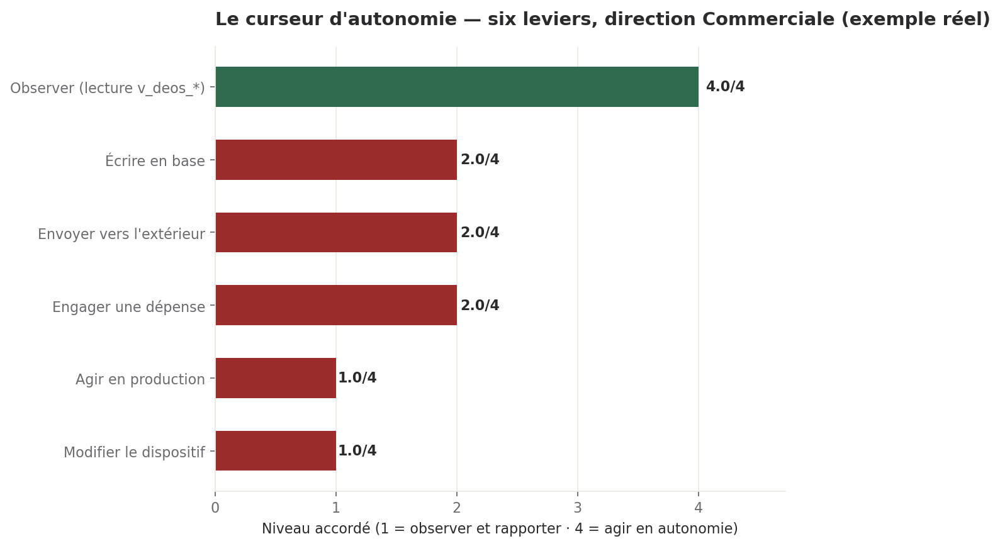

# Support de projection — Démonstration DEOS, Crédit Logement (dernière semaine d'août)

## Statut

**Proposition, pas un livrable final.** Ce document répond au routage
DEC-2026-0810-08 (support visuel, porté par le Marketing, appui du Commercial)
et à son complément DEC-2026-0810-30 (intégrer la preuve de déploiement local).
Il doit être relu et validé par Sam **avant** la présentation — c'est la
condition posée par le CEO lui-même dans DEC-2026-0810-08 : « il ne doit pas
découvrir le support sur scène ».

**Mise à jour du 11/08 : les trois prérequis sont désormais confirmés par le Commercial**
(config/commercial/dossier_demo_credit_logement_addendum_2026-08-11.md) :
1. script en trois gestes : confirmé, définitif.
2. exemples retenus : geste 1 sur DEC-2026-0810-11 (déploiement local, pas DEC-2026-0810-04, pour
   ne raconter qu'une seule histoire jusqu'au geste 4) ; geste 3 sur la ligne hooks.log du 06/08
   proposée par défaut par le Marketing.
3. absence de sur-promesse (colonne NON_démontrable) : confirmée par relecture croisée du Commercial.

Reste UNE seule étape avant projection : la relecture de Sam, prévue le 12/08 (échéance posée par
DEC-2026-0810-08). Ce support n'est plus un brouillon ouvert sur ses choix ; c'est une pièce prête
pour cette relecture.

**Mise à jour du 12/08 (DEC-2026-0811-04)** : un complément a été ajouté après le geste 2, distinguant pour chacun des six axes du curseur ce qui est tenu par un refus technique journalisé de ce qui l'est par convention et périmètre — deux variantes de discours sont prêtes selon la réponse que Sam donnera à DEC-2026-0811-02 (corriger le garde-fou, le déclarer tel quel, ou attendre après la démonstration). Rien d'autre n'est modifié : les chiffres, le déroulé et les trois prérequis du 11/08 restent inchangés.

---

## Ce qu'il faut retenir

- **Le support tient en quatre pages**, gabarit charte.py, aucune capture d'écran de production — uniquement des données réelles déjà accessibles au comité aujourd'hui (registre, curseurs, journal de refus).
- **Le fil conducteur reste les trois gestes de l'étude du 08/08** : le registre, le curseur, le refus journalisé. Rien de nouveau n'est inventé pour la démonstration.
- **Un quatrième élément est ajouté ce jour** (DEC-2026-0810-30) : la preuve de déploiement entièrement local, testée le 10/08 sur le projet 109 — argument différenciant fort pour un DSI qui internalise, à condition de montrer le coût réel (2,35 dollars, pas zéro) et l'écart de qualité mesuré, pas de le taire.
- **La limite Naaia posée par le CEO est respectée** : aucune ligne de ce support ne cite un concurrent nommément.
- **Rien au-delà du démontrable** (DH-CRO-004) : la liste NON_démontrable du dossier Commercial (tableau de bord client, audit exportable, toute référence client) n'apparaît nulle part, même en exemple flou.

---

## Le déroulé en trois gestes, avec preuve réelle à l'écran

### Geste 1 — Le registre

Une décision, avec son origine, sa date, son statut, sa preuve de clôture. **Choix confirmé par le
Commercial le 11/08** : DEC-2026-0810-11 (le test de déploiement local lui-même) — cohérent avec le
geste 4 ci-dessous, une seule histoire du début à la fin. DEC-2026-0810-04 (élévation de droit
d'écriture) est écarté : neutre mais sans lien narratif avec le reste de la démonstration.

*Écarté volontairement, dans les deux cas* : tout exemple touchant à un correctif de sécurité
(identifiants, mots de passe) — vrai et démontrable, mais contre-productif devant un DSI : on ne
bâtit pas la confiance en exposant une faille corrigée, même vite corrigée.

### Geste 2 — Le curseur

La matrice à 36 lignes existe en base (table curseurs), un niveau par direction et par type de tâche. Pour l'écran, un graphique plus lisible qu'un tableau : six leviers d'une direction, sur quatre niveaux (1 = observer et rapporter, 4 = agir en autonomie).

**Graphique produit ce jour** (config/marketing/graphiques/curseur_credit_logement_2026-08-11.png, gabarit charte.py, données réelles extraites de la table curseurs le 11/08) :

*Lecture à voix haute proposée* : « Chaque direction dispose d'un cran différent selon la nature du geste. Observer, elle le fait toujours en autonomie complète. Agir en production ou modifier le dispositif, jamais sans un humain. C'est réglé cran par cran, pas en tout ou rien — et c'est réversible en un mot. »

### Complément du 12/08 (DEC-2026-0811-04) — ce que chaque axe tient réellement

**Constat qui motive cet ajout** : le CEO a vérifié le 11/08, dans la source du garde-fou
technique, que deux des six axes affichés au geste 2 ne sont pas tenus par un refus
technique journalisé, contrairement aux quatre autres (DEC-2026-0811-02, détail et
preuves — trois écrasements de clé `deos_state` le même matin en sont la preuve
indépendante). Un DSI qui vérifie — c'est précisément l'objet de la venue de Crédit
Logement (DEC-2026-0806-14) — pose la question « et si une direction écrit quand même ? ».
Le support doit y répondre juste, axe par axe, plutôt que de laisser entendre que les six
sont tenus de la même façon.

| Axe | Ce qui est réellement tenu au 11/08 |
| --- | --- |
| Observer et rapporter | Sans objet : toujours en autonomie complète, aucun refus n'est nécessaire sur cet axe. |
| Écrire en base (comité) | **Convention et périmètre**, pas un refus technique journalisé : les outils du comité (`deos-state`, `deos-decisions`) ne déclenchent aucun contrôle de mots-clés SQL. Chaque direction n'écrit que sa propre clé — le périmètre est respecté dans les faits — mais rien n'empêcherait techniquement une écriture hors cran aujourd'hui. |
| Agir en production | **Refus technique journalisé**, vérifié. |
| Envoyer vers l'extérieur | **Refus technique journalisé**, vérifié — c'est l'exemple projeté au geste 3 (hooks.log, 06/08). |
| Engager une dépense | **Refus technique journalisé**, vérifié. |
| Modifier le dispositif | **Convention et périmètre**, pas un refus technique journalisé sur toute sa surface : la protection couvre les skills promus et les journaux de production contre une redirection en ligne de commande, mais pas les prompts des directions ni le garde-fou lui-même face à l'outil d'édition de fichiers. |

**Deux variantes préparées, faute de réponse de Sam à DEC-2026-0811-02 au moment de la relecture du 12/08 :**

- **Variante « corrigée »** (si Sam choisit l'option a — corriger avant la démonstration) :
  au geste 2, dire les six axes comme tenus par un refus technique, sans réserve.
- **Variante « déclarée »** (si Sam choisit l'option b — déclarer sans corriger, ou l'option
  c — attendre après la démonstration) : au geste 2, garder le tableau ci-dessus tel quel,
  formulé à l'oral ainsi : *« Quatre de ces six axes sont bloqués techniquement, et nous en
  faisons la preuve au geste suivant. Les deux autres — l'écriture dans notre propre
  registre interne, et la modification du dispositif — sont aujourd'hui tenus par le
  périmètre et par convention, pas encore par un refus technique : c'est une limite connue,
  que nous corrigeons. »* Une limite nommée avant qu'elle soit trouvée pèse plus, devant un
  DSI, qu'une limite découverte.

**Ce qui ne change pas** : le geste 3 continue de porter sur l'envoi vers l'extérieur — un des
quatre axes qui tiennent réellement. Aucun chiffre du support n'est modifié par cet ajout.

---

### Geste 3 — Le refus, journalisé

Exemple réel, extrait du journal technique du dispositif, horodaté le 6 août à 16 h 15 : une direction (le Marketing, chez nous-mêmes) a tenté une action au-dessus de son cran autorisé — un envoi vers l'extérieur via un appel réseau sortant. Le dispositif l'a bloqué et journalisé en moins d'une seconde, avec l'heure exacte, la direction concernée, le geste demandé et le niveau requis pour l'autoriser. **Exemple choisi parce qu'il porte sur notre propre dispositif interne, pas sur une donnée commerciale** — aucun risque d'exposer une tension ou un chiffre sensible. Le détail technique exact de la commande bloquée est consigné en annexe de ce document, pas repris ici pour rester lisible à l'écran.

**Choix confirmé par le Commercial le 11/08** : la ligne hooks.log du 06/08 ci-dessus, retenue telle que proposée par défaut — aucune alternative demandée.

---

## Geste 4 (ajouté ce jour, DEC-2026-0810-30) — La démonstration locale

**Ce qui a réellement tourné** le 10/08 sur le serveur GPU dédié, projet 109 (« CRM Digital·Humans — socle d'agents ») :

| Mesure | Valeur réelle | Source |
|---|---|---|
| Exécution | n° 167, statut terminé | vue des exécutions |
| Coût réel | 2,35 dollars (pas zéro) | vue des exécutions, colonne coût total |
| Agent Sophie | 26 exigences extraites, 156 secondes, 7 388 jetons | DEC-2026-0810-11 |
| Agent Olivia | 5 appels, 439 secondes, 12 403 jetons | DEC-2026-0810-11 |
| Appels vers un service externe | zéro | DEC-2026-0810-11 |

**Trois objections de DSI que ce test permet de lever** (reprises telles que posées dans le dossier Commercial) : souveraineté (aucune donnée ne sort de l'infrastructure du client), sous-traitance contractuelle (le client utilise ses propres modèles), coût (la machine tourne, le nombre de projets n'y change rien — coût fixe, pas variable).

**Ce qu'on ne montre pas en l'enjolivant** : l'agent Emma, sur cette même exécution, a produit un rapport de couverture erroné (79 % annoncé, en réalité sous-évalué — 12 écarts signalés, la majorité inventés). C'est un écart de raisonnement documenté sur les modèles ouverts en local, pas un défaut de format. **Si la question est posée, la réponse est celle-ci, pas un silence** : « Les modèles locaux tiennent très bien le travail structuré — l'extraction, le cadrage. Le raisonnement croisé sur de longues instructions reste leur point faible aujourd'hui, documenté, et c'est pour cela qu'un humain valide avant bascule en production. » C'est un argument de gouvernance, pas un aveu de faiblesse : la limite mesurée du modèle est précisément ce que le dispositif est fait pour rattraper.

---

## Réponses aux objections (reprises du dossier Commercial, inchangées)

| Objection | Réponse |
|---|---|
| « On a déjà une gouvernance interne » | Un outil de GRC règle des process, pas le cran d'autonomie d'un agent avant l'appel d'outil. Montrer le refus journalisé plutôt que l'expliquer. |
| « Qui vous audite, vous ? » | Personne à ce jour — zéro référence client, zéro audit tiers. C'est pour cela qu'on ne vend rien de fermé aujourd'hui, seulement une démonstration et un cadrage. |
| « Quel est le prix ? » | Hors du périmètre de ce support — phrase de cadrage disponible dans le dossier Commercial, sous réserve de l'arbitrage de Sam (DEC-2026-0809-02, toujours en attente). |

**Limite impérative reprise de DEC-2026-0810-08** : la ligne de différenciation face à un concurrent nommé n'entre pas dans ce support sans validation distincte de Sam. Aucune ligne ci-dessus n'en contient.

---

## Réserves

- **Prérequis Commercial** : confirmés le 11/08 (voir Statut). Plus aucun choix ouvert côté contenu.
- **Format de sortie** : ce document reste un Markdown à ce stade. Conversion en Word charte
  possible via l'outil du comité dès que Sam a validé le fond — non faite avant, pour ne pas figer
  une mise en page sur un contenu encore susceptible d'être corrigé en relecture.
- **Le graphique du geste 2** utilise des données de la table curseurs telles que lues le 11/08 — à
  revérifier avant projection si Sam modifie un curseur entre-temps.
- **Aucun test devant un tiers** : ce support n'a été relu par personne d'autre que le Commercial
  (validation des prérequis) à ce stade. La relecture de Sam, posée par DEC-2026-0810-08, reste
  l'étape qui manque avant projection — pas une option, une condition explicite du CEO.

---

## Annexe — sources brutes

- Curseurs (11/08) : table curseurs, 36 lignes, extrait direction Commerciale utilisé pour le graphique (observer=4, écrire en base=2, envoyer vers l'extérieur=2, engager une dépense=2, agir en production=1, modifier le dispositif=1).
- Décisions citées : DEC-2026-0810-04, DEC-2026-0810-11, DEC-2026-0810-30, DEC-2026-0810-08, DEC-2026-0809-02.
- Refus journalisé : fichier hooks.log du comité, ligne du 6 août 2026 à 16 h 15 min 52 s UTC, direction marketing, geste envoyer_externe, niveau réglé 2 (Conseille), niveau requis 3 (Agit sous validation).
- Exécution locale : vue des exécutions, identifiant 167, projet 109, statut terminé, coût total 2,3475569999999992 dollars.
